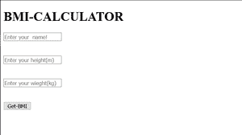
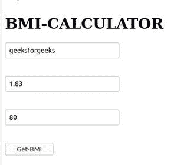
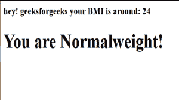

# 使用 Express.js 的身体质量指数计算器

> 原文:[https://www . geesforgeks . org/BMI-计算器-使用-express-js/](https://www.geeksforgeeks.org/bmi-calculator-using-express-js/)

**体重指数(身体质量指数)**用个体的体重和身高来表示。分别以*公斤和*米为单位，是体重与身高的平方之比。

```js
BMI = (weight of body) / (height of body)2
Unit of weight: Kilogram(Kg);
Unit of height: Meter(m);
Unit of BMI is kg/m2
```

**进场:**

*   首先，我们编写 **HTML 代码**来创建一个表单，在这个表单中，我们将从用户那里获得姓名、身高(m)、体重(kg)作为输入。
*   导入所需模块并将其存储到应用程序变量中
*   发送 html 并使用此
    在特定路线上发布数据

```js
app.post("/bmicalculator", function (req, res) {
    heigh = parseFloat(req.body.Height);
    weigh = parseFloat(req.body.Weight);
    bmi = weigh / (heigh * heigh);
```

*   使用公式检查身体质量指数条件。

**第一步:**

## 超文本标记语言

```js
<!DOCTYPE html>
<html lang="en">
    <head>
        <!-- title is used to provide
             a specific name to our web-page! -->
        <title>BMI-CALCULATOR</title>
        <!-- link function is used here, so that we can
    connect our css file with our html file externally -->
        <link rel="stylesheet" href="1.css" />
    </head>
    <body>
        <div id="MAIN">
            <h1 id="heading">BMI-CALCULATOR</h1>
        </div>

        <form action="/bmicalculator" method="post">
            <input type="text"
                   name="Name"
                   placeholder="Enter your  name!" />
            <br />
            <input id="Height"
                   name="Height"
                   placeholder="Enter your height(m)" />
            <br />
            <input id="Weight"
                   name="Weight"
                   placeholder="Enter your weight(kg)" />
            <br />
            <button class="btn"
                    type="submit">Get-BMI</button>
        </form>
    </body>
</html>
```

**输出:**



单形

现在让我们为我们的计算和功能编写代码，这是我们的身体质量指数计算器的主要部分。

**第 2 步**

```js
Dependencies: 
express:    npm install express
bodyparser:   npm install body-parser
```

## java 描述语言

```js
//importing modules
const express = require("express");
const bodyparser = require("body-parser");

// stores the express module into the app variable!
const app = express();
app.use(bodyparser.urlencoded({ extended: true }));

//sends index.html
app.get("/bmicalculator", function (req, res) {
    res.sendFile(__dirname + "/" + "index.html");
});

//this is used to post the data on the specific route
app.post("/bmicalculator", function (req, res) {
    heigh = parseFloat(req.body.Height);
    weigh = parseFloat(req.body.Weight);
    bmi = weigh / (heigh * heigh);

    //number to string format
    bmi = bmi.toFixed();

    req_name = req.body.Name;

    // CONDITION FOR BMI
    if (bmi < 19) {
        res.send("<h3>hey! " + req_name +
                 " your BMI is around: " + bmi +
                 "<centre><h1>You are Underweight!");
    } else if (19 <= bmi && bmi < 25) {
        res.send("<h3>hey! " + req_name +
                 " your BMI is around: " + bmi +
                 "<centre><h1>You are Normalweight!");
    } else if (25 <= bmi && bmi < 30) {
        res.send("<h3>hey! " + req_name +
                 " your BMI is around: " + bmi +
                 "<centre><h1>You are Overweight!");
    } else {
        res.send("<h3>hey! " + req_name +
                 " your BMI is around: " + bmi +
                 "<centre><h1>You are Obese!");
    }
});

//this is used to listen a specific port!
app.listen(7777, function () {
    console.log("port active at 7777");
});
```

**输出:**



**最终输出:**



输出