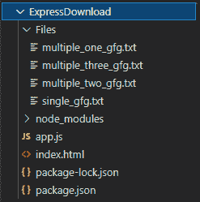
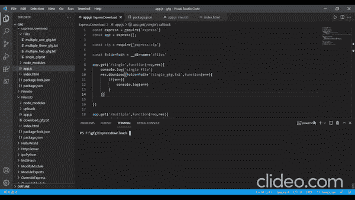

# 如何使用 Express.js 下载文件？

> 原文:[https://www . geesforgeks . org/如何使用 express-js 下载文件/](https://www.geeksforgeeks.org/how-to-download-a-file-using-express-js/)

[Express.js](https://www.geeksforgeeks.org/introduction-to-express/) 是一个路由和[中间件](https://www.geeksforgeeks.org/working-of-express-js-middleware-and-its-benefits/)框架，用于处理网页的不同路由，它工作在请求和响应周期之间，工作在 node.js 服务器的顶部。在本文中，我们将讨论如何使用 express.js 下载文件。

**下载文件使用******express . js******我们将看到两种场景:******

1.  ****使用 [**res.download()**](https://www.geeksforgeeks.org/express-js-res-download-function/) 函数下载单个文件，该函数采用两个参数文件路径和一个函数来处理任何错误。****
2.  ****为此，我们将使用“**express-zip**”NPM 包下载多个文件作为压缩文件夹，该包使用以对象数组为参数的**zip()** 函数创建一个压缩文件夹。每个对象都有两个字段路径和文件名。****

******我们先初始化项目，逐一讨论各个场景:******

******步骤 1:** 创建一个“**app . j***T5【s】*”文件并用 [npm 初始化您的项目。](https://www.geeksforgeeks.org/node-js-npm-node-package-manager/)****

```
**npm init**
```

******步骤 2:** 现在安装两个 *npm* 包:“**快递**”和“**快递-zip** ”。****

```
**npm install express
npm install express-zip**
```

******第三步:**创建一个“**index.html**”文件，然后在项目文件夹内创建一个名为“**文件**”的文件夹。在文件文件夹中创建下面提到的四个文本文件:****

*   ****single_gfg.txt****
*   ****multiple_one_gfg.txt****
*   ****multiple_two_gfg.txt****
*   ****multiple_three_gfg.txt****

******最终的项目结构看起来会像** **这个:******

****

项目结构**** 

******第四步:**现在让我们对“**index.html**文件进行编码。在其中，我们将创建两种形式:****

*   ****一个是 GET 路由为–’**/single**(处理单个文件下载请求)。****
*   ****GET 路由为–'**/mulp*****e***'的(处理多文件下载请求)。****

******index.html******

## ****超文本标记语言****

```
**<!DOCTYPE html>
<html lang="en">

<head>
    <meta charset="UTF-8">
    <meta http-equiv="X-UA-Compatible" content="IE=edge">
    <meta name="viewport" content=
        "width=device-width, initial-scale=1.0">
    <title>Download</title>
</head>

<body>
    <br>

    <!-- Form to handle single filee download request-->
    <form action="/single" method="get">
        <button type="submit">Download Single File</button>
    </form>

    <br><br>

    <!-- Form to handle single filee download request-->
    <form action="/multiple" method="get">
        <button type="submit">Download Multiple File</button>
    </form>
</body>

</html>**
```

******第五步:**现在对“ **app.js** 文件进行编码。其中，我们创建了 *GET* 请求函数，使用 express 处理下载请求。我们使用开头提到的“ *express-zip* ”和 *res.download()* 。****

******app.js 文件******

## ****java 描述语言****

```
**// Requiring express package for routing
const express = require('express')

// Creating app
const app = express();

// Requiring express-zip for downloading a zip file
const zip = require('express-zip');

// The folder path for the files
const folderPath = __dirname+'/Files';

// GET request for single file
app.get('/single',function(req,res) {
    console.log('single file');

    // Download function provided by express
    res.download(folderPath+'/single_gfg.txt', function(err) {
        if(err) {
            console.log(err);
        }
    })
})

// GET request for multiple file download as zip
app.get('/multiple', function(req, res) {
    console.log('Multiple file download')

    // zip method which take file path
    // and name as objects
    res.zip([
           { path: folderPath+'/multiple_one_gfg.txt',
               name: 'one_gfg.txt'},
           { path: folderPath+'/multiple_two_gfg.txt',
               name: 'two_gfg.txt'},
           { path: folderPath+'/multiple_three_gfg.txt',
            name: 'three_gfg.txt'}
    ])
})

// GET request to the root of the app
app.get('/', function(req, res){
    res.sendFile(__dirname+'/index.html');
})

// Creating serveer at port 3000
app.listen(3000,function(req,res){
    console.log('Server started to listen at 3000');
})**
```

******第五步:**现在使用你的终端运行应用。****

```
**node app.js**
```

******输出:**进入任意浏览器，输入 **http://localhost:3000******

****

输出**** 

****您可以转到下载文件夹并提取 zip 文件夹。这就是我们如何在 Node.js 中使用 *express* 下载文件****