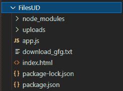
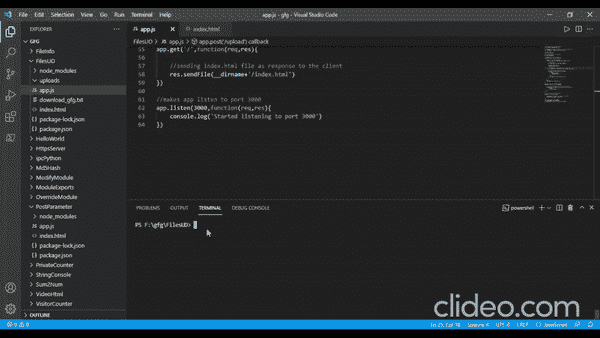

# 如何用 Express 实现文件上传下载？

> 原文:[https://www . geesforgeks . org/如何用 express 实现文件上传和下载/](https://www.geeksforgeeks.org/how-to-implement-file-uploading-and-downloading-with-express/)

文件上传和下载是网络应用的重要功能。这里我们使用**快递-文件上传** npm 包处理文件上传，下载使用快递的 **res.download()** 功能处理。**快递文件上传**作为中间件传递给应用。

**做法:**首先安装 express-fileupload 模块，然后进行需求，作为中间件传递给 app，如下图:

```
const fileUpload = require('express-fileupload')
app.use(fileUpload())
```

然后使用以下命令访问 POST 请求中上传的文件:

```
req.files.<uploaded_file_name>
```

它提供了一些函数和值，如文件名、mime 类型、数据和大小。它提供了一个重要的 **mv()** 功能，用于保存上传的文件。它以上传路径和错误处理函数为参数。

```
req.files.<uploaded_file_name>.mv(<upload_path>, function(err) {
  // statement(s)
})
```

使用 **res.download()** 函数处理下载，该函数采用两个参数:文件路径和错误处理函数。

```
res.download( <file_path>, function(err) {
  // statement(s)
})
```

#### **上传下载的实现:**

**步骤 1:** 创建一个 **app.js** 文件、**index.html**文件，并使用以下命令初始化项目:

```
npm init
```

**步骤 2:** 使用以下命令安装 express 和 express-fileupload:

```
npm install express
npm install express-fileupload
```

**项目结构:**项目结构如下。在项目目录中创建一个上传文件夹，并在项目文件夹中创建一个名为 download_gfg.txt 的文件，该文件将被下载。



项目结构

**第三步:**现在我们先对**index.html**文件进行编码。其中，我们创建了两个表单，一个处理上传的表单有**动作= '/上传'**，一个处理下载的表单有**动作= '/下载'**。

## index.html

```
<!DOCTYPE html>
<html lang="en">
<head>
    <meta charset="UTF-8">
    <meta http-equiv="X-UA-Compatible" 
          content="IE=edge">
    <meta name="viewport" 
          content="width=device-width, initial-scale=1.0">
    <title>Files</title>
</head>
<body>
    <!-- Upload section-->
    <div>
        <h3>Upload Section</h3> <br>
        <!-- action to the /upload route-->
        <form action="/upload" 
              method="post"
              enctype="multipart/form-data">
            File to be uploaded: <input type="file" 
                                        name="uploadFile" 
                                        id=""> 
            <br><br>
            <button type="submit">Upload</button>
        </form>
        <br>
    </div>

    <!-- Download Section-->
    <div>
        <h3>Download Section</h3> <br>
        <!-- action to the /download route-->
        <form action="/download" method="get">
            <button type="submit">Download</button>
        </form>
    </div>

</body>
</html>
```

**第四步:**现在我们将对 **app.js** 文件进行编码。其中，我们创建了 **POST 路由–’/upload‘**处理上传， **GET 路由–’/download‘**处理下载。对于应用程序根的 GET 请求，我们发送**index.html**文件。

## app.js

```
// Requiring express to handle routing
const express = require("express");

// The fileUpload npm package for handling
// file upload functionality
const fileUpload = require("express-fileupload");

// Creating app
const app = express();

// Passing fileUpload as a middleware
app.use(fileUpload());

// For handling the upload request
app.post("/upload", function (req, res) {

  // When a file has been uploaded
  if (req.files && Object.keys(req.files).length !== 0) {

    // Uploaded path
    const uploadedFile = req.files.uploadFile;

    // Logging uploading file
    console.log(uploadedFile);

    // Upload path
    const uploadPath = __dirname
        + "/uploads/" + uploadedFile.name;

    // To save the file using mv() function
    uploadedFile.mv(uploadPath, function (err) {
      if (err) {
        console.log(err);
        res.send("Failed !!");
      } else res.send("Successfully Uploaded !!");
    });
  } else res.send("No file uploaded !!");
});

// To handle the download file request
app.get("/download", function (req, res) {

  // The res.download() talking file path to be downloaded
  res.download(__dirname + "/download_gfg.txt", function (err) {
    if (err) {
      console.log(err);
    }
  });
});

// GET request to the root of the app
app.get("/", function (req, res) {

  // Sending index.html file as response to the client
  res.sendFile(__dirname + "/index.html");
});

// Makes app listen to port 3000
app.listen(3000, function (req, res) {
  console.log("Started listening to port 3000");
});
```

**运行应用程序的步骤:**使用以下命令启动应用程序。

```
node app.js
```

**输出:**打开浏览器，转到 **<u>http://localhost:3000/，</u>** 会看到如下命令:



输出