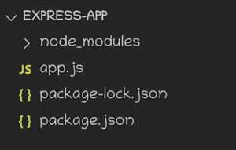
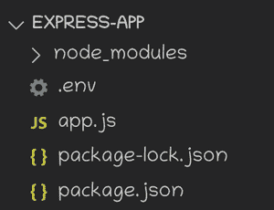
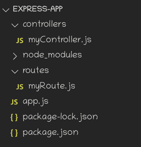
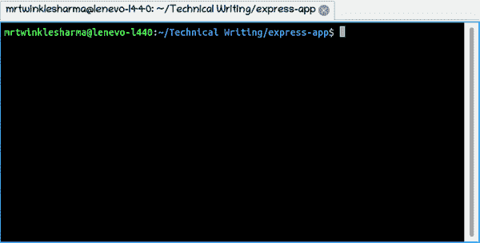

# 如何在 Express.js 中构造我的应用程序？

> 原文:[https://www . geesforgeks . org/how-to-structure-my-application-in-express-js/](https://www.geeksforgeeks.org/how-to-structure-my-application-in-express-js/)

Express 是一个用于创建 web 服务器的极简框架。它建立在 node.js 的 HTTP 模块上，提供了一种更简单的方法来管理与服务器相关的代码。

在本文中，我们将讨论如何构建我们的 express 应用程序。

**创建节点项目:**

**步骤 1:** 由于 express 应用程序是建立在 NodeJS 上的，所以首先我们要初始化一个节点项目，在你的终端中写下下面的命令。

```js
npm init
```

**步骤 2:** 安装软件包

```js
npm install express
```

**第三步:**创建 app.js 文件。在这个文件中，我们编写了服务器的全部代码。

```js
touch app.js
```

**项目结构:**经过这一切，我们的项目结构会变成这样。



**配置环境变量:**在多次编写服务器代码时，我们需要在整个代码库中有一些常量变量，所以我们应该设置某种环境变量，以便它可以在所有文件中使用。
该模块用于从加载环境变量。这样以后我们可以在代码库中的任何地方轻松地使用这些变量。

```js
npm install dotenv 
```



## 。包封/包围（动词 envelop 的简写）

```js
PORT=3000 // This will be available as process.env.PORT

// You can write any variable here.
```

**app . js 文件的结构:**导入是这个文件里面首先要写的东西，然后可以有某种初始化，之后应该有和整个路由相关的中间件。例如，它可以是 express.json()中间件，用于将传入的请求解析为 json。在所有这些之后，当用户请求从中间件内部给出的字符串开始的 URL 时，我们可以编写我们的路由来执行特定的功能。
最后，我们可以启动我们的服务器来监听客户端的请求。如果我们关心数据持久性，那么首先建立数据库连接会更安全。

## app.js

```js
// 3rd Party Modules
const express = require('express');
require('dotenv/config');

// Local Modules
const myRoute = require('./routes/myRoute.js');

// Server Initialization
const app = express();
const PORT = process.env.PORT;

// Middlewares
app.use(express.json());

// Routes will be written here
app.use('/route', myRoute); 

// Server Listen Along with Database 
// connection(in case of data persistence)
app.listen(PORT, (error) =>{
    if(!error)
        console.log("Server is Successfully Running, 
                   and App is listening on port "+ PORT)
    else 
        console.log("Error occured, server can't start", error);
    }
);
```

**设置控制器和路由:**路由是 HTTP 请求到服务器的端点，或者可以说是客户端与服务器交互的几种方式，我们的 app 中经常需要很多路由，所以提前设置是一种很方便的方式。
控制器只不过是客户端访问某条路由时要执行的代码。这段代码可以由几行组成，这就是我们将其与路由文件分开的原因。



## 单片机. j

```js
// Methods to be executed on routes
const method1 = (req, res)=>{
    res.send("Hello, Welcome to our Page");
}

const method2 = (req, res)=>{
    res.send("Hello, This was a post Request");
}

// Export of all methods as object
module.exports = {
    method1,
    method2
}
```

## 迈罗特. js

```js
// 3rd Party Modules
const { Router } = require('express');

// Local Modules
const myController = require('../controllers/myController');

// Initialization
const router = Router();

// Requests 
router.get('/', myController.method1);
router.post('/', myController.method2);

module.exports = router;
```

**运行应用的步骤:**我们可以用下面的命令运行我们的 express 应用，app.js 是这个应用的入口点。

```js
node app.js
```



在服务器成功运行之后，我们可以开始与它交互，这里有一个通过浏览器获取请求的例子，

**输出:**


**附加点:**

1.  使用 node 命令运行服务器时，它会根据上次保存的文件继续运行，如果您希望服务器是交互式的，并且希望每次代码更改时都重新运行服务器，可以使用 **nodemon** 。
2.  通常情况下，服务器是由几个 API 组成的，这样客户端就可以进行交互，如果你想记录服务器上的请求细节，可以使用 **morgan** 。这只是了解服务器上发生了什么的一种便捷方式。