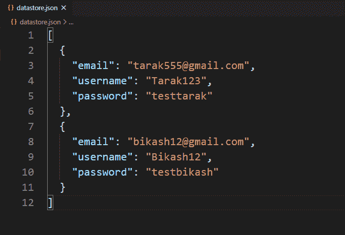
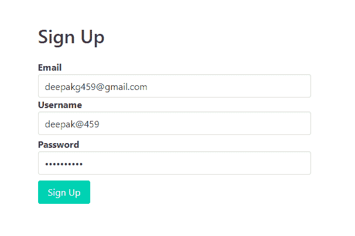
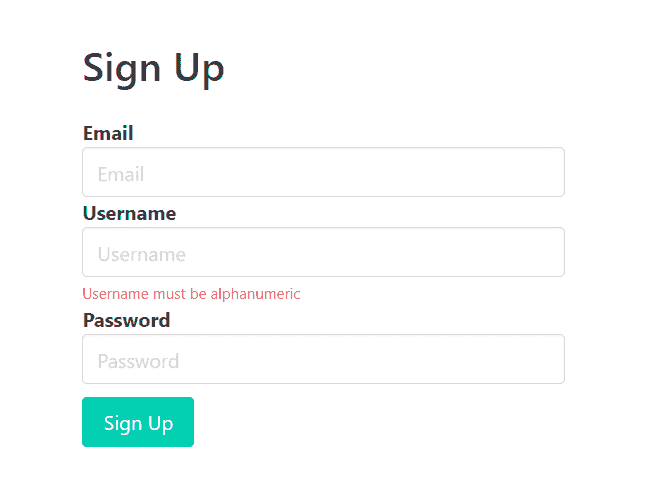
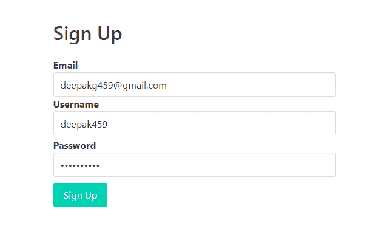
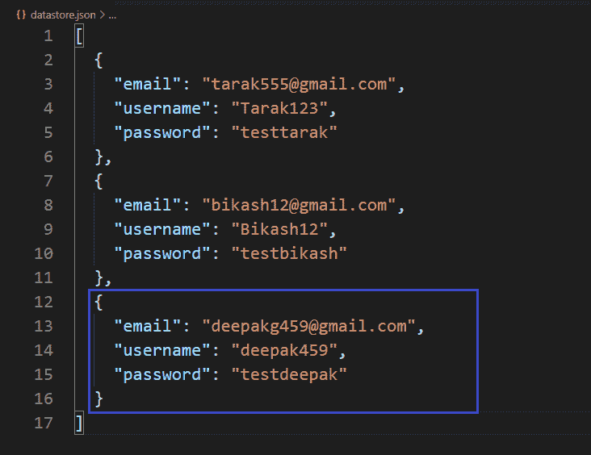

# 如何使用快速验证器验证输入字段中的输入是否只有字母数字字符？

> 原文:[https://www . geesforgeks . org/如何验证输入字段中的输入是否只有字母数字字符使用快速验证器/](https://www.geeksforgeeks.org/how-to-validate-if-input-in-input-field-has-alphanumeric-characters-only-using-express-validator/)

在 HTML 表单中，我们经常需要不同类型的验证。验证现有电子邮件、验证密码长度、验证确认密码、验证为仅允许整数输入，这些都是验证的一些示例。在某个输入字段中，只允许字母数字字符，即不允许任何特殊字符。我们还可以使用 express-validator 中间件验证这些输入字段，使其只接受字母数字字符。

**安装快速验证器的命令:**

```
npm install express-validator
```

**使用快速验证器实现逻辑的步骤:**

*   安装快速验证中间件。
*   创建一个 validator.js 文件来编码所有的验证逻辑。
*   通过验证输入验证输入:检查(输入字段名)和带有“.”的验证链
*   在路由中使用验证名称(validateInputField)作为一个中间件，作为一个验证数组。
*   从快速验证器中析构“验证结果”函数，用它来查找任何错误。
*   如果发生错误，重定向到传递错误信息的同一页。
*   如果错误列表为空，则允许用户访问后续请求。

**注意:**这里我们使用本地或自定义数据库来实现逻辑，同样的步骤也可以在 MongoDB 或 MySql 这样的常规数据库中实现逻辑。

**示例:**此示例说明了如何验证输入字段以仅允许字母。

**文件名–index . js**

```
const express = require('express')
const bodyParser = require('body-parser')
const {validationResult} = require('express-validator')
const repo = require('./repository')
const { validateUsername } = require('./validator')
const signupTemplet = require('./signup')

const app = express()
const port = process.env.PORT || 3000

// The body-parser middleware to parse form data
app.use(bodyParser.urlencoded({extended : true}))

// Get route to display HTML form to sign up
app.get('/signup', (req, res) => {
  res.send(signupTemplet({}))
})

// Post route to handle form submission logic and 
app.post(
  '/signup',
  [validateUsername],
  async (req, res) => {
    const errors = validationResult(req)
    if(!errors.isEmpty()) {
      return res.send(signupTemplet({errors}))
    }
    const {email, username, password} = req.body
    await repo.create({
      email, 
      username,
      password
    })
    res.send('Sign Up successfully')
})

// Server setup
app.listen(port, () => {
  console.log(`Server start on port ${port}`)
})
```

**Filename–repository . js:**该文件包含创建本地数据库并与之交互的所有逻辑。

```
// Importing node.js file system module 
const fs = require('fs')

class Repository {
  constructor(filename) {

    // Filename where datas are going to store
    if(!filename) {
      throw new Error('Filename is required to create a datastore!')
    }

    this.filename = filename

    try {
      fs.accessSync(this.filename)
    } catch(err) {

      // If file not exist it is created with empty array
      fs.writeFileSync(this.filename, '[]')
    }
  }

  // Get all existing records
  async getAll(){
    return JSON.parse(
      await fs.promises.readFile(this.filename, {
        encoding : 'utf8'
      })
    )
  }

  // Create new record
  async create(attrs){
    const records = await this.getAll()
    records.push(attrs)
    await fs.promises.writeFile(
      this.filename,
      JSON.stringify(records, null, 2)   
    )
    return attrs
  }
}

// The 'datastore.json' file created at runtime 
// and all the information provided via signup form
// store in this file in JSON format.
module.exports = new Repository('datastore.json')
```

**文件名–注册. js:** 该文件包含显示注册表单的逻辑。

```
const getError = (errors, prop) => {
  try {
    return errors.mapped()[prop].msg
  } catch (error) {
    return ''
  } 
}

module.exports = ({errors}) => {
  return `
    <!DOCTYPE html>
    <html>
      <head>
        <link rel='stylesheet' 
href='https://cdnjs.cloudflare.com/ajax/libs/bulma/0.9.0/css/bulma.min.css'>
        <style>
          div.columns{
            margin-top: 100px;
          }
          .button{
            margin-top : 10px
          }
        </style>
      </head>
      <body>
        <div class='container'>
          <div class='columns is-centered'>
            <div class='column is-5'>
              <h1 class='title'>Sign Up<h1>
              <form method='POST'>             
                <div>
                  <div>
                    <label class='label' id='email'>Email</label>
                  </div>
                  <input class='input' type='text' name='email' 
                  placeholder='Email' for='email'>
                </div>
                <div>
                  <div>
                    <label class='label' id='fn'>Username</label>
                  </div>
                  <input class='input' type='text' name='username'
                  placeholder='Username' for='username'>
                  <p class="help is-danger">${getError(errors, 'username')}</p>
                </div>
                <div>
                  <div>
                    <label class='label' id='password'>Password</label>
                  </div>
                  <input class='input' type='password' name='password' 
                  placeholder='Password' for='password'>
                </div>
                <div>
                  <button class='button is-primary'>Sign Up</button>
                </div>
              </form>
            </div>
          </div>
        </div>
      </body>
    </html>   
  `
}
```

**Filename–validator . js:**该文件包含所有验证逻辑(验证输入字段只允许字母数字字符的逻辑)。

```
const {check} = require('express-validator')
const repo = require('./repository')
module.exports = {
  validateUsername : check('username')

    // To delete leading and triling space
    .trim()

    // Validate minimum length of password
    // Optional for this context
    .isLength({min:4})

    // Custom message
    .withMessage('Username must be minimum 4 characters long')

    // Validate username to be alphanumeric
    .isAlphanumeric()

    // Custom message
    .withMessage('Username must be alphanumeric')

}
```

**文件名–package . JSON**


package.json 文件

**数据库:**



数据库ˌ资料库

**输出:**



当用户名输入字段不是字母数字时，尝试注册



尝试使用非字母数字的用户名输入字段注册时的响应



当用户名输入字段仅包含字母数字字符时，尝试注册


尝试使用仅包含字母数字字符的用户名输入字段注册时的响应

**成功注册后的数据库:**



成功注册后的数据库

**注意:**我们在注册. js 文件中使用了一些布尔玛类(CSS 框架)来设计内容。