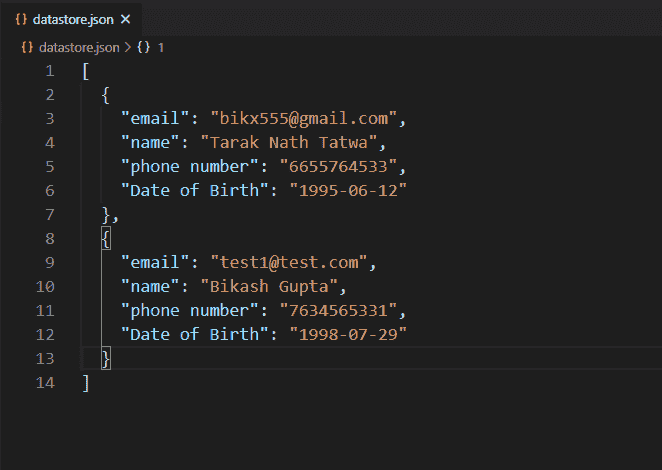
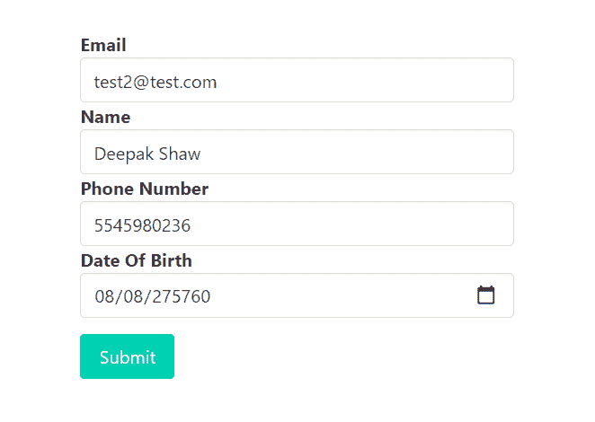
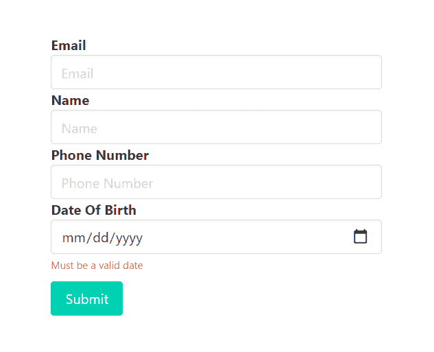
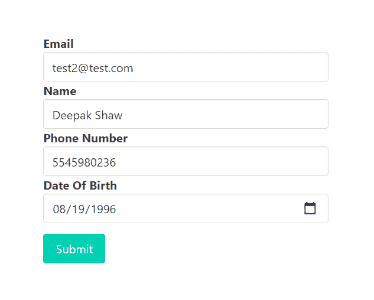
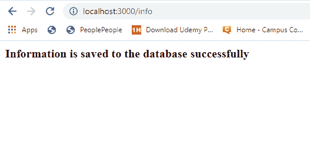
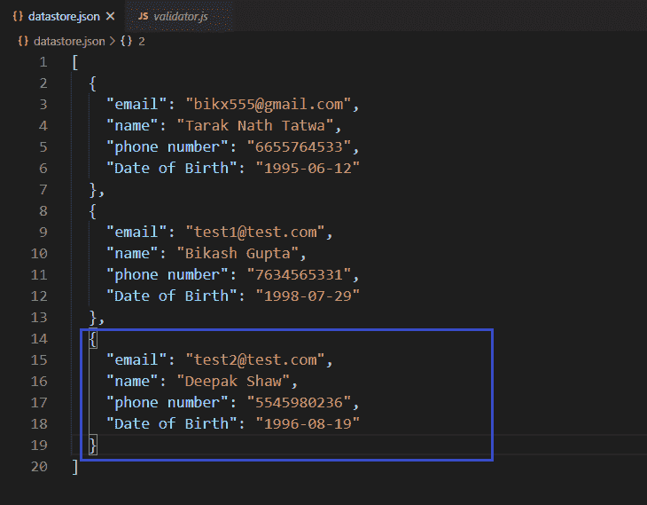

# 如何使用快速验证器验证输入字段中的输入是否为有效日期？

> 原文:[https://www . geesforgeks . org/如何验证输入字段中的输入是否是使用快速验证器的有效日期/](https://www.geeksforgeeks.org/how-to-validate-if-input-in-input-field-is-a-valid-date-using-express-validator/)

在 HTML 表单中，我们经常需要不同类型的验证。验证现有电子邮件、验证密码长度、验证确认密码、验证为仅允许整数输入，这些都是验证的一些示例。在某个输入字段中，只允许有效日期，即不允许有任何字符串、数字或无效日期字符。我们还可以使用 express-validator 中间件验证这些输入字段，使其只接受有效的日期。

**安装快速验证器的命令:**

```
npm install express-validator

```

**使用快速验证器实现逻辑的步骤:**

*   安装快速验证中间件。
*   创建一个 validator.js 文件来编码所有的验证逻辑。
*   通过 validateInputField 验证输入:检查(输入字段名)和带有“.”的验证 isDate()上的链
*   在路由中使用验证名称(validateInputField)作为一个中间件，作为一个验证数组。
*   从快速验证器中析构“验证结果”函数，用它来查找任何错误。
*   如果发生错误，重定向到传递错误信息的同一页。
*   如果错误列表为空，则允许用户访问后续请求。

**注意:**这里我们使用本地或自定义数据库来实现逻辑，同样的步骤也可以在 MongoDB 或 MySql 这样的常规数据库中实现逻辑。

**示例:**此示例说明了如何验证输入字段以仅接受有效日期。

**文件名–index . js**

```
const express = require('express')
const bodyParser = require('body-parser')
const {validationResult} = require('express-validator')
const repo = require('./repository')
const { validateDOB } = require('./validator')
const formTemplet = require('./form')

const app = express()
const port = process.env.PORT || 3000

// The body-parser middleware to parse form data
app.use(bodyParser.urlencoded({extended : true}))

// Get route to display HTML form
app.get('/', (req, res) => {
  res.send(formTemplet({}))
})

// Post route to handle form submission logic and 
app.post(
  '/info',
  [validateDOB],
  async (req, res) => {
    const errors = validationResult(req)
    if (!errors.isEmpty()) {
      return res.send(formTemplet({errors}))
    }

    const {email, name, phn, dob} = req.body

    // New record
    await repo.create({
      email,
      name,
      'phone number':phn,
      'Date of Birth':dob
    })
res.send('<strong>Information is saved to '
   + 'the database successfully</strong>')
})

// Server setup
app.listen(port, () => {
  console.log(`Server start on port ${port}`)
})
```

**Filename–repository . js:**该文件包含创建本地数据库并与之交互的所有逻辑。

```
// Importing node.js file system module 
const fs = require('fs')

class Repository {

    constructor(filename) {

        // Filename where datas are going to store
        if (!filename) {
            throw new Error(
'Filename is required to create a datastore!')
        }

        this.filename = filename

        try {
            fs.accessSync(this.filename)
        } catch (err) {

            // If file not exist it is created
            // with empty array
            fs.writeFileSync(this.filename, '[]')
        }
    }

    // Get all existing records
    async getAll() {
        return JSON.parse(
            await fs.promises.readFile(this.filename, {
                encoding: 'utf8'
            })
        )
    }

    // Create new record
    async create(attrs) {
        // Fetch all existing records
        const records = await this.getAll()

        // All the existing records with new
        // record push back to database
        records.push(attrs)
        await fs.promises.writeFile(
            this.filename,
            JSON.stringify(records, null, 2)
        )
        return attrs
    }
}

// The 'datastore.json' file created at runtime 
// and all the information provided via signup form
// store in this file in JSON formet.
module.exports = new Repository('datastore.json')
```

**Filename–form . js:**该文件包含显示表单的逻辑。

```
const getError = (errors, prop) => {
  try {
    return errors.mapped()[prop].msg
  } catch (error) {
    return ''
  } 
}

module.exports = ({errors}) => {
  return `
    <!DOCTYPE html>
    <html>
      <head>
        <link rel='stylesheet' 
href='https://cdnjs.cloudflare.com/ajax/libs/bulma/0.9.0/css/bulma.min.css'>
        <style>
          div.columns{
            margin-top: 100px;
          }
          .button{
            margin-top : 10px
          }
        </style>
      </head>
      <body>
        <div class='container'>
          <div class='columns is-centered'>
            <div class='column is-5'>
              <form action='/info' method='POST'>
                <div>
                  <div>
                    <label class='label' id='email'>Email</label>
                  </div>
                  <input class='input' type='text' name='email' 
                  placeholder='Email' for='email'>
                </div>          
                <div>
                  <div>
                    <label class='label' id='name'>Name</label>
                  </div>
                  <input class='input' type='text' name='name' 
                  placeholder='Name' for='name'>
                </div>
                <div>
                  <div>
                    <label class='label' id='phn'>Phone Number</label>
                  </div>
                  <input class='input' type='text' name='phn'
                  placeholder='Phone Number' for='phn'>
                </div>
                <div>
                  <div>
                    <label class='label' id='dob'>Date Of Birth</label>
                  </div>
                  <input class='input' type='date' name='dob' 
                  placeholder='DOB' for='dob'>
                  <p class="help is-danger">${getError(errors, 'dob')}</p>
                </div>
                <div>
                  <button class='button is-primary'>Submit</button>
                </div>
              </form>
            </div>
          </div>
        </div>
      </body>
    </html>   
  `
}
```

**Filename–validator . js:**该文件包含所有的验证逻辑(验证输入字段只接受有效日期的逻辑)。

```
const {check} = require('express-validator')
const repo = require('./repository')
module.exports = {

  validateDOB : check('dob')

    // To delete leading and triling space
    .trim()

    // Validate DOB to be a valid date
    .isDate()

    // Custom message
    .withMessage('Must be a valid date')   
}
```

**文件名–package . JSON**


Package.json 文件

**数据库:**



数据库ˌ资料库

**输出:**



当 DOB 输入字段的日期无效时，尝试提交表单



试图提交 DOB 输入字段日期无效的表单时的响应



当 DOB 输入字段具有有效日期时，尝试提交表单



当试图提交 DOB 输入字段具有有效日期的表单时的响应

**成功提交表单后的数据库:**



成功提交表单后的数据库

**注意:**我们在注册. js 文件中使用了一些布尔玛类(CSS 框架)来设计内容。