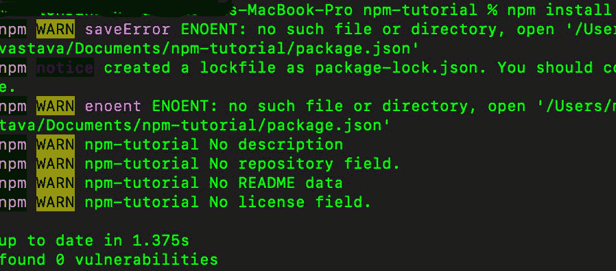
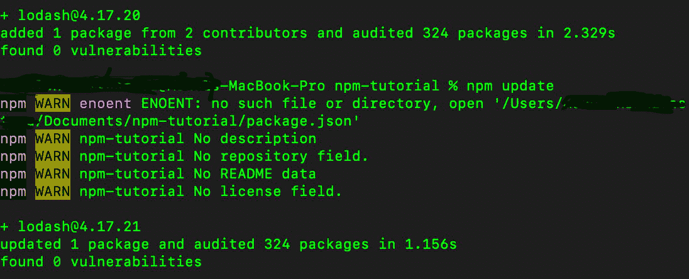
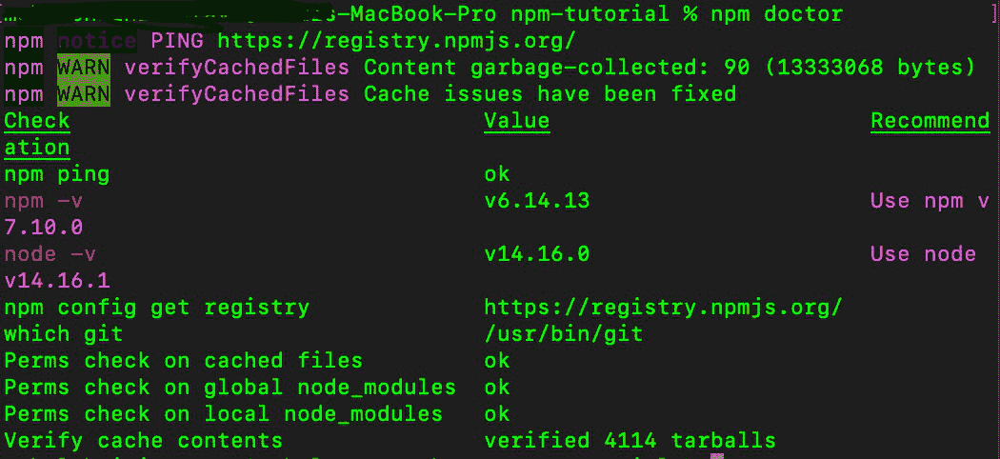
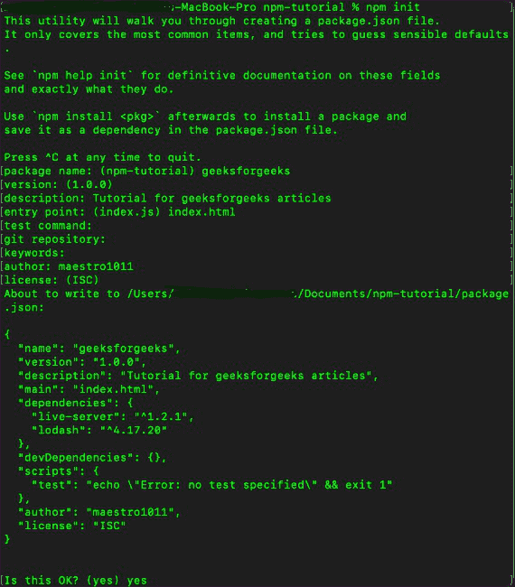
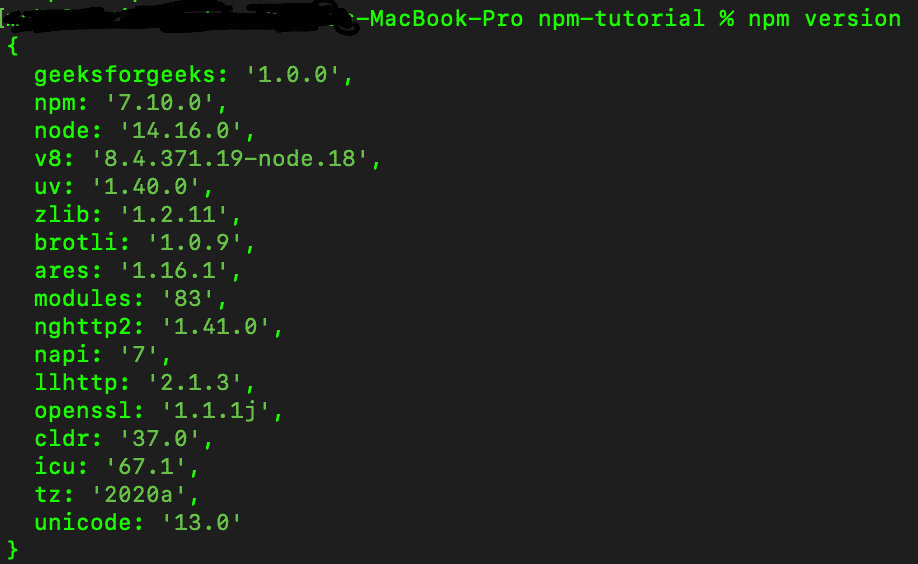
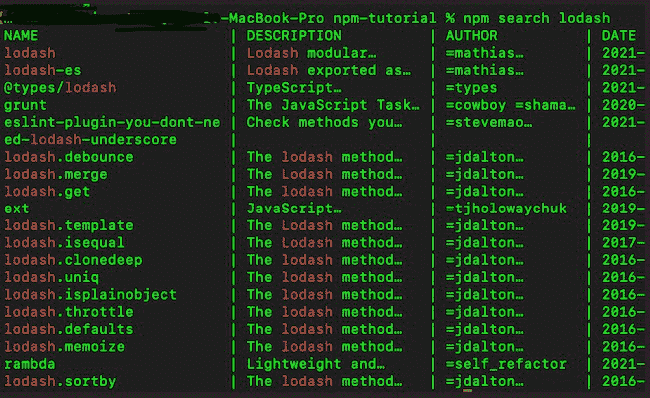
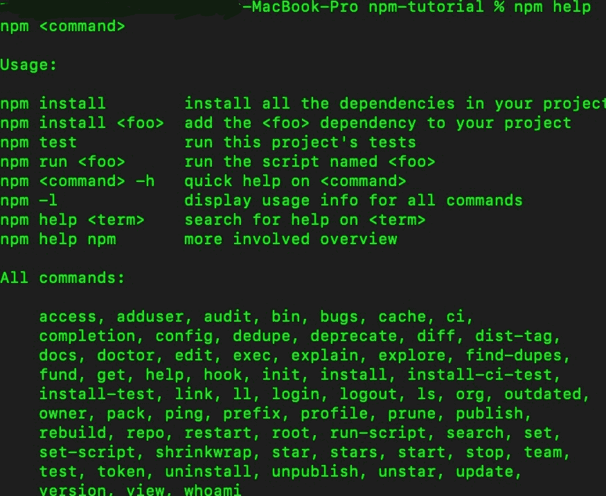

# 每个 Node.js 开发者都应该知道的 15 个 npm 命令

> 原文:[https://www . geesforgeks . org/15-NPM-commands-every-node-js-developer-应知/](https://www.geeksforgeeks.org/15-npm-commands-that-every-node-js-developer-should-know/)

**NPM** 代表节点包管理器，是节点 JavaScript 平台的包管理器。它将模块放在适当的位置，以便节点可以找到它们，并智能地管理依赖关系冲突。最常见的是，它用于发布、发现、安装和开发节点程序。

**每个开发人员都应该知道的一些重要 npm 命令有:**

*   **NPM Install Command:** Installs a package in the *package.json* file in the local *node_modules* folder.

    ```js
    npm install
    ```

    示例:

    

    图中显示了“npm install”的用法，即安装 package.json 和包-lock.json

*   **NPM Uninstall Command:** Remove a package fromthe *package.json* file andremoves the module from the local *node_modules* folder.

    ```js
    npm uninstall 
    ```

    示例:

    

    图中显示了一个程序包“lodash ”,它是一个正在使用 npm 卸载命令卸载的 npm 程序包

*   **NPM Update Command:** This command updates the specified package. If no package is specified then it updates all the packages in the specified location.

    ```js
    npm update 
    ```

    示例:

    

    最初的 lodash 版本 4.17.20 ->使用 npm update 命令更新到 4.17.21

*   **NPM Global Update Command:** This command will apply the update action to each globally installed package.

    ```js
    npm update -g
    ```

    示例:

    

    npm update -g 会更新所有可用的软件包。

*   **NPM 弃用命令:**该命令将弃用包的 NPM 注册表，向所有试图安装它的人提供弃用警告。

    ```js
    npm deprecate
    ```

*   **NPM Outdated Command:** Checks the registry if any (or specified) package is outdated. It prints a list of all packages which are outdated.

    ```js
    npm outdated
    ```

    示例:

    

    终端中显示的 lodash 包已经过时，可以更新

*   **NPM Doctor Command:** Checks our environment so that our npm installation has what it needs to manage our JavaScript packages.

    ```js
    npm doctor
    ```

    示例:

    

*   **NPM Initialize Command** Creates a package.json file in our directory. It basically asks some questions and finally creates a package.json file in the current project directory.

    ```js
    npm init
    ```

    

    图显示了 npm init 命令中涉及的步骤。

*   **NPM 启动命令**运行脚本中*启动*属性中定义的命令。如果没有定义，它将运行*节点 server.js* 命令。

    ```js
    npm start
    ```

*   **NPM Build Command:** It is used to build a package.

    ```js
    npm build
    ```

    示例:

    

    显示有一个主要更新可用，可以使用 changelog 之后给出的命令进行更新。

*   **NPM List Command:** Lists all the packages as well as their dependencies installed.

    ```js
    npm ls
    ```

    示例:

    

    npm ls 列出了 package.json 文件中安装的所有 npm 包。

*   **NPM Version Command:** Bumps a package version.

    ```js
    npm version
    ```

    示例:

    

    列出项目中安装或使用的所有软件包版本。

*   **NPM Search Command:** Searches the npm registry for packages matching the search terms.

    ```js
    npm search
    ```

    

    显示包 lodash 和所有提交的描述以及进行更改的作者。

*   **NPM Help Command:** Searches npm help documentation for a specified topic. It is used whenever the user needs help to get some reference.

    ```js
    npm help
    ```

    示例:

    

*   **NPM 所有者命令:**管理发布包的所有权。它用于管理包所有者。

    ```js
    npm owner
    ```