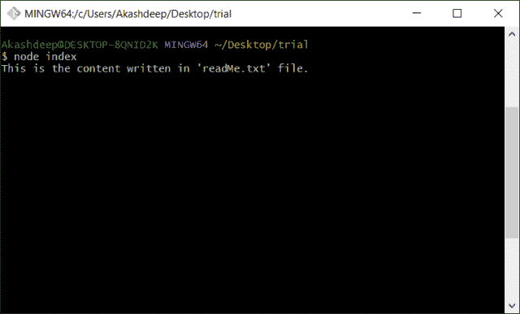
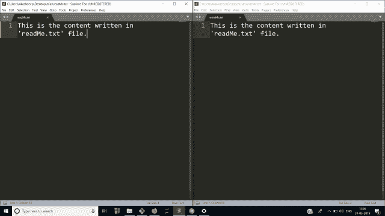

# node . js 中的文件处理

> 原文:[https://www.geeksforgeeks.org/file-handling-in-node-js/](https://www.geeksforgeeks.org/file-handling-in-node-js/)

编程语言提供的最重要的功能是从计算机中读取和写入文件。Node.js 提供了从计算机读取和写入文件的功能。在 Node.js 中读写文件是通过使用名为 **fs 模块**的 node.js cool 模块之一来完成的。
fs 模块将使用给定的语句安装。

```js
npm install fs --save
```

**注意:**上面命令中的 npm 代表节点包管理器，我们从这里安装所有的依赖项。节点 5.0.0 版本之后不再需要–save 标志，因为我们现在安装的所有模块都将被添加到依赖项中。

该文件可以在 node.js 中以同步和异步方式读写。同步方法是一种代码阻塞方法，这意味着给定的方法将阻塞代码的执行，直到代码的执行完成(即读取或写入完整的文件)。另一方面，异步方法有一个回调函数，该函数在给定方法执行完成时执行，因此允许代码在其执行完成时运行。因此，它是非阻塞的。

**读取文件的同步方法:**要以同步模式读取文件，我们在 fs 模块中使用了一种方法，即 readFileSync()。它有两个参数，第一个是完整路径的文件名，第二个参数是字符编码，一般是“utf-8”。

```js
// Require the given module
var fs = require('fs');

// Use readFileSync() method

// Store the result (return value) of this
// method in a variable named readMe

// Keep the file in the same folder so
// donot need to specify the complete path
var readMe = fs.readFileSync('readMe.txt', 'utf-8');

// log the content of file stored in
// a variable to screen
console.log(readMe);
```

**输出:**


**写入文件的同步方法:**为了以同步模式写入文件，我们在 fs 模块中使用了一种方法，即 writeFileSync()。它需要两个参数，第一个是文件名，包含要写入内容的完整路径，第二个参数是要写入文件的数据。

```js
// Require the given module
var fs = require('fs');

// Use readFileSync() method

// Store the result (return value) of this
// method in a variable named readMe
var readMe = fs.readFileSync('readMe.txt', 'utf-8');

// Store the content and read from
// readMe.txt to a file WriteMe.txt
fs.writeFileSync('writeMe.txt', readMe);
```

**读写文件的异步方法:**要在 fs 模块中以异步模式读写文件，我们使用 readFile()和 writeFile()方法。fs.readFile()取三个参数第一个是有完整路径的文件名，第二个参数取字符编码一般为' utf-8 '，第三个参数是回调函数(读取完整文件后激发)有两个参数，一个是读取文件时万一出错的错误，第二个是我们读取文件后检索到的数据，fs.writeFile()也取三个参数，文件名有其完整路径， 第二个参数是要写入文件的数据，第三个参数是回调函数，在写入文件时发生错误时会触发该函数。

**注意:**异步方法首先完成任务(读取文件)，然后触发回调函数。

```js
// Require the given module
var fs = require('fs');

// Use readFile() method
fs.readFile('readMe.txt', 'utf-8', function(err, data) {

    // Write the data read from readeMe.txt
    // to a file writeMe.txt
    if( !err )
        fs.writeFile('writeMe.txt', data, (err)=>{
            if( err ) {
                throw err;
            }
        });
    else
        throw err;
});
```

**输出:**
