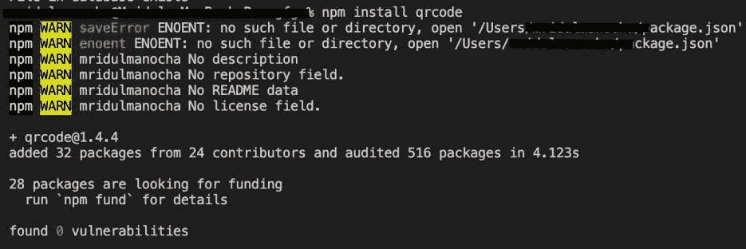
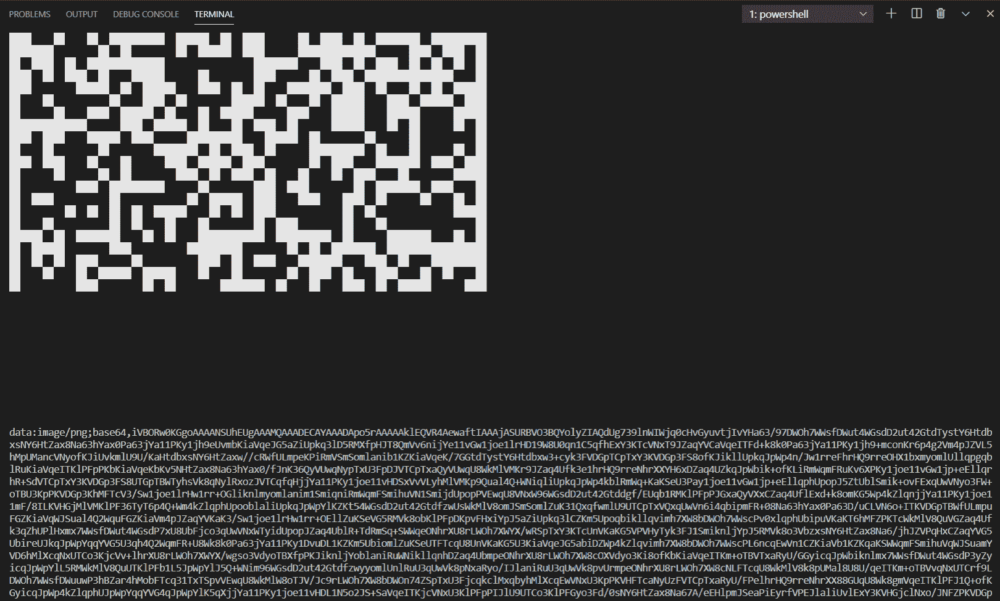

# 在 Node.js

生成一个二维码

> 原文:[https://www . geesforgeks . org/generate-a-QR-code-in-node-js/](https://www.geeksforgeeks.org/generate-a-qr-code-in-node-js/)

在本文中，我们将讨论如何使用 [Node.js](https://www.geeksforgeeks.org/nodejs-tutorials/) 生成二维码。一个**二维码**是一个带有嵌入式数据的单色矩阵，用于制造业，以便给产品贴标签。如今二维码被用于基于合众国际社的应用程序、一些聊天应用程序(如 WhatsApp)和游戏商店的支付。这些是一些最常见的例子，但是我们可以在我们的应用程序中使用二维码来达到更好的目的。如果我们正在使用 MEAN/MERN 堆栈或任何与 JavaScript 相关的技术创建一个网站，我们可以生成二维码来构建高级应用程序。

让我们通过执行以下命令来设置我们的工作空间:

**创建目录:**

```
npm init -y
mkdir src
cd src
nano app.js
```


**安装包:**我们需要安装一个 [npm](https://www.geeksforgeeks.org/node-js-npm-node-package-manager/) 包才能继续工作。

```
npm install qrcode
```



我们有两种方法可以使用这个库来生成二维码。第一个用于开发和测试。另一个用于部署。

*   让我们创建要隐藏在二维码中的数据:

```
let data = {
    name:"Employee Name",
    age:27,
    department:"Police",
    id:"aisuoiqu3234738jdhf100223"
}
```

*   我们需要使用 [JSON.stringify()](https://www.geeksforgeeks.org/javascript-json-stringify-method/#:~:text=The%20JSON.,the%20form%20of%20the%20strings.) 方法将数据转换为字符串格式，以便可以轻松执行进一步的操作。

```
// Converting into String data
let stringdata = JSON.stringify(data)
```

*   二维码包的两种方法用于编码数据。第一种方法将在终端本身打印代码。但是这种方法对于部署是没有用的。但是对于测试来说是很好的。

1.toString(文本，[选项]，[cb(错误，字符串)]

```
// Print the QR code to terminal
QRCode.toString(stringdata,{type:'terminal'}, function (err, url) {
   if(err) return console.log("error occured")
   console.log(url)
 })
```

2.toDataURL(文本、[选项]、[cb(错误，url)])

```
// Get the base64 url
QRCode.toDataURL(stringdata, function (err, url) {
    if(err) return console.log("error occured")
    console.log(url)
})
```

还有一个附加的 toCanvas()方法，但是它的功能可以在 toDataURL()方法中使用。

**Index.js**

## java 描述语言

```
// Require the package
const QRCode = require('qrcode')

// Creating the data
let data = {
    name:"Employee Name",
    age:27,
    department:"Police",
    id:"aisuoiqu3234738jdhf100223"
}

// Converting the data into String format
let stringdata = JSON.stringify(data)

// Print the QR code to terminal
QRCode.toString(stringdata,{type:'terminal'},
                    function (err, QRcode) {

    if(err) return console.log("error occurred")

    // Printing the generated code
    console.log(QRcode)
})

// Converting the data into base64
QRCode.toDataURL(stringdata, function (err, code) {
    if(err) return console.log("error occurred")

    // Printing the code
    console.log(code)
})
```

使用以下命令运行 **index.js** 文件:

```
node index.js
```

**输出:**

