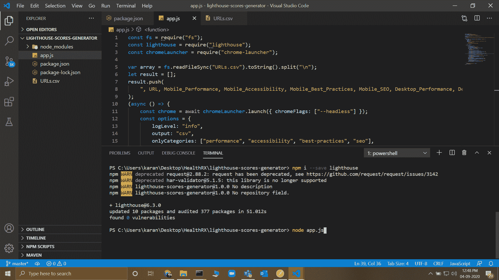
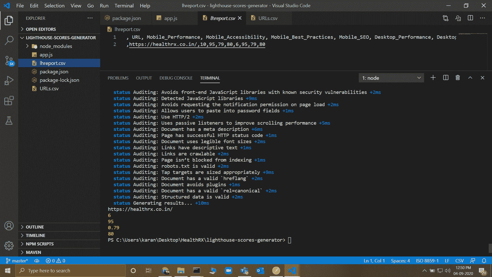

# 使用 Node.js

生成灯塔得分

> 原文:[https://www . geesforgeks . org/generating-灯塔-scores-use-node-js/](https://www.geeksforgeeks.org/generating-lighthouse-scores-using-node-js/)

**灯塔**是一个开源工具，用来生成任何网页的性能。我们可以使用 CLI 或 chrome extension 为网页生成灯塔评分，但这里描述了如何为一个 csv 文件中存在的多个 URL 生成灯塔评分，并为两个**移动**和**桌面**视图生成由**性能、可访问性、最佳实践**和 **SEO** 评分组成的 csv 文件。

我们使用 npm 提供的灯塔包，也使用 chrome-launcher 来生成数十个网站。我们可以下载该软件包并按如下方式使用它们:

*   ```js
    npm install --save lighthouse
    ```

*   ```js
    const lighthouse = require("lighthouse")
    ```

导入这个第三方包后，我们准备通过使用 NodeJS 提供的默认 fs 包的 readFileSync 方法来进一步导入 URL 文件，并将这些 URL 存储在一个数组中，我们将从该数组中遍历所有 URL，并为 Mobile 和 Desktop 策略生成分数。

**方法:**
按照以下步骤实现解决方案:

1.  使用默认文件系统 npm 包读取 csv 文件。
2.  将数据转换为字符串，并将其拆分为数组。
3.  推送数组中的标题列。
4.  使用 chromeLauncher.launch()方法启动 chrome。
5.  创建一个选项对象，以指定输出格式、类别、审核和其他自定义的详细信息(如果您希望在输出中有任何自定义的话)。
6.  遍历数组中的所有 URL，并对每个 URL 执行以下操作:
    *   运行两个循环:一个用于移动，另一个通过指定选项用于桌面评分。strategy=mobile 或 options.strategy = desktop。
    *   调用灯塔函数，url 即 array[i]作为第一个参数，options 对象作为第二个参数。
    *   返回的对象将存储调用灯塔函数后收到的详细信息。
    *   我们可以从这个对象中获取分数，由于分数是小数，我们需要将它乘以 100，得到百分比。
    *   在结果中推分数。
7.  将结果附加到 csv 文件中并结束程序。

**文件名:app.js**

```js
// Import the required npm packages
const fs = require("fs");
const lighthouse = require("lighthouse");
const chromeLauncher = require("chrome-launcher");

// Read the csv file and store the
// urls in an array
var array = fs.readFileSync("URLs.csv")
                .toString().split("\n");

// Declare a resultant array to store 
// the generated scores and initialize
// it with headings
let result = [];
result.push(
  ", URL, Mobile_Performance, Mobile_Accessibility, 
    Mobile_Best_Practices, Mobile_SEO, 
    Desktop_Performance, Desktop_Accessibility, 
    Desktop_Best_Practices, Desktop_SEO"
);

// The async await is used to ensure 
// non-blocking code execution 
(async () => {
  const chrome = await chromeLauncher
    .launch({ chromeFlags: ["--headless"] })

  // Declaring an object to specify score 
  // for what audits, categories and type
  // of output that needs to be generated 
  const options = {
    logLevel: "info",
    output: "csv",
    onlyCategories: ["performance", 
      "accessibility", "best-practices", "seo"],
    audits: [
      "first-meaningful-paint",
      "first-cpu-idle",
      "byte-efficiency/uses-optimized-images",
    ],
    port: chrome.port,
  };

  // Traversing through each URL 
  for (i in array) {

    // Separate strategy for Mobile
    // and Desktop view
    for (let x = 0; x < 2; x++) {
      let configuration = "";

      if (x == 0) options.strategy = "mobile";
      else options.strategy = "desktop";

      const runnerResult = 
        await lighthouse(array[i], options);

      // Current report
      const reportCsv = runnerResult.report;

      // URL to be put only for first iteration 
      // (mobile and not separately for desktop)
      if (x == 0) {
        result.push("\n");
        result.push(runnerResult.lhr.finalUrl);
      }

      // If score can't be determined, NA is 
      // put in the corresponding field.   
      if (runnerResult.lhr.categories.performance.score) {
        result.push(runnerResult.lhr
              .categories.performance.score * 100)
      } else {
        result.push("NA")
      }

      if (runnerResult.lhr.categories.accessibility.score) {
        result.push(runnerResult.lhr
              .categories.accessibility.score * 100)
      } else {
        result.push("NA");
      }

      if (runnerResult.lhr.categories["best-practices"].score) {
        result.push(runnerResult.lhr
            .categories["best-practices"].score * 100)
      } else {
        result.push("NA");
      }

      if (runnerResult.lhr.categories.seo.score) {
        result.push(runnerResult.lhr
              .categories.seo.score * 100)
      } else {
        result.push("NA");
      }
    }
  }

  // Append the result in a report.csv 
  // file and end the program
  fs.appendFileSync("lhreport.csv", result);
  await chrome.kill();
})();
```

**输入:**



安装灯塔包后运行 app.js 文件。

**输出:**



灯塔报告文件(lhreport.csv)在我们运行程序后生成