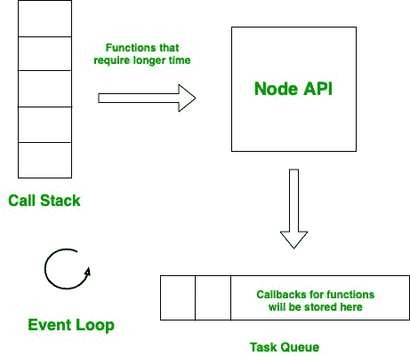

# node . js 实际创建了多少线程？

> 原文:[https://www . geesforgeks . org/多少线程-do-node-js-actual-create/](https://www.geeksforgeeks.org/how-many-threads-does-node-js-actually-create/)

[<u>Node.js</u>](https://www.geeksforgeeks.org/introduction-to-nodejs/) 是一个跨平台的 [<u>JavaScript</u>](https://www.geeksforgeeks.org/javascript-tutorial/) 运行时环境，帮助执行和实现服务器端程序。Node 支持对代码的异步处理，这导致我们认为它是一个单线程平台。让我们详细讨论一下什么是单线程节点，以及它为什么遵循这种方法。

下载安装 Node.js: [<u>下载 Node.js</u>](https://www.geeksforgeeks.org/installation-of-node-js-on-windows/)

**Node 的早期开发:**当 Node 最初被开发时，它遵循每个请求一个线程的范例。这意味着每当用户向服务器发出请求，或者从数据库发出请求时，都会创建一个单独的线程来完成该请求。这种方法的问题是，当请求将时间花在输入/输出操作上时，会导致浪费与这些线程相关的资源。这也导致了更长的执行时间，因为这是同步处理。

**使用单线程和事件循环的概念:**为了克服这个问题，Node 采用了具有事件循环和异步 I/O 操作的单线程系统。使用单个线程允许节点一次执行一个进程，而比通常时间更长的进程由节点应用编程接口和事件循环处理。事件循环使用回调返回由节点应用编程接口处理的函数的输出，任务继续正常执行，直到处理完整个代码。



节点的单线程工作

这种方法被认为是非常有效的，但是这种方法也有一个缺点。当我们有许多需要同步处理的 CPU 密集型任务时，这种方法将不起作用，因为它将花费很长时间并阻塞代码。由于 JavaScript 和 Node 不是为 CPU 任务而设计的，这是一个例外情况，将通过使用 [<u>工作线程</u>](https://www.geeksforgeeks.org/node-js-worker-threads/) 进行不同的处理。

**示例:**让我们考虑一个示例来了解事件循环是如何工作的。

## java 描述语言

```
// Simple JavaScript Code to show Event
// loop demonstration for Node
console.log("Geeks");
setTimeout(function cb(){
    console.log("Geeks");
}, 3000);
console.log("For");
```

当我们执行给定的代码时，输出将如下所示。

**输出:**

```
Geeks
For
Geeks
```

这个输出的原因是节点应用编程接口正在处理的 *setTimeout()* 函数的执行。因此，超时将继续单独执行，调用堆栈将继续异步执行其他语句。要了解更多关于 Node 如何阻止代码，请查看 [<u>这篇文章</u>](https://www.geeksforgeeks.org/how-node-js-prevents-blocking-code/) 。

综上所述，Node 和 JavaScript 都是单线程开发的，这有助于节省时间和内存。

**参考文献:**T2【https://www . geeksforgeeks . org/why-node-js-is-单线程语言/