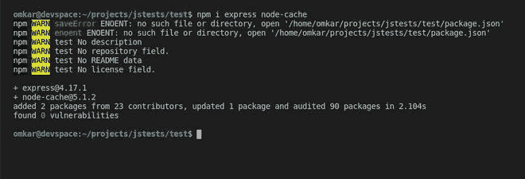
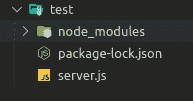
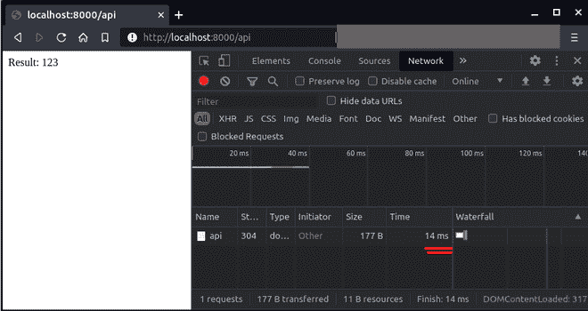
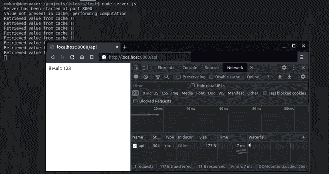

# 如何在 Node.js 中访问缓存数据？

> 原文:[https://www . geesforgeks . org/如何访问-缓存-节点中的数据-js/](https://www.geeksforgeeks.org/how-to-access-cache-data-in-node-js/)

**缓存:**缓存是一种用于提高日常生活中使用的服务器和大量设备性能的技术。
在缓存中，某些计算或任务的结果存储在某个地方，如果再次需要相同的计算，则从该位置本身提供，而不是再次进行计算。这减少了计算量并提高了性能，从而提供了更好的用户体验。
许多应用程序在第一次启动时会缓存数据，因此能够高效地提供响应。类似地，大多数服务器都有高级的端点缓存机制，在大多数情况下可以提供相同的响应。

可以使用各种技术存储缓存，如内存缓存、文件缓存或单独的缓存数据库。
本文使用包[节点缓存](https://www.npmjs.com/package/node-cache)演示了在 Node.js 中缓存的用法，节点缓存是一个内存缓存模块。

**使用节点缓存实现缓存演示。**

**创建基本节点 js 服务器。[使用 express](https://www.geeksforgeeks.org/nodejs-building-simple-rest-api-in-express/) 构建简单节点 REST API**

通过以下命令确保安装了节点:

```
node -v
```


导航到所需的项目目录，并使用以下命令安装快速(用于创建服务器)和节点缓存 npm 包:

```
npm i express node-cache
```



**项目结构:**



**示例:**在目录中创建一个文件 **server.js** ，代码如下:

## server.js

```
// Importing express module
const express = require('express')

// Creating an express object
const app = express()

// Starting server using listen function on port 8000
app.listen(8000, err => { 
   if(err) 
        console.log("Error while starting server")
   else
        console.log("Server has been started at port 8000")
})

app.get('/', (req, res)=>{
    res.send('Home page !')
})
```

**运行以下命令:**

```
node server.js
```


**输出:**打开所需浏览器中的链接: [http://localhost:8000/](http://localhost:8000/) 进行验证


主页

**创建一个简单的应用编程接口，执行一个昂贵的操作来提供响应(模拟外部应用编程接口/数据库查询)。**

在 **server.js** 末尾添加以下代码

## server.js

```
function heavyComputation(){
     let temp = 0;
     for(let i=0; i<100000; i++)
          temp = (Math.random()*5342)%i;
     return 123;
}

app.get('/api', (req, res)=>{
     let result =  heavyComputation();
     res.send("Result: "+result);
})
```

通过 ***停止服务器，通过 ***节点再次启动服务器。
在浏览器中，打开 Chrome 开发工具中的网络选项卡，检查获得响应所需的时间。******



**实现节点缓存:**导入[节点缓存 npm 模块](https://www.npmjs.com/package/node-cache)并创建一个新的节点缓存对象

```
const NodeCache = require( "node-cache" );
const myCache = new NodeCache();
```

**节点缓存有以下主要功能:**

*   **。set(key，val，[ ttl ]):** 用于设置缓存中某个特定键对应的某个值。必须使用相同的键来检索该值。
*   **。获取(键):**用于获取设置为指定键的值。如果密钥不存在，它将返回 undefined。
*   **有(键):**用于检查缓存是否已经为指定键设置了某个值。如果存在则返回 true，否则返回 false。

**通过以下方式实现缓存:**

*   在应用编程接口请求时，使用散列(键)函数检查缓存是否已经设置了键
*   如果缓存有关键字，则通过 get(key)函数检索缓存的值并使用它，而不是再次执行操作。(这样可以节省时间)
*   如果缓存没有键，请执行所需的操作，并在发送响应之前设置该键的值，以便可以通过缓存的数据直接响应进一步的请求。

**server . js 中的最终代码:**

## server.js

```
// Importing express module
const express = require('express')

// Importing NodeCache and creating a 
// new object called myCache
const NodeCache = require('node-cache')
const myCache = new NodeCache()

// Creating an express object
const app = express()

// Starting server using listen
// function on port 8000
app.listen(8000, err => { 
   if(err) 
        console.log("Error while starting server")
   else
        console.log(
        "Server has been started at port 8000")
})

app.get('/', (req, res)=>{
    res.send('Home page !')
})

// Function to demonstrate heavy computation
// like API requests, database queries, etc.
function heavyComputation(){
     let temp = 0;
     for(let i=0; i<100000; i++)
          temp = (Math.random()*5342)%i;
     return 123;
}

app.get('/api', (req, res)=>{

     // If cache has key, retrieve value
     // from cache itself
     if(myCache.has('uniqueKey')){
          console.log('Retrieved value from cache !!')

          // Serve response from cache using
          // myCache.get(key)
          res.send("Result: " + myCache.get('uniqueKey'))
     }else{

          // Perform operation, since cache 
          // doesn't have key
          let result =  heavyComputation()

          // Set value for same key, in order to 
          // serve future requests efficiently
          myCache.set('uniqueKey', result)

          console.log('Value not present in cache,'
                + ' performing computation')
          res.send("Result: " + result)
     }
})
```

*   按 Ctrl+C 停止服务器，按 node server.js 重新启动。
*   重新加载网页一次。执行该时间计算。也可以在控制台上看到
*   再次重新加载网页。这一次数据是从控制台上看到的缓存中提供的。
*   进一步的重载将从缓存中提供数据，从而节省计算。



**注意:**响应时间之间的差异在这里并不显著，因为计算量非常少，但是对于大型项目来说，它提供了巨大的性能提升。
例如，GeeksforGeeks 还为各种目的使用高级缓存机制来实现效率。