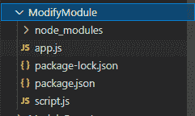
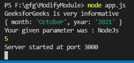

# 如何在 Node.js 中给模块增加新的功能？

> 原文:[https://www . geesforgeks . org/如何向节点中的模块添加新功能-js/](https://www.geeksforgeeks.org/how-to-add-new-functionalities-to-a-module-in-node-js/)

[Node.js](https://www.geeksforgeeks.org/nodejs-tutorials/) 是一个开源的跨平台运行时环境，构建在 Chrome 的 V8 JavaScript 引擎上，用于在浏览器之外执行 JavaScript 代码。你需要记住 NodeJS 不是一个框架，也不是一种编程语言。在本文中，我们将讨论如何向模块添加新功能。

**模块**是*节点*的组成部分。可以要求三种不同类型的模块:

*   NodeJS 提供的内置或默认模块。
*   可通过 *npm* 或*纱线*安装的开源模块。
*   私有模块是由美国程序员根据他们的需要定义的。

在本文中，我们将安装 NodeJS 的**模块，并为其添加新的功能。要添加新功能，首先导入模块，然后根据我们的需要添加功能。**

****语法:****

```
<module_name>.<new_functionality_name> = expression or function
```

**然后导出该模块。让我们一步一步来实现它。**

****步骤 1:** 在项目文件夹中创建一个“ ***app.js*** ”文件，并使用 *npm* 初始化项目。**

```
npm init
```

****步骤 2:** 创建一个“ ***script.js*** ”文件，并使用 *npm* 安装 ***express*** 包。**

```
npm install express
```

****项目结构:****

**

项目结构** 

****第三步:**现在让我们为“***script . js”***文件编码。其中，我们需要*快速 npm* 包，然后添加新功能，最后导出包。在其中，我们将添加一个变量、一个对象和两个函数用于演示目的。**

****文件名:script.js****

## **java 描述语言**

```
// Requiring the express module installed through npm
const express = require('express')

// Added a variable
express.fact = 'GeeksforGeeks is very informative'

// Added an object
express.info = {
    month: 'October',
    year: '2021'
}

// Added a function
express.print = function(str){
    return 'Your given parameter was : '+str
}

// Added a function
express.add = function(a,b){
    return a+b
}

// Exported so that modified express
// module can be used
module.exports = express
```

****第四步:**现在我们将对“ ***app.js*** ”文件进行编码。在其中，我们需要从“ ***script.js*** 文件中导出 *express* 模块。并使用该模块演示它的新旧功能。**

****文件名:app.js****

## **java 描述语言**

```
// Requiring modified express module
// from script.js
const express = require('./script.js')

// The default attribute of express
// that makes the app object
const app = express()

// New functionality of variable
console.log(express.fact)

// New functionality of object
console.log(express.info)

// New functionality of function
console.log(express.print('NodeJs'))

// New functionality of function
console.log(express.add(2,3))

// Default functionality to create server
app.listen(3000,function(req,res){
    console.log('Server started at port 3000')
})
```

****步骤 5:** 使用以下命令运行 **app.js** 文件:**

```
node app.js
```

*****输出:*****

**

输出**