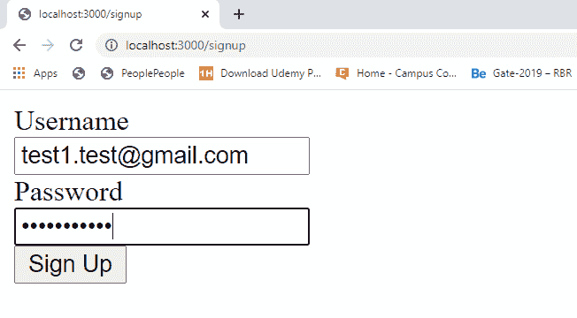
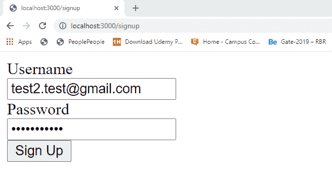
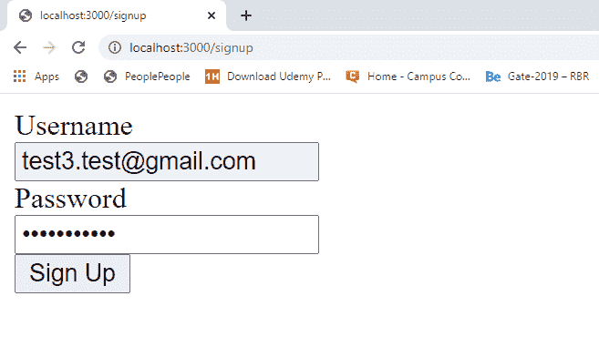
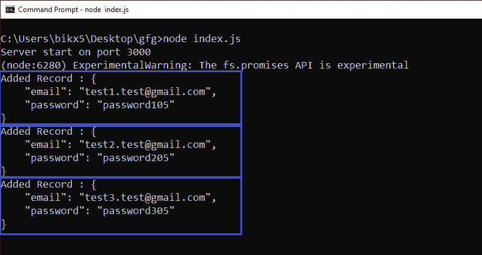
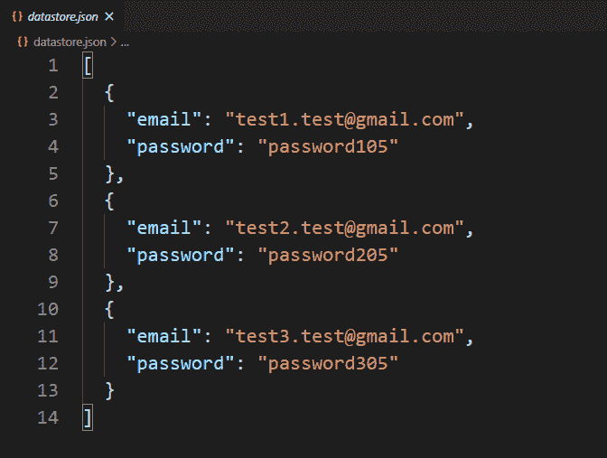

# 如何在 Node.js 中添加自己本地/自定义数据库中的记录？

> 原文:[https://www . geesforgeks . org/how-add-records-in-your-local-custom-database-in-node-js/](https://www.geeksforgeeks.org/how-to-add-records-in-your-own-local-custom-database-in-node-js/)

自定义数据库表示文件系统中的本地数据库。有两种类型的数据库“SQL”和“NoSQL”。在 SQL 数据库中，数据以表的方式存储，而在 Nosql 数据库中，数据以某种特定的方式独立存储，以独立标识每条记录。我们还可以用 Nosql 方式在本地创建自己的数据库或数据存储。

创建本地数据库并向其中添加记录需要一些步骤。这些步骤如下:

*   在项目目录的根目录下创建 package.json 文件。
    **命令创建包文件**

    ```
    npm init -y
    ```

*   安装 express 和 body-parser 包。
    **命令安装软件包**

    ```
    npm install express body-parser
    ```

*   创建一个显示表单的 GET 路径(将信息提交给数据库的 HTML 表单)。
*   创建后续的帖子路由来处理表单提交请求。
*   将服务器设置为在特定端口(开发者端口–3000)上运行
*   创建一个存储库文件，并向其中添加与创建数据库和存储数据相关的所有逻辑。

本示例创建一个名为“datastore.json”的本地数据库，并将用户信息存储到其中。

**文件名:index.js**

```
const express = require('express')
const bodyParser = require('body-parser')
const repo = require('./repository')

const app = express()

const port = process.env.PORT || 3000

// The body-parser middleware 
// to parse form data
app.use(bodyParser.urlencoded({extended : true}))

// Get route to display HTML form
app.get('/signup', (req, res) => {
  res.send(`
    <div>
      <form method='POST'>
        <div>
          <div>
            <label id='email'>Username</label>
          </div>
          <input type='text' name='email' 
                    placeholder='Email' 
          for='email'>
        </div>

        <div>
          <div>
            <label id='password'>Password</label>
          </div>
          <input type='password' name='password'
                     placeholder='Password' 
          for='password'>
        </div>

        <div>
          <button>Sign Up</button>
        </div>
      </form>
    </div>
  `);
})

// Post route to handle form submission 
// logic and add data to the database
app.post('/signup', async (req, res) => {
  const {email, password} = req.body

  const addedRecord = await 
    repo.createNewRecord({email, password})

  console.log(`Added Record : 
    ${JSON.stringify(addedRecord, null, 4)}`)

  res.send("Information added to the"
         + " database successfully.")
})

// Server setup
app.listen(port, () => {
  console.log(`Server start on port ${port}`)
})
```

**文件名:repository.js**

```
// Importing node.js file system module 
const fs = require('fs')

class Repository {

  constructor(filename) {

    // Filename where datas are going to store
    if (!filename) {
      throw new Error(
'Filename is required to create a datastore!')
    }

    this.filename = filename

    try {
      fs.accessSync(this.filename)
    } catch (err) {

      // If file not exist
      // it is created with empty array
      fs.writeFileSync(this.filename, '[]')
    }
  }

  // Logic to add data
  async createNewRecord(attributes) {

    // Read filecontents of the datastore
    const jsonRecords = await 
      fs.promises.readFile(this.filename,{
      encoding : 'utf8'
    })

    // Parsing JSON records in JavaScript
    // object type records
    const objRecord = JSON.parse(jsonRecords)

    // Adding new record
    objRecord.push(attributes)

    // Writing all records back to the file
    await fs.promises.writeFile(
      this.filename,
      JSON.stringify(objRecord, null, 2)   
    )

    return attributes;
  }

}

// The 'datastore.json' file created at
// runtime and all the information 
// provided via signup form store in
// this file in JSON formet.
module.exports = new Repository('datastore.json')
```

**包联文件:**


**运行程序的步骤:**
使用以下命令运行 index.js 文件:

```
node index.js
```

**提交回复的表单:**
**注意:**这里三个回复一个接一个提交，所有回复都存储在 datastore.json 文件中。







**提交请求后重定向页面:**


**输出:**


**数据库:**


**注意:**第一次运行的程序数据库(datastore.json)文件在项目目录中不存在，它在运行程序后动态创建并存储提交的响应。之后，所有提交的回复都被逐一添加到数据库中。