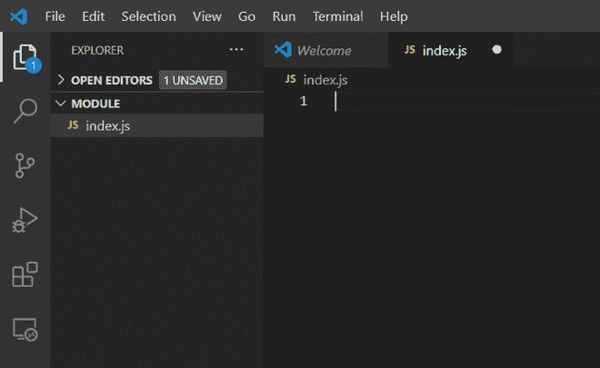

# 如何使用 Node.js 创建目录？

> 原文:[https://www . geesforgeks . org/如何使用节点创建目录-js/](https://www.geeksforgeeks.org/how-to-create-a-directory-using-node-js/)

在本文中，我们将使用**节点创建一个**目录**。**

**NodeJS** 有 **[Filesystem(fs)](https://www.geeksforgeeks.org/node-js-file-system/)** 核心模块，实现与文件系统的交互，有 **[Node.js fs.mkdir()方法](https://www.geeksforgeeks.org/node-js-fs-mkdir-method/)** 或 **[Node.js fs.mkdirSync()方法](https://www.geeksforgeeks.org/node-js-fs-mkdirSync-method/)** 方法，创建新目录/父目录。

**[Node.js fs.mkdir()方法](https://www.geeksforgeeks.org/node-js-fs-mkdir-method/) :** 我们用 **fs.mkdir()** 方法新建一个目录。最初，我们有单个文件 **index.js，**，正如我们在给定图像中看到的。



index.js

**示例:**编辑 index.js 文件。

## java 描述语言

```js
const fs = require("fs");

const path = "./new-Directory";

fs.access(path, (error) => {

  // To check if the given directory 
  // already exists or not
  if (error) {
    // If current directory does not exist
    // then create it
    fs.mkdir(path, (error) => {
      if (error) {
        console.log(error);
      } else {
        console.log("New Directory created successfully !!");
      }
    });
  } else {
    console.log("Given Directory already exists !!");
  }
});
```