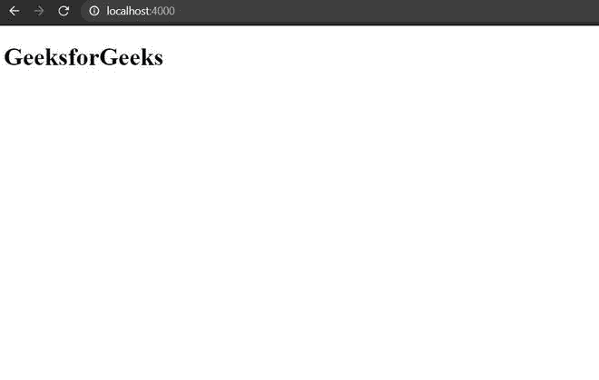
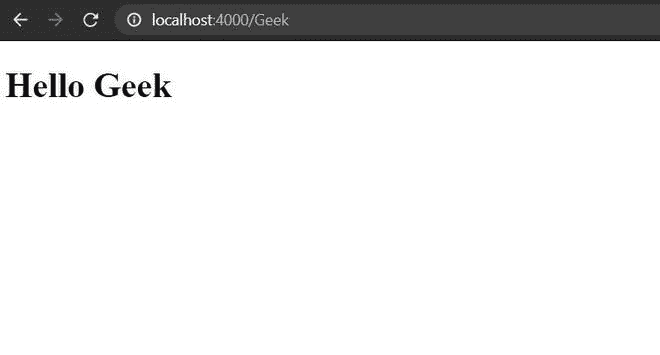

# 如何在 Node.js 中使用 ExpressJS 做模板？

> 原文:[https://www . geesforgeks . org/how-do-templating-using-expressjs-in-node-js/](https://www.geeksforgeeks.org/how-to-do-templating-using-expressjs-in-node-js/)

**模板引擎:**一个模板引擎基本上帮助我们用最少的代码使用静态模板文件。在运行时，模板引擎在客户端用实际值替换所有变量。

**模板引擎示例:**

*   EJS(嵌入式 JavaScript 模板)
*   哈巴狗
*   髭

在本文中，我们将使用 EJS 引擎。

*   **设置 NPM 套餐:**

    ```js
    npm init -y
    ```

*   **安装依赖项**

    ```js
    npm install ejs express --save
    ```

**基本 ExpressJS 服务器:**

## java 描述语言

```js
const express = require('express');
const app = express();

app.get('/' , (req , res)=>{
    res.send("GeeksforGeeks");
})

app.listen(4000 , ()=>{
    console.log("server is running on port 4000");
})
```

**输出:**


**添加 EJS 引擎:**这里我们需要设置 ejs 作为我们的视图引擎。

## java 描述语言

```js
const express = require('express');
const app = express();

app.set('view engine', 'ejs');

app.get('/' , (req , res)=>{
    res.send("GeeksforGeeks");
})

app.listen(4000 , ()=>{
    console.log("server is running on port 4000");
})
```

## 索引. ejs

```js
<!--Ejs File-->
<!DOCTYPE html>
<html lang="en">
<head>
    <meta charset="UTF-8">
    <meta http-equiv="X-UA-Compatible" content="IE=edge">
    <meta name="viewport" 
          content="width=device-width, initial-scale=1.0">
</head>
<body>
    <h1>GeeksforGeeks</h1>
</body>
</html>
```

**输出:**



输出

**EJS 文件渲染:**

## java 描述语言

```js
const express = require('express');
const app = express();

app.set('view engine', 'ejs');

app.get('/:name' , (req , res)=>{
    res.render("index" , {
        data : req.params.name
    });
})

app.listen(4000 , ()=>{
    console.log("server is running on port 4000");
})
```

**数据存储:**这里我们要存储数据`var name = "<%= data %>"`。

## java 描述语言

```js
<!DOCTYPE html>
<html lang="en">
<head>
    <meta charset="UTF-8">
    <meta http-equiv="X-UA-Compatible" content="IE=edge">
    <meta name="viewport" 
          content="width=device-width, initial-scale=1.0">
    <script type="text/javascript">
        var name = "<%= data %>"
        setTimeout(()=>{
        document.getElementById('hello').innerHTML = name;
        },1000);
    </script>
</head>
<body>
    <h1 id="hello"></h1>
</body>
</html>
```

**输出:** 