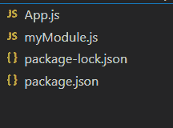

# 如何在 Node.js 中用静态方法导出类？

> 原文:[https://www . geesforgeks . org/如何使用节点中的静态方法导出类-js/](https://www.geeksforgeeks.org/how-to-export-class-with-static-methods-in-node-js/)

我们知道 JS **static** 关键字定义了一个类的静态属性和方法。不能从类的实例中调用静态方法或属性。相反，他们从类本身调用。

```js
class Car {
    static run() { console.log('Car running...') }
}

// Error: (intermediate value).run
// is not a function
( new Car() ).run()

// Car running...
Car.run()
```

【require()和 module.exports 之间的关系:默认情况下， *module.exports* 指向一个对象。*模块导出*的值可以是文字、函数、对象等。当我们导出一个模块时，这意味着我们导出*模块的值。*

***require()*****功能的任务是导入*模块的值，从调用该模块的地方导出模块中的*。*模块*中 *require()* 函数返回的值等于*模块，导出*模块*中的*对象。因此，关系如下所示。**

```js
require() == module.exports
```

****用静态方法导出类:**如果你想从 NodeJS 模块中用静态方法导出一个类，那么思路就像导出类本身一样简单。让我们看一些例子。**

****步骤 1:** 使用以下命令创建一个 NodeJS 项目。**

```js
mkdir Project&& cd Project
npm init -y
```

****第二步:**在项目根目录下创建两个 JS 文件，命名为 **App.js** 和 **myModule.js****

****项目结构:**会是这样的。**

****

****第三步:**用以下代码编辑 *myModule.js* 。**

## **my module . js-我的模组. js**

```js
// myModule module
class Car{
    static run() { console.log('Car running...') }
}

// Export this module
module.exports = Car
```

**我们已经在 *myModule.js* 中创建了一个名为 **Car** 的类，使用静态方法 **run()** ，并通过将类本身分配给 *module.exports* 来导出它**

****第四步:**接下来，用下面的代码编辑你的 *App.js* 。**

## **App.js**

```js
// Import myModule
const mercedes = require('./myModule')

// Printing data
console.log(mercedes)

// Invoke static function
mercedes.run()
```