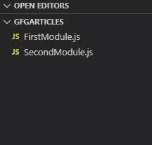

# 如何将承诺从一个模块导出到另一个模块节点. js？

> 原文:[https://www . geesforgeks . org/如何导出-承诺-从一个模块到另一个模块-节点-js/](https://www.geeksforgeeks.org/how-to-export-promises-from-one-module-to-another-module-node-js/)

JavaScript 是一种异步单线程编程语言。异步意味着同时处理多个进程。[回调函数](https://www.geeksforgeeks.org/node-js-callback-concept/)因 JavaScript 语言的异步特性而异。一个**回调**是一个任务完成时调用的函数，因此有助于防止任何类型的阻塞，一个回调函数允许其他代码在此期间运行，但是回调函数的主要问题是[回调地狱](https://www.geeksforgeeks.org/what-is-callback-hell-in-node-js/#:~:text=This%20is%20a%20big%20issue,difficult%20to%20read%20and%20maintain.)问题。回调地狱的解决方案是使用本文中的承诺，我们将讨论如何从一个模块导出到另一个模块。

**项目结构:**会是这样的。



## 第一个模块. js

```
function check(number) {
  return new Promise((Resolve, reject) => {
    if (number % 2 == 0) {
      Resolve("The number is even")
    }
    else {
      reject("The number is odd")
    }
  })
}

// Exporting check function
module.exports = {
  check: check
};
```

## 第二个模块. js

```
// Importing check function
const promise = require("./FirstModule.js")

// Promise handling
promise.check(8).then((msg) => {
  console.log(msg)
}).catch((msg) => {
  console.log(msg)
})
```

使用以下命令运行 **SecondModule.js** 文件:

```
node SecondModule.js
```

**输出:**

```
The number is even
```