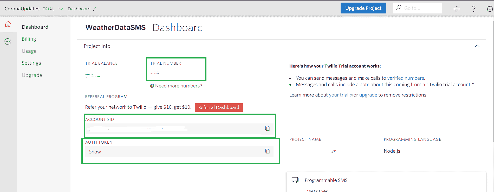
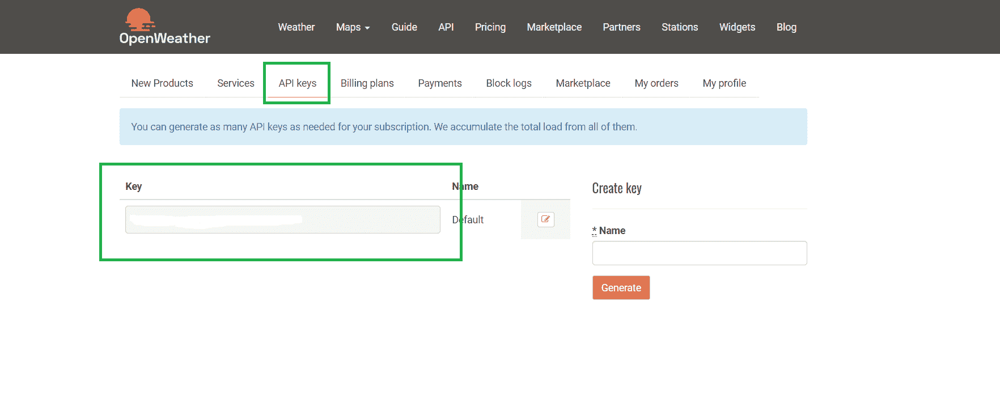

# 如何使用 Node.js 和 Twilio API 在手机上获取每日天气通知？

> 原文:[https://www . geesforgeks . org/how-to-day-weather-notification-on-mobile-use-node-js-and-twilio-API/](https://www.geeksforgeeks.org/how-to-get-daily-weather-notification-on-mobile-using-node-js-and-twilio-api/)

每天寻找天气信息是一项琐碎的任务。作为程序员，我们可以通过创建通知服务来简化这项任务。我们将使用 **Twilio 短信 API** 发送短信，使用 Node.js 编写每天特定时间运行的服务。

**获取 Twilio 凭据:**要使用 Twilio APIs，我们需要注册我们的应用程序，并从 Twilio 的控制台获取 API 密钥。我们需要得到`ACCOUNT SID`、`AUTH TOKEN`和`TRIAL NUMBER`。您可以在[这里](https://www.twilio.com/console/)获取所有这些凭证。



Twilio 控制台

将这些凭据与您的电话号码一起保存到项目根目录下的`.env`文件中。因为将每个凭据保存在单独的文件中是安全的最佳做法。

```
ACC_SID = 'your-account-sid'
AUTH_TOKEN = 'your-auth-token'

TO = 'your-number-with-country-code'
FROM = 'twilio-trial-number'
```

**发送短信:**为了发送短信，我们可以使用 Twilio 的 Node.js 库，使用以下命令安装库:

```
npm install twilio
```

现在让我们通过发送一条消息来测试我们的凭据。将以下代码添加到`index.js`文件中。

```
// Getting Data from .env file
const accountSid = process.env.ACC_SID;
const authToken = process.env.AUTH_TOKEN;

const twilio = require("twilio");
const client = new twilio(accountSid, authToken);

client.messages
    .create({
        body: "Hello from GeeksForGeeks!",
        to: process.env.TO,
        from: process.env.FROM
    })
    .then(message => console.log(message.sid));
```

如果一切顺利的话，你会收到一条 Twilio 发来的短信，短信内容是“GeeksForGeeks 您好！”。

**获取天气信息:**获取最新天气信息，我们将使用[开放天气地图 API](http://openweathermap.org/) ，免费提供。

使用网站上的 API 注册，进入仪表板生成 API 密钥，如下所示:



open weather map.org 仪表板

我们将使用 Node.js 的`request`库从 API 中获取数据。使用以下命令安装依赖项:

```
npm install request
```

然后将下面的代码片段添加到`index.js`文件中。

```
// Import request library
const request = require("request");

function getdata() {
    request(
"http://api.openweathermap.org/data/2.5/weather?q=delhi&appid=<your-api-key>&units=metric",
    { json: true },
    (err, res, body) => {
        if (err) {
            return console.log(err);
        }

        // Printing fetched data
        console.log(body); 
    });
}

// Calling function
getData();
```

现在，创建一个发送通知数据的函数，并添加发送短信的代码，如下所示:

```
// Send message
function sendNotification(msg) {
  client.messages
    .create({
      body: msg,
      to: process.env.TO,
      from: process.env.FROM
    })
    .then(message => console.log(message.sid));
}
```

现在，我们必须根据从天气应用编程接口接收的数据创建一条消息。将`getData(`功能替换为以下代码:

```
function getdata(){
  request(
    "http://api.openweathermap.org/data/2.5/weather?q=delhi&appid=<your-api-key>&units=metric",
    { json: true },
    (err, res, body) => {
        if (err) {
            return console.log(err);
        }

        // Create a message
        let msg = `\nToday's Weather : \n${body.weather[0].main}, ${body.main.temp}°C\nHumidity : ${body.main.humidity}%    
      `;

        // Calling Send Message function
        sendNotification(msg);
    });
}
```

现在，为了每天发送消息，我们必须使用`node-cron`库设置一个 cronjob。

```
npm install node-cron
```

添加 cronjob 以在每天上午 8:00 调用 getData()方法:

```
// Importing library
const twilio = require("node-cron");

// Cronjob runs everyday at 8:00 AM
cron.schedule("0 8 * * *", () => {

    // Calling getData method which
    // calls the send message method
    getData(); 
});
```

如果一切顺利，你会收到一条显示天气信息的短信。

**输出:**
