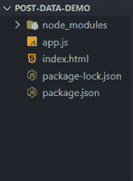
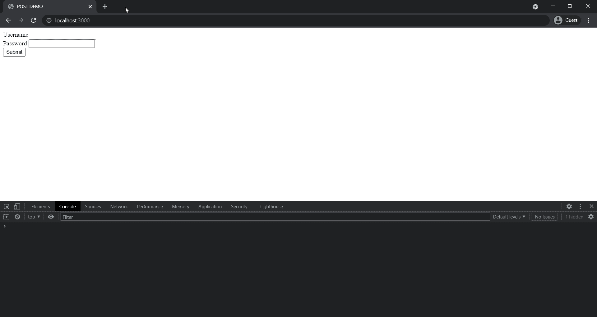

# 如何在 Node.js 中获取 Post 数据？

> 原文:[https://www . geesforgeks . org/如何获取节点中的后期数据-js/](https://www.geeksforgeeks.org/how-to-get-post-data-in-node-js/)

[Node.js](https://www.geeksforgeeks.org/nodejs-tutorials/) 是一个开源的跨平台运行时环境，构建在 Chrome 的 V8 JavaScript 引擎上，用于在浏览器之外执行 JavaScript 代码。你需要记住 NodeJS 不是一个框架，也不是一种编程语言。在本文中，我们将讨论如何使用 node.js 发出 post 请求

[POST](https://www.geeksforgeeks.org/how-http-post-request-work-in-node-js/) 是 HTTP 支持的一种向服务器发送数据的请求方式。在 express 中，我们可以使用 [app.post()](https://www.geeksforgeeks.org/express-js-app-post-function/) 方法接受 post 请求。下面提到了使用 app.post()方法的基本语法。

post 数据是在 app.post()方法的回调函数内部的 **req** 对象上提供给我们的。我们可以使用下面提到的语法访问作为正文发送的数据。

```js
const bodyContent = req.body;
```

类似地，如果我们想访问标题内容，那么我们可以使用下面提到的语法。

```js
const headerContent = req.headers;
```

**项目设置:**

**第一步:** [如果你的机器中没有安装 Node.js，安装 Node.js](https://www.geeksforgeeks.org/installation-of-node-js-on-windows/) 。

**步骤 2:** 为项目创建一个文件夹，并在其中创建了两个名为 app.js 和 index.html 的文件。

**步骤 3:** 现在，使用命令行中的以下命令，用默认配置初始化一个新的 Node.js 项目。

```js
npm init -y
```

**步骤 4:** 现在使用命令行中的以下命令在项目内部安装 express。

```js
npm install express
```

**项目结构:**按照步骤操作后，你的项目结构会是什么样子。



**文件名:app.js**

## java 描述语言

```js
// Importing express module
const express = require('express');
const app = express();

app.use(express.json());

app.get('/', (req, res) => {
  res.sendFile(__dirname + '/index.html');
});

app.post('/', (req, res) => {
  const { username, password } = req.body;
  const { authorization } = req.headers;
  res.send({
    username,
    password,
    authorization,
  });
});

app.listen(3000, () => {
  console.log('Our express server is up on port 3000');
});
```

**文件名:index.html**

## 超文本标记语言

```js
<!DOCTYPE html>
<html lang="en">

<head>
    <meta charset="UTF-8" />
    <title>POST DEMO</title>
</head>

<body>
    <form>
        <div>
            <label>Username</label>
            <input type="text" id="user" />
        </div>
        <div>
            <label>Password</label>
            <input type="password" id="pass" />
        </div>
        <button type="submit">Submit</button>
    </form>

    <script>
        document.querySelector('button')
            .addEventListener('click', (e) => {
                e.preventDefault();
                const username = document
                    .querySelector('#user').value;

                const password = document
                    .querySelector('#pass').value;

                fetch('/', {
                    method: 'POST',
                    headers: {
                        Authorization: 'Bearer abcdxyz',
                        'Content-Type': 'application/json',
                    },
                    body: JSON.stringify({
                        username,
                        password,
                    }),
                })
                    .then((res) => {
                        return res.json();
                    })
                    .then((data) => console.log(data));
            });
    </script>
</body>

</html>
```

在上面的例子中，我们创建了一个渲染 index.html 文件的快速服务器。这个 index.html 包含一个有两个用户名和密码输入的表单。当我们按下提交按钮时，它向主路由发送一个 POST 请求，主体包含用户名和密码，头部包含授权令牌。我们在 app.post()方法中处理这个 post 请求，并发送这些详细信息，即用户名、密码和授权令牌作为响应。我们稍后将这些细节打印到控制台。

使用以下命令运行 **app.js** 文件:

```js
node app.js
```

**输出:**打开浏览器转到 **http://localhost:3000** 会看到如下输出。

