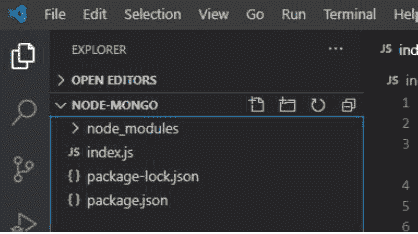
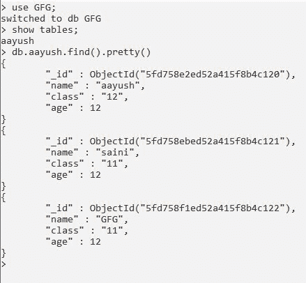

# 如何使用 Node.js 获取集合的大小？

> 原文:[https://www . geesforgeks . org/如何使用节点 js 获取集合大小/](https://www.geeksforgeeks.org/how-to-get-the-size-of-a-collection-using-node-js/)

**collection . count documents()**是 node.js 中 [mongodb](https://www.geeksforgeeks.org/what-are-the-advantages-of-using-mongoose-module/) 模块的方法，用于统计 mongodb 中特定数据库的集合中存在的文档总数。

**语法:**

```
collection.countDocuments(Query)
```

**参数:**该方法取以下一个默认不需要的参数:

*   **查询:**是从集合中统计过滤单据的查询。

**返回类型:**该方法返回承诺。

**安装模块:**使用以下命令安装 **mongodb** 模块:

```
npm install mongodb
```

**项目结构:**会是这样的。



**在本地 IP 上运行服务器:**数据是 MongoDB 服务器所在的目录。

```
mongod --dbpath=data --bind_ip 127.0.0.1
```


**MongoDB 数据库:**下面是我们数据库中的一些样本数据。

```
Database:GFG
Collection:aayush
```



## index.js

```
// Requiring module
const MongoClient = require("mongodb"); 

// Connection URL
const url = 'mongodb://localhost:27017/'; 

// Database name 
const databasename = "GFG";

MongoClient.connect(url).then((client) => { 
    const connect = client.db(databasename); 

    // Connect to collection 
    const collection = connect.collection("aayush"); 

    // Count the total documents
     collection.countDocuments().then((count_documents) => {
         console.log(count_documents);
     }).catch((err) => {
         console.log(err.Message);
     })  

}).catch((err) => { 
    // Printing the error message 
    console.log(err.Message); 
})
```

使用以下命令运行 **index.js** 文件:

```
node index.js
```

**输出:**

