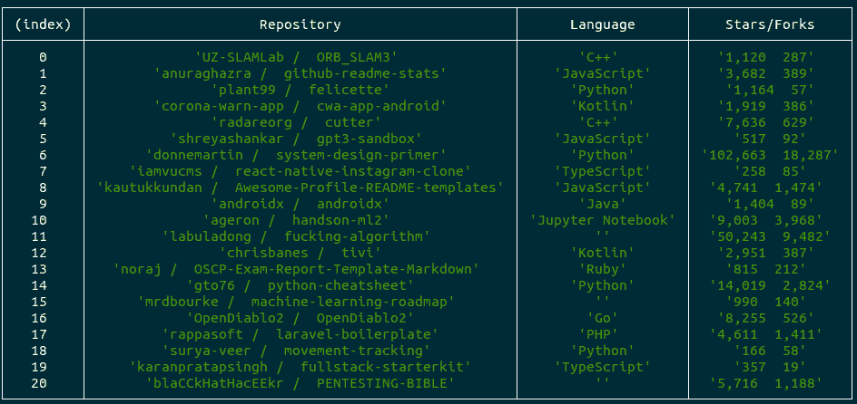

# 如何使用 Node.js 获取趋势 GitHub 知识库？

> 原文:[https://www . geesforgeks . org/how-trending-github-repositories-use-node-js/](https://www.geeksforgeeks.org/how-to-get-trending-github-repositories-using-node-js/)

**进场:**

*   获取整个 HTML 页面，并使用请求包将其存储为字符串。
*   将 HTML 加载到 cheerio 中，并找到 CSS 选择器来提取存储库细节。

**使用请求包:**
[请求包](https://www.npmjs.com/package/request):请求被设计成最简单的 http 调用方式。默认情况下，它支持 HTTPS 并遵循重定向。

**安装请求包:**

```
$ npm install request
```

**注意:**在当前文件夹中运行此命令，当前文件夹是' app.js '文件所在的位置。

**请求语法:**

```
request(url, (error, response, body) => {
    if(!error && response.statusCode == 200) {
        statements to be executed.
    }
}
```

**参数:**

*   **url:** 向其发出请求的 API 端点。
*   **响应:** HTTP 响应状态代码表示特定的 HTTP 请求是否已经成功完成。
*   **身体:**反应数据。

**使用 cheerio 包:**
[cheerio 包:](https://www.npmjs.com/package/cheerio)快速、灵活的&精益实现专为服务器设计的核心 jQuery。

**安装麦片包装:**

```
$ npm install cheerio
```

**注意:**在当前文件夹中运行此命令，当前文件夹是' app.js '文件所在的位置。

【cheerio 的语法:

```
const cheerio = require('cheerio')
const $ = cheerio.load(HTMLString)

$(CSS Selector).text('Hello there!')
$.html()
```

```
// Import request package
const request = require('request');

// Import cheerio package
const cheerio = require('cheerio');

// Github Trending Page URL
const url = 'https://github.com/trending';

// Get request to the URL
request.get(url, (error, response, body) => {

    // If the response code is 200 and
    // there is no error
    if (!error && response.statusCode == 200) {

        // Load HTML string into cheerio
        const $ = cheerio.load(body);

        // Below are the CSS selectors to 
        // fetch the data required
        let temp = $('.Box-row')
        let repos = $('.h3.lh-condensed a');
        let data = [];
        for (let i = 0; i < repos.length; i++) {
            let reponame = $(temp[i])
                .find('.h3.lh-condensed a')
                .text().replace(
                /[\n\r]+|[\s]{2, }/g, ' ').trim();

            let repolanguage = $(temp[i])
                .find(
'.f6.text-gray.mt-2 span span[itemprop="programmingLanguage"]')
                .text()
                .replace(/[\n\r]+|[\s]{2, }/g, ' ').trim();

            let repostars = $(temp[i])
                .find(
'.f6.text-gray.mt-2 .muted-link.d-inline-block.mr-3')
                .text()
                .replace(/[\n\r]+|[\s]{2, }/g, ' ').trim();

            // Push the fetched data into an object
            data.push({
                'Repository': reponame,
                'Language': repolanguage,
                'Stars/Forks': repostars
            })
        }

        // Display the Object created using console.table
        console.table(data)
    }
    else {
        console.log("Unable to fetch data from github");
    }
});
```

**输出:**
