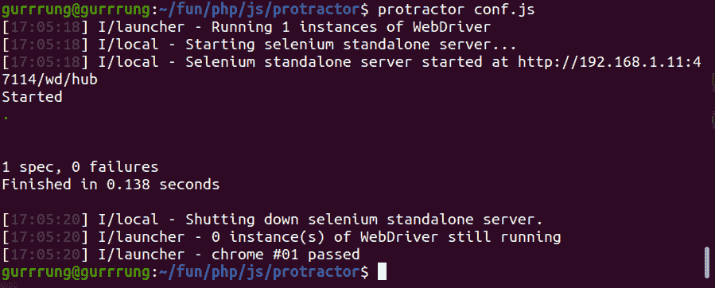

# 如何在量角器 Node.js 中获取一个元素的 x、y 坐标？

> 原文:[https://www . geeksforgeeks . org/如何获取量角器中元素的 x 和 y 坐标-节点-js/](https://www.geeksforgeeks.org/how-to-get-x-and-y-coordinates-of-an-element-in-protractor-node-js/)

**量角器**是为 AngularJS 和 Angular 应用开发的端到端测试框架。它基本上是针对与它交互的应用程序运行测试，就像一个真实的用户在真实的浏览器中运行一样。在下面的例子中，我们将获得一个元素的 x 和 y 坐标，并检查它是否如预期的那样。

**先决条件:** [量角器的安装和设置](https://www.geeksforgeeks.org/angularjs-end-to-end-e2e-testing-protractor-installation-and-setup/)

**进场:**

*   我们将创建一个基本的测试程序，其中我们将检查元素的 x 和 y 坐标是否如预期的那样。
*   所有量角器测试都有一个包含配置的文件，这个文件将是启动测试的初始文件。
*   让我们用名称 **conf.js** 创建这个文件。

**示例:文件名:conf.js**

## java 描述语言

```html
exports.config = {

    // Capabilities values for
    // webdriver instance
    capabilities: {
        'browserName': 'chrome'
    },

    // Framework value
    framework: 'jasmine',

    // The Spec patterns are relative to the 
    // current working directory when
    // protractor is called.
    specs: ['test.js'],

    // Options which are passed to our
    // framework ie. Jasmine.
    jasmineNodeOpts: {
        defaultTimeoutInterval: 30000
    },

    // File URL
    baseUrl: 'file://' + __dirname + '/',

    onPrepare: function () {
        browser.resetUrl = 'file://';
    }
};
```

现在让我们创建一个名为**test.html**的 HTML 文件，它将包含要测试的元素。

**文件名:test.html**

## 超文本标记语言

```html
<!DOCTYPE html>
<html lang="en">
<body>
    <!-- The element to be tested -->
    <div id="foo" style="position: absolute;
        top:20px; left: 15px">
        Inner text
    </div>
</body>
</html>
```

现在让我们创建我们的测试文件 **test.js** 。在这个文件中，我们将访问一个 HTML 文件，然后获取 x 和 y 坐标，并将检查它是否如 HTML 文件中设置的那样。浏览器是量角器创建的全局。

Jasmine 框架提供了**description()**功能和 **it()** 功能，其中**description**是对您的测试的描述，而 **it** 是测试的步骤。

**文件名:test.js**

## java 描述语言

```html
describe('Protractor Demo App', function () {
    it('should have a title', function () {
        // Disabling waiting for angular
        browser.waitForAngularEnabled(false)

        // Get our html file for testing
        browser.get('test.html');

        // Test if the element have required coordinates
        let foo = element(by.id('foo'));
        expect(foo.getLocation()).toEqual(
        jasmine.objectContaining({
            x: 15,
            y: 20
        }));
    });
});
```

使用以下命令运行 conf.js 文件:

```html
protractor conf.js
```

**输出:**

