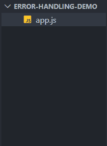
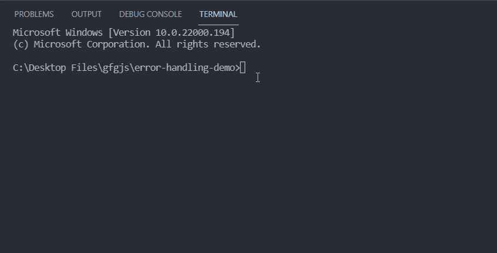
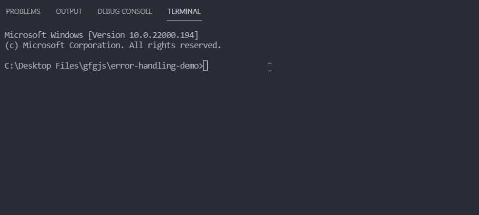

# 如何处理 Node.js 中异步代码的错误？

> 原文:[https://www . geesforgeks . org/如何处理节点中异步代码的错误-js/](https://www.geeksforgeeks.org/how-to-handle-errors-for-async-code-in-node-js/)

JavaScript 中的异步操作是不阻止进一步操作的操作。这意味着，如果我们在代码中的某个点执行异步操作，那么之后的代码就会被执行，而不会等待该异步操作完成。Node.js 中异步操作的一个例子是当我们从 web 服务器请求一些数据时。

如果我们想在 Node.js 中处理异步代码的错误，那么我们可以通过以下两种方式来完成。

*   使用回调处理错误
*   处理承诺拒绝

**使用回调处理错误:**回调函数是在函数执行完成后执行某个操作。我们可以在异步操作完成后调用回调函数。如果有错误，我们可以用那个错误调用回调函数，否则我们可以用空值和异步操作的结果作为参数来调用它。

**项目设置:**

**第一步:** [如果你还没有安装 Node.js](https://www.geeksforgeeks.org/installation-of-node-js-on-windows/) 。

**第二步:**为你的项目创建一个文件夹，并将 [**cd**](https://www.geeksforgeeks.org/cd-command-in-linux-with-examples/) (更改目录)放入其中。在该文件夹中创建一个名为 app.js 的新文件。

**项目结构:**按照步骤操作后，您的项目结构将如下所示。



在下面提到的代码示例中，我们使用 setTimeout()方法模拟了一个异步操作。我们执行除法运算，1 秒后返回除法结果，如果除数为零，我们将一个错误实例传递给回调方法。如果没有错误，我们调用回调函数，错误为空，除法结果为参数。错误和结果在我们的回调函数中处理。

## app.js

```js
const divide = (a, b, callback) => {
  setTimeout(() => {
    if (b == 0) {
      callback(new Error('Division by zero error'));
    } else {
      callback(null, a / b);
    }
  }, 1000);
};

divide(10, 2, (err, res) => {
  if (err) {
    console.log(err.message);
  } else {
    console.log(`The result of division = ${res}`);
  }
});

divide(5, 0, (err, res) => {
  if (err) {
    console.log(err.message);
  } else {
    console.log(`The result of division = ${res}`);
  }
});
```

**运行应用程序的步骤:**您可以在命令行上使用以下命令执行您的 app.js 文件。

```js
node app.js
```

**输出:**



**处理承诺拒绝:**[node . js 中的承诺](https://www.geeksforgeeks.org/promises-in-node-js/#:~:text=A%20Promise%20in%20Node%20means,callbacks%2C%20promises%20can%20be%20chained.)是处理异步操作的一种方式。当我们从异步函数返回一个承诺时，它可以稍后使用[然后()](https://www.geeksforgeeks.org/why-we-use-then-method-in-javascript/)方法或[异步/等待](https://www.geeksforgeeks.org/async-await-function-in-javascript/)来获得最终值。当我们使用 then()方法消费承诺并且我们必须处理承诺拒绝时，我们可以对 then()方法调用进行 catch()调用。Promise.catch()是一个返回承诺的方法，它的工作是处理被拒绝的承诺。

**语法:**

```js
// func is an async function
func().then(res => {   
    // code logic
}).catch(err => {
    // promise rejection handling logic
})
```

现在，如果我们想使用异步/等待来处理承诺拒绝，那么我们可以使用一个简单的 [try/catch](https://www.geeksforgeeks.org/javascript-errors-throw-and-try-to-catch/) 块轻松完成，如下面给出的语法所示。

```js
const hello = async () => {
    try {
        // func is an async function
        const res = await func();
    } catch(err) {
        // error handling logic
    }
}
```

在下面的例子中，我们用 setTimeout()方法模拟一个异步函数，并在一个返回 Promise 的异步函数中执行除法运算。如果除数为零，我们会错误地拒绝承诺，否则我们会用除法的结果来解决它。

## app.js

```js
const divide = async (a, b) => {
  return new Promise((resolve, reject) => {
    setTimeout(() => {
      if (b == 0) {
        reject(new Error('Division by zero error'));
      } else {
        resolve(a / b);
      }
    }, 1000);
  });
};

// Consuming the promise using then() method
// and handling the rejected promise using
// catch() method
divide(5, 0)
  .then((res) => {
    console.log(`The result of division is ${res}`);
  })
  .catch((err) => {
    console.log(err.message);
  });

// This function is immedietly invoked after
// its execution. In this case we consume the
// promise returned by divide function() using
// async/await and handle the error using
// try/catch block
(async () => {
  try {
    const res = await divide(10, 5);
    console.log(`The result of division is ${res}`);
  } catch (err) {
    console.log(err);
  }
})();
```

**输出:**

