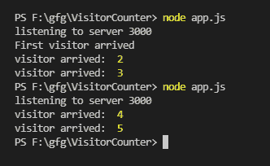

# 如何在 Node.js 中实现访客计数器？

> 原文:[https://www . geesforgeks . org/如何实现-节点中的访问者计数器-js/](https://www.geeksforgeeks.org/how-to-implement-visitor-counter-in-node-js/)

我们将使用*节点中的 ***快递*** 和 ***猫鼬*** 来实现访客柜台。使用*猫鼬*将计数存储在**猫鼬数据库**中的好处是，当我们重新启动服务器时，计数不会丢失。每当浏览器获得该页面时，访问者的数量就会增加一(1)。让我们一步一步走过。*

**步骤 1:** 创建一个“ ***app.js*** ”文件并用 *npm* 初始化你的项目。

```js
npm init
```

**第二步:**使用 *npm* 安装*快车*和*猫鼬*

```js
npm install express
npm install mongoose
```

*Express* 包将帮助我们创建服务器并为 *GET* 请求定义路线。*mongose*是一个针对 MongoDB 和 NodeJS 的对象数据建模库，它将帮助我们与 MongoDB 数据库进行对话。

**项目结构:**项目结构如下图所示:


项目结构

**第三步:**让我们开始编码“ ***app.js*** ”文件。

1.  首先需要快递和猫鼬
2.  创建到本地蒙古数据库的连接
3.  定义猫鼬模式来存储记录。它有两个字段一个是*字符串*数据类型的 ***名称*** ，另一个是*数值*数据类型的 ***计数*** 。
4.  从模式创建猫鼬模型
5.  定义根 *GET* 请求，让 app 监听本地端口。

当应用程序第一次被点击时， *GET* 请求有一种特殊情况。在这种情况下，我们需要创建默认记录，访问者的数量等于 1(1)。对于其他时间，只需将其值增加 1。

我们使用*猫鼬*的 ***findOne()*** 函数，该函数以一个参数作为搜索条件。它返回符合我们条件的第一条记录。如果没有记录匹配，则返回一个 ***空值*** 。现在让我们看看“ *app.js* ”文件的完整代码。

## app.js

```js
// Requiring express to handle routing
const express = require('express')

// Creating app 
const app = express()

// Requiring mongoose to handle mongoDB Database
const mongoose = require('mongoose')

// Connecting to local MongoDB
mongoose.connect("mongodb://localhost:27017/visitCounterDB", {
    useNewUrlParser: true
});

// Creating visitor Schema to hold the
// count of visitors
const visitorSchema = new mongoose.Schema({
    name: String,
    count: Number
})

// Creating Visitor Table in visitCounterDB
const Visitor = mongoose.model("Visitor",visitorSchema)

// Get request to app root
app.get('/', async function(req,res){

    // Storing the records from the Visitor table
    let visitors = await Visitor.findOne({name: 'localhost'})

    // If the app is being visited first
    // time, so no records
    if(visitors == null) {

        // Creating a new default record
        const beginCount = new Visitor({
            name : 'localhost',
            count : 1
        })

        // Saving in the database
        beginCount.save()

        // Sending thee count of visitor to the browser
        res.send(`<h2>Counter: `+1+'</h2>')

        // Logging when the app is visited first time
        console.log("First visitor arrived")
    }
    else{

        // Incrementing the count of visitor by 1
        visitors.count += 1;

        // Saving to the database
        visitors.save()

        // Sending thee count of visitor to the browser
        res.send(`<h2>Counter: `+visitors.count+'</h2>')

        // Logging the visitor count in the console
        console.log("visitor arrived: ",visitors.count)
    }
})

// Creating server to listen at localhost 3000
app.listen(3000,function(req,res){

    // Logging when the server has started
    console.log("listening to server 3000")
})
```

**第 4 步:**现在运行应用程序

```js
node app.js
```

**输出:** 现在点击 http://localhost:3000 在浏览器中加载该应用


输出屏

关闭服务器，再次重启后，当我们访问根页面时，我们看到访问者的计数是 ***保留*** 并增加 1。我们将所有这些步骤记录到控制台中，也是为了验证和理解输出。



安慰