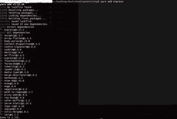

# 如何在 node.js 中安装没有 npm 的模块？

> 原文:[https://www . geesforgeks . org/how-install-modules-not-NPM-in-node-js/](https://www.geeksforgeeks.org/how-to-install-modules-without-npm-in-node-js/)

我们可以在 **node.js** 中安装特定项目所需的模块，无需 **npm** ，推荐的节点包管理器使用 [**纱线**](https://classic.yarnpkg.com/en/) **。**纱是一个很棒的包经理。像 npm 一样，如果您有一个带有 package.json 的项目文件夹，其中包含了项目中提到的所有必需的依赖项，那么您可以使用纱线来安装所有的依赖项。

**1。如何安装纱线？**

安装纱线，请访问纱线官方安装页面([https://classic.yarnpkg.com/en/docs/install](https://classic.yarnpkg.com/en/docs/install))。该页面将自动检测您正在使用的操作系统。安装页面中还提到了其他安装说明。按照安装管理器上的步骤完成安装过程后，在 ternimal/命令提示符下键入以下命令。

```js
yarn --version 
```

这应该显示您在计算机中使用的特定版本。例如: **1.22.5** 。现在我们已经安装了纱线，让我们看看如何在我们的项目中使用纱线。

**2。如何用纱线安装项目？**

要使用纱线，请转到需要安装模块的文件夹。如果没有用纱线初始化，运行**纱线初始化**命令。它将询问一些关于创建**包. json** 文件项目的问题。package.json 文件是最重要的文件，因为它包含项目所需的必要模块。任何拥有 package.json 文件的人都可以运行一些命令(我们将在后面讨论)来安装项目所需的所有依赖项。当您运行**纱线初始化**命令时，您会得到类似的问题:

```js
question name (testdir): my-awesome-package
question version (1.0.0):
question description: 
    The best package you will ever find.
question entry point (index.js):
question git repository: 
    https://github.com/yarnpkg/example-yarn-package
question author: Yarn Contributor
question license (MIT):
question private:
success Saved package.json
Done in 87.70s.
```

完成后，创建一个包 json 文件。如果打开 package.json 文件，应该如下所示:

```js
{
     "name": "my-awesome-package",
     "version": "1.0.0",
     "description": "The best package you will ever find.",
     "main": "index.js",
     "repository": {
           "url": "https://github.com/yarnpkg/example-yarn-package",
           "type": "git"
     },
     "author": "Yarn Contributor",
     "license": "MIT"
}
```

或者，如果您有一个从一开始就包含 package.json 文件的项目，您可以使用**纱线**或**纱线安装**命令来安装 package.json 文件中提到的所有依赖项。

**注意:**如果在执行**纱线初始化**命令时不想回答所有问题(虽然不推荐)，可以使用**纱线初始化-y** 命令将其初始化为默认值。您可以通过使用合适的文本编辑器编辑 package.json 文件来更改详细信息。

**3。在项目文件夹**
中安装软件包

现在我们将了解如何使用纱线安装包装。假设我们想要安装名为 express 的包。我们将输入以下命令来安装 express:

```js
// Command to install express to the current project folder
yarn add express  

// Command to install express globally in your machine
yarn global add expres 

// This is the most generalized way, Just replace  
// the <package-name> with the name of the package
yarn add <package-name> 
```



**注:**global 关键字用于通知纱线我们要全球安装快递。

**参考:**你可以用纱线执行更多的命令。以下链接中提到了命令列表:[**【https://classic.yarnpkg.com/en/docs/cli】**](https://classic.yarnpkg.com/en/docs/cli)

如果您正在从 npm 迁移到纱线，您可以使用此[**cheat sheet**](https://www.digitalocean.com/community/tutorials/nodejs-npm-yarn-cheatsheet)**了解纱线的类似命令。**