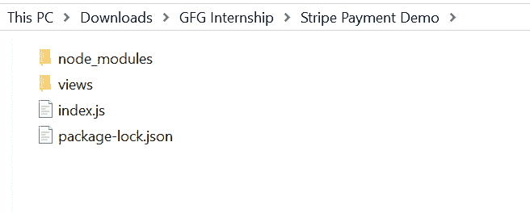
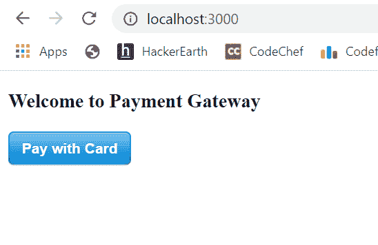
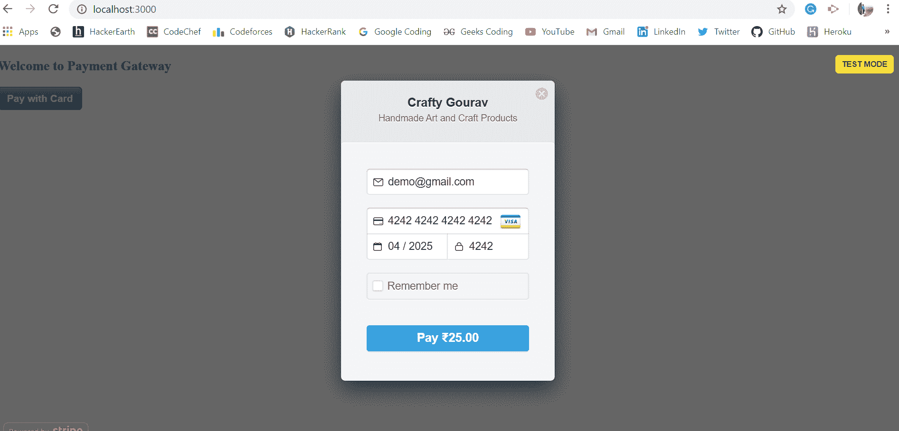
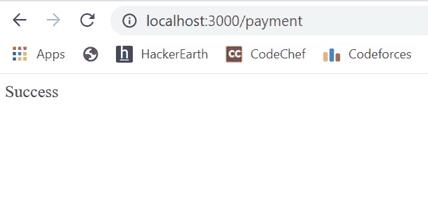
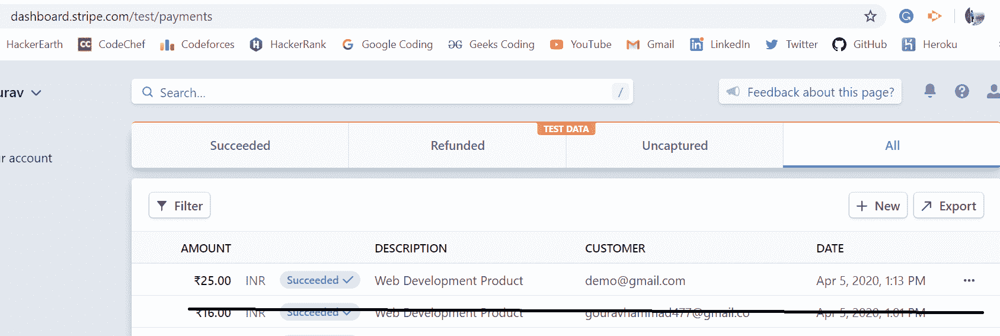

# 如何在 Node.js 中集成条带支付网关？

> 原文:[https://www . geesforgeks . org/how-integrate-stripe-payment-gateway-in-node-js/](https://www.geeksforgeeks.org/how-to-integrate-stripe-payment-gateway-in-node-js/)

支付网关帮助用户进行支付。市场上有很多支付网关，比如 Razorpay、Google pay 等，但其中最受欢迎的是 Stripe 支付网关。Stripe 是在线信用卡处理的首选，也是最受欢迎的高级支付网关。

**简介:**

1.  上手简单，使用方便。
2.  它是广泛使用和流行的处理支付的模块。
3.  用户友好的服务和高度服务。

**条纹模块安装:**

1.  您可以访问链接[安装条纹模块](https://www.npmjs.com/package/stripe)。您可以使用此命令安装此软件包。

    ```js
    npm install stripe
    ```

2.  安装条带模块后，您可以使用命令在命令提示符下检查您的条带版本。

    ```js
    npm version stripe
    ```

3.  之后，您可以创建一个文件夹并添加一个文件，例如 index.js。

    ```js
    node index.js
    ```

4.  **Requiring module:** You need to include stripe module in your file by using these lines.

    ```js
    var stripe = require('stripe')('Your_Secret_Key');
    ```

    要获得您的密钥，只需进入[条纹官方网站](http://stripe.com/)并创建一个帐户，然后您就可以获得您的密钥以及可发布的密钥。

**档案名称:home . ejs】t1**

```js
<!DOCTYPE html>
<html>
<title>Stripe Payment Demo</title>
<body>
    <h3>Welcome to Payment Gateway</h3>
    <form action="payment" method="POST">
       <script 
          src="//checkout.stripe.com/v2/checkout.js"
          class="stripe-button"
          data-key="<%= key %>"
          data-amount="2500"
          data-currency="inr"
          data-name="Crafty Gourav"
          data-description="Handmade Art and Craft Products"
          data-locale="auto" >
        </script>
    </form>
</body>
</html>
```

**文件名:index.js**

```js
const express = require('express')
const bodyparser = require('body-parser')
const path = require('path')
const app = express()

var Publishable_Key = 'Your_Publishable_Key'
var Secret_Key = 'Your_Secret_Key'

const stripe = require('stripe')(Secret_Key)

const port = process.env.PORT || 3000

app.use(bodyparser.urlencoded({extended:false}))
app.use(bodyparser.json())

// View Engine Setup
app.set('views', path.join(__dirname, 'views'))
app.set('view engine', 'ejs')

app.get('/', function(req, res){
    res.render('Home', {
       key: Publishable_Key
    })
})

app.post('/payment', function(req, res){

    // Moreover you can take more details from user
    // like Address, Name, etc from form
    stripe.customers.create({
        email: req.body.stripeEmail,
        source: req.body.stripeToken,
        name: 'Gourav Hammad',
        address: {
            line1: 'TC 9/4 Old MES colony',
            postal_code: '452331',
            city: 'Indore',
            state: 'Madhya Pradesh',
            country: 'India',
        }
    })
    .then((customer) => {

        return stripe.charges.create({
            amount: 2500,     // Charing Rs 25
            description: 'Web Development Product',
            currency: 'INR',
            customer: customer.id
        });
    })
    .then((charge) => {
        res.send("Success")  // If no error occurs
    })
    .catch((err) => {
        res.send(err)       // If some error occurs
    });
})

app.listen(port, function(error){
    if(error) throw error
    console.log("Server created Successfully")
})
```

**运行程序的步骤:**

1.  项目结构如下:
    
    “home . ejs”保存在视图文件夹中。
2.  确保你有像我使用“ejs”一样的“视图引擎”，并使用以下命令安装 express、body-parser 和 stripe:

    ```js
    npm install ejs
    npm install express
    npm install body-parser
    npm install stripe
    ```

3.  Run index.js file using below command:

    ```js
    node index.js
    ```

    

4.  打开浏览器，输入该网址:

    ```js
    http://localhost:3000/
    ```

5.  然后你会看到如下所示的支付网关表单:
    
6.  然后点击“用卡支付”按钮，您将看到如下所示的条纹支付表单:
    
    用正确的信用卡详细信息填写此表单，然后点击“支付”按钮，如果没有错误，将显示以下消息:
    
7.  现在进入你的条纹仪表盘，可以看到当前的支付明细如下所示:
    

这就是你如何在 node.js 中集成 Stripe 支付网关的方法。市场上还有其他支付网关，如 Razorpay、Google Pay 等。