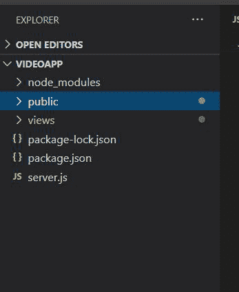

# 如何在 node.js 中进行视频通话 app？

> 原文:[https://www . geesforgeks . org/如何进行视频通话-app-in-node-js/](https://www.geeksforgeeks.org/how-to-make-a-video-call-app-in-node-js/)

要制作视频通话应用程序，要求每个客户端都将其视频和音频流发送给所有其他客户端。因此，为了这个目的，我们使用了 Peer.js，为了客户端和服务器之间的通信，我们使用了 WebSocket，即 [**Socket.io**](https://www.geeksforgeeks.org/introduction-to-sockets-io-in-node/) 。

**先决条件:**
**1。 [**Node.js:**](https://www.geeksforgeeks.org/nodejs-tutorials/)** 它是一个开源的 JavaScript 后端技术。它有一个名为 [**npm**](https://www.geeksforgeeks.org/node-js-npm-node-package-manager/#:~:text=NPM%20(Node%20Package%20Manager)%20is,default%20package%20manager%20for%20Node.&text=A%20package%20contains%20all%20the,a%20project%20through%20the%20package.) **的包管理器–节点包管理器**，可以非常轻松地安装不同的包。

**2。 [**Express.js:**](https://www.geeksforgeeks.org/working-of-express-js-middleware-and-its-benefits/)** 它是一个 node.js 服务器框架。

**3。 [**Socket.io:**](https://www.geeksforgeeks.org/introduction-to-sockets-io-in-node/)** 它帮助我们在服务器和客户端之间创建一个基于事件的实时双向通信。

**4。Peer.js:** 帮助我们收发其他客户端的音视频流。

**设置环境:**这是第一步，这里我们正在创建和初始化一个新的存储库。

```js
$ mkdir VideoCallApp 
$ cd VideoCallApp
$ npm init
```

现在，下一步是为我们的 VideoCallApp 安装所需的包。

*   **Express :** 是 node.js 的基于服务器的框架
*   **ejs :** 这是一种简单的模板语言，可以让你用普通的 JavaScript 生成 HTML 标记。
*   **Socket.io :** 它管理基于事件的通信的 Websocket。**T3】**
*   [**Nodemon**](https://www.geeksforgeeks.org/node-js-nodemon-module/#:~:text=The%20nodemon%20Module%20is%20a,code%20and%20method%20of%20development.) **(可选):**保存项目文件时自动重启服务器。
*   [**uuid 模块**](https://www.geeksforgeeks.org/node-js-npm-uuid/) **:该模块用于生成唯一 id。这将用于本项目**

**安装** **所需模块:**

```js
$ npm install express
$ npm install ejs
$ npm install socket.io
$ npm install nodemon
```

现在，我们都为实现部分做好了准备。

**实施:**

**步骤 1:** 创建一个服务器文件— **server.js**

## Java Script 语言

```js
// Importing express module
const express = require('express'); 
const app = express(); 

app.set("view engine", "ejs"); 

// Calling the public folder
app.use(express.static("public")); 

// Handling get request
app.get("/" , (req,res)=>{
  res.send("Welcome to GeeksforGeeks Video Call App"); 
});

// Listing the server 
server.listen(4000 , ()=>{
    console.log("Server running on port 4000");
) 
```

**服务器的执行命令**

```js
node server.js
```

现在，如果您打开本地主机，即 localhost:4000，您将看到输出，即—欢迎使用 GeeksforGeeks 视频通话应用程序。


> 现在，对于 socket.io，我们需要编写更多的代码。在这里，我们添加了 socket.io 的代码，我们只需将 app.listen()改为 server.listen()方法。
> 
> 现在我们都为客户端开发做好了准备。

## java 描述语言

```js
const server = require('http').Server(app);
const io = require('socket.io')(server);

server.listen(4000 , ()=>{
    console.log("Server running on port 4000");
);
```

**步骤 2:** 创建两个文件夹，一个是公共文件夹，另一个是视图文件夹。

**项目结构:**



*   现在在视图中创建一个包含所有 html 代码的 index.ejs 文件。
*   在这里，我们添加了三个脚本文件，第一个用于 peerjs，第二个用于 socket.io，最后一个是我们的主 index.js 文件。

**索引。例如档案**

## 超文本标记语言

```js
<!DOCTYPE html>
<html lang="en" dir="ltr">

<head>
    <meta charset="utf-8" />
    <title>Video App</title>
    <style media="screen">
        * {
            margin: 0;
        }

        #videoDiv {
            display: grid;
            grid-gap: 10px;
            height: 80%;
            position: relative;
            grid-template-columns: repeat(auto-fill, 300px);
            grid-auto-rows: 300px;
        }

        #footer {
            width: 100%;
            height: 50px;
            background-color: white;
            display: flex;
            justify-content: center;
            flex: 1;
            border-bottom: 1px solid grey;
            margin-top: 10px;
        }

        button {
            height: 30px;
            width: 80px;
            margin-top: 10px;
            text-align: center;
            border-radius: 10px;
            outline: none;
            border: none;
            text-decoration: none;
            background-color: red;
            cursor: pointer;
        }

        video {
            width: 100%;
            height: 100%;
            object-fit: cover;
            border: 2px solid white;
        }
    </style>
    <script type="text/javascript">
        var roomID = "<%= RoomId %>"
    </script>

    <script src=
"https://unpkg.com/peerjs@1.3.1/dist/peerjs.min.js"
        defer>
    </script>

    <script src="socket.io/socket.io.js" defer>
    </script>

    <script src="index.js" charset="utf-8" defer>
    </script>
</head>

<body>
    <div id="videoDiv"></div>
</body>

</html>
```