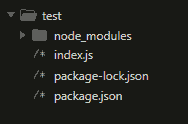
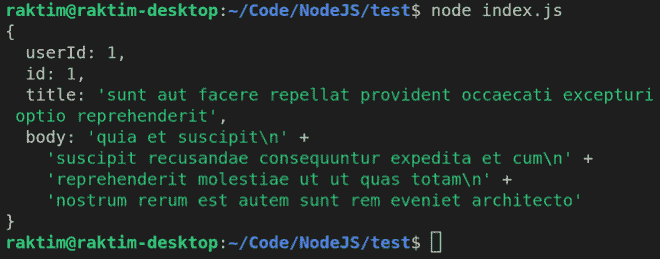
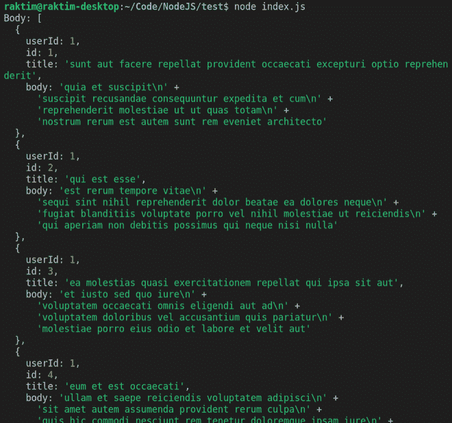

# 如何在 Node.js 中进行 HTTP 请求？

> 原文:[https://www . geesforgeks . org/how-to-make-http-requests-in-node-js/](https://www.geeksforgeeks.org/how-to-make-http-requests-in-node-js/)

在 REST API 的世界里，发出 **HTTP** 请求是现代技术的核心功能。许多开发人员在到达一个新环境时就学会了。包括*****【HTTPS】***模块在内的各种开源库都可以用来从 NodeJS 发出网络请求。**

**有许多方法可以创建不同类型的网络请求。在这里，我们将讨论 4 种不同的方法。**

1.  **使用 ***AXIOS*** 模块**
2.  **使用 ***超级代理*****
3.  **使用 ***节点-获取*** 模块**
4.  **使用 ***HTTP*** 模块**

**在这里，我们将请求发送到 https://jsonplaceholder.typicode.com/ API，并显示响应的数据。这是我们所有的 REST APIs。**

<figure class="table">

| **方法** | **REST API** | **详细信息** |
| 得到 | /员额 | 列出所有资源 |
| 得到 | /帖子/ | 获取资源 |
| 邮政 | /员额 | 创建资源 |
| 放 | /帖子/ | 更新资源 |

</figure>

****设置新项目:**要创建新项目，请在终端中输入以下命令。**

```js
mkdir test
npm init -y
```

****项目结构:**如下图。**

**

项目目录** 

****方法 1:** 在这种方法中，我们将使用 [AXIOS](https://www.geeksforgeeks.org/how-to-make-get-call-to-an-api-using-axios-in-javascript/) 库发送获取资源的请求。Axios 是 NodeJS 的一个基于承诺的 HTTP 客户端。你，也可以在浏览器中使用它。在处理像网络请求这样的异步代码时，使用 promise 是一个很大的优势。**

****安装模块:****

```js
npm i axios
```

**创建 ***index.js*** 并写下以下代码。**

## **index.js**

```js
const axios = require('axios')

// Make request
axios.get('https://jsonplaceholder.typicode.com/posts/1')

  // Show response data
  .then(res => console.log(res.data))
  .catch(err => console.log(err))
```

****运行应用程序的步骤:**打开终端，写下以下命令。**

```js
node index.js
```

#### **输出:**

**

axios 请求响应** 

****方法 2 :** 这里我们将请求使用[超级代理](https://github.com/visionmedia/superagent)库创建资源。这是另一个在浏览器中进行网络请求的流行库，但也适用于 Node.js。**

****安装模块:****

```js
npm i superagent
```

**用以下代码重写 ***index.js*** 。**

## **index.js**

```js
const superagent = require('superagent');

// promise with async/await
(async () => {

    // Data to be sent
    const data = {
        title: 'foo',
        body: 'bar',
        userId: 1,
    }

    try {

        // Make request
        const {body} = await superagent.post(
  'https://jsonplaceholder.typicode.com/posts')
                             .send(data)       
        // Show response data
        console.log(body)
    } catch (err) {
        console.error(err)
    }
  })();
```

****运行应用程序的步骤:**打开终端，写下以下命令。**

```js
node index.js
```

****输出:****

**

超级代理请求响应** 

****方法 3 :** 这里我们将发送一个使用[节点获取](https://www.geeksforgeeks.org/fetch-api/)库更新资源的请求。如果你已经在浏览器中使用**获取**，那么它可能是你的 NodeJS 服务器的好选择。**

****安装模块:****

```js
npm i node-fetch
```

**用以下代码重写 ***index.js*** 。**

## **index.js**

```js
const fetch = require('node-fetch');

// Propmise then/catch block
// Make request
fetch('https://jsonplaceholder.typicode.com/posts/1', {
  method: 'PUT',
  body: JSON.stringify({
    id: 1,
    title: 'fun',
    body: 'bar',
    userId: 1,
  }),
  headers: {
    'Content-type': 'application/json; charset=UTF-8',
  },
})
  // Parse JSON data
  .then((response) => response.json())

  // Showing response
  .then((json) => console.log(json))
  .catch(err => console.log(err))
```

****运行应用程序的步骤:**打开终端，写下以下命令。**

```js
node index.js
```

****输出:****

**

节点提取请求响应** 

****方法 4 :** 这里我们将使用 [HTTP](https://www.geeksforgeeks.org/node-js-http-module-complete-reference/) 模块发送获取所有资源的请求。NodeJS 内置 ***HTTP*** 模块进行网络请求。但缺点是，它不像其他解决方案那样太用户友好。你，需要在收到后手动解析数据。**

****安装模块:**是内置模块，不需要安装。即插即用。**

**用以下代码重写 ***index.js*** 。**

## **index.js**

```js
// Importing https module
const http = require('http');

// Setting the configuration for
// the request
const options = {
    hostname: 'jsonplaceholder.typicode.com',
    path: '/posts',
    method: 'GET'
};

// Sending the request
const req = http.request(options, (res) => {
    let data = ''

    res.on('data', (chunk) => {
        data += chunk;
    });

    // Ending the response 
    res.on('end', () => {
        console.log('Body:', JSON.parse(data))
    });

}).on("error", (err) => {
    console.log("Error: ", err)
}).end()
```

****运行应用程序的步骤:**打开终端，写下以下命令。**

```js
node index.js
```

#### ****输出:****

**

http 请求响应** 

****结论:**我个人选择的是 Axios，但是 npm 上还有一些其他流行的库，看一下:**

*   **[请求](https://github.com/request/request)**
*   **[GOT](https://github.com/sindresorhus/got)**
*   **[针](https://github.com/tomas/needle)**