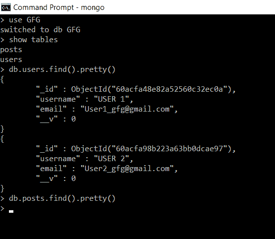
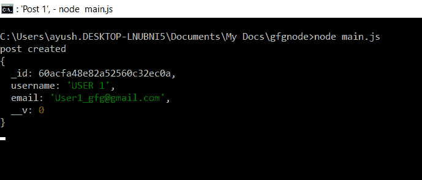
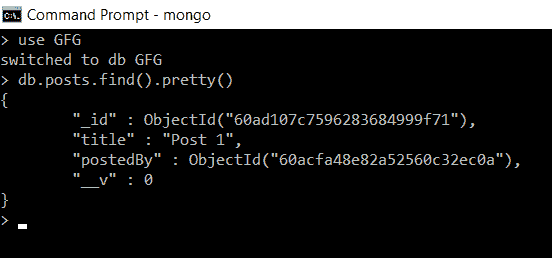

# 如何使用 Node.js 将虚拟物填充到猫鼬模型中？

> 原文:[https://www . geesforgeks . org/如何使用节点-js/](https://www.geeksforgeeks.org/how-to-populate-virtuals-to-a-mongoose-model-using-node-js/) 将 virtuals 填充到猫鼬模型中

在 Mongoose 中，**虚拟的**是没有存储在数据库中的属性，它们只在逻辑上存在，不能基于这个属性直接查询。欲了解更多关于虚拟的信息，请参阅本文[猫鼬虚拟。](https://www.geeksforgeeks.org/mongoose-virtuals/)

**填充虚拟对象:**

在 MongoDB 中，**填充**是用另一个集合的实际文档替换一个集合的文档中指定路径的过程。

猫鼬在创建期间也支持大量虚拟财产。每当我们希望我们的虚拟属性引用任何其他集合的模型时，我们都必须填充它，以便它可以包含其他集合的文档。

**安装猫鼬:**

**第一步:**可以访问[安装猫鼬](https://www.npmjs.com/package/mongoose)链接安装猫鼬模块。您可以使用此命令安装此软件包。

```
npm install mongoose
```

**步骤 2:** 现在，您可以使用以下命令导入文件中的猫鼬模块:

```
const mongoose = require('mongoose');
```

**数据库:**我们的数据库 GFG 中有两个集合*用户*和*帖子*。

*   **用户:***用户*集合有两个用户*用户 1* 和*用户 2。*
*   **帖子:***帖子*集合为空*。*



最初用户和帖子收集在数据库中

**实施:**

1.  创建一个文件夹并添加文件 **main.js.**
2.  为了填充虚拟，我们必须指定三个必要的选项:
    *   **参考:**它包含我们要从中填充文档的模型的名称。
    *   **localField:** 是当前集合的任意字段。
    *   **foreignField:** 它是集合中我们要填充文档的任何字段。

猫鼬将从**参考**中给出的模型填充这些文档，其**外域**值将与当前集合的**本地域**值匹配。

**示例:**现在我们将看到如何使用 Node.js 向猫鼬模型填充虚拟物。

## main.js

```
// Requiring module
const mongoose = require('mongoose');

// Connecting to database
mongoose.connect('mongodb://localhost:27017/GFG',
    {
        useNewUrlParser: true,
        useUnifiedTopology: true,
        useFindAndModify: false
    });

// User Schema
const userSchema = new mongoose.Schema({
    username: String,
    email: String
})

// Post Schema
const postSchema = new mongoose.Schema({
    title: String,
    postedBy: mongoose.Schema.Types.ObjectId
})

// Creating and populating virtual property 'user' in postSchema
// will populate the documents from user collection if 
// their '_id' matches with the 'postedBy' of the post
postSchema.virtual('user', {
    ref: 'User',
    localField: 'postedBy', // Of post collection
    foreignField: '_id',    // Of user collection
    justOne: true
})

// Creating user and post models 
const User = mongoose.model('User', userSchema);
const Post = mongoose.model('Post', postSchema);

// Function to create a post by the user
const createPost = async (next) => {
    const user = await User.findOne({ _id: '60acfa48e82a52560c32ec0a' });

    const newPost = new Post({
        title: 'Post 1',
        postedBy: user._id
    })

    const postSaved = await newPost.save();
    console.log("post created");

    // The findPost will be called after the post is created
    next();
}

// Function to find the post and show the virtual property
const findPost = async () => {
    const post = await Post.findOne().populate('user');
    console.log(post.user);
}

// Creating the post then showing the virtual property on console
createPost(findPost);
```

使用以下命令运行 **main.js** :

```
node main.js
```

**输出:**



执行 main.js 后的输出

**说明:**这里我们通过 *_id* 字段找到*用户 1* ，然后创建一个帖子，其 *postedBy* 字段值将是*用户 1 _id* 字段值(因此该帖子是由*用户 1* 创建的)。无论何时创建帖子，都会为该帖子创建一个虚拟属性“用户”，该属性将填充用户模型的文档，该文档的 *_id* 字段值与该帖子的 *postedBy* 值相匹配。

**数据库:**创建一个填充了虚拟属性*用户*的帖子后，我们可以在数据库的*帖子*集合中看到*帖子 1* 。但是在这里，我们无法在数据库中看到属性用户，因为它是一个虚拟属性，并且不会存储在数据库中。



使用填充的虚拟创建帖子后的帖子集合