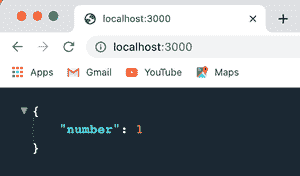
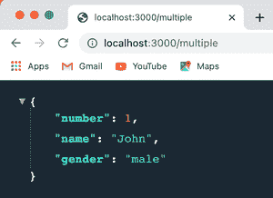
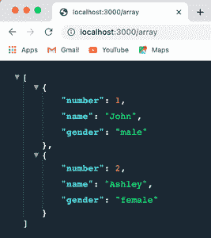

# 如何使用 Node.js 返回 JSON？

> 原文:[https://www . geesforgeks . org/how-return-JSON-using-node-js/](https://www.geeksforgeeks.org/how-to-return-json-using-node-js/)

[JSON](https://www.geeksforgeeks.org/javascript-json/) 代表 JavaScript 对象符号。它是跨应用程序交换信息最广泛使用的格式之一。 [<u>Node.js</u>](https://www.geeksforgeeks.org/introduction-to-nodejs/) 支持各种有助于使流程更加顺畅的框架。以下方法介绍了如何从 Node.js 返回应用程序中的 JSON 数据

**方法一(使用 Express . js):**[](https://www.geeksforgeeks.org/introduction-to-express/)<u>是 Node.js 的一个后端 web 应用框架，是很多开发者使用的标准框架之一。要安装它，我们将使用[<u>【NPM】</u>](https://www.geeksforgeeks.org/node-js-npm-node-package-manager/)(节点包管理器)。</u>

*   <u>**步骤 1(在我们的目录中安装 npm):**要在项目中安装 NPM，请前往终端，并将您当前的工作目录更改为该项目。然后，使用 npm init 命令初始化 package.json 文件。</u>

    ```js
    $ cd {your-project-directory}
    $ npm init
    ```

*   <u>**第 2 步(安装 express):** 现在我们的项目中已经安装了 npm，我们可以在我们的终端中使用 npm install 命令来安装 express。</u>

    ```js
    $ npm install express --save
    ```

*   <u>**第三步(准备好快递使用):**安装快递后，我们可以开始在我们的服务器上写代码了。在使用之前，我们需要一个快速模块，我们可以通过在服务器代码的顶部添加下面给出的代码来实现。</u>

     <u>```js
    const express = require('express');
    const app = express();
    ```</u> 
*   <u>**第四步(使用快递返回 JSON 数据):**现在我们的快递已经完全可以使用了。在下面给出的示例中，我们以以下方式返回数据:</u>

    *   <u>在“/”路由中，我们返回一个包含单个键值对的对象。</u>
    *   <u>在“/multiple”路由中，我们返回一个包含多个键值对的对象。</u>
    *   <u>在“/array”路由中，我们返回一个对象数组，每个对象都有多个键值对。</u>

<u>**示例:**</u>

## <u>index.js</u>

```js
// Requiring express in our server
const express = require('express');
const app = express();

// Defining get request at '/' route
app.get('/', function(req, res) {
  res.json({
    number: 1
  });
});

// Defining get request at '/multiple' route
app.get('/multiple', function(req, res) {
  res.json({
    number: 1,
    name: 'John',
    gender: 'male'
  });
});

// Defining get request at '/array' route
app.get('/array', function(req, res) {
  res.json([{
      number: 1,
      name: 'John',
      gender: 'male'
    },
    {
      number: 2,
      name: 'Ashley',
      gender: 'female'
    }
  ]);
});

// Setting the server to listen at port 3000
app.listen(3000, function(req, res) {
  console.log("Server is running at port 3000");
});
```

<u>**运行应用程序的步骤:**从项目的根目录使用以下命令运行应用程序。</u>

```js
node index.js
```

<u>**输出:**</u>

*   <u>现在打开浏览器，转到***http://localhost:3000/***，会看到如下输出。
    </u>
*   <u>转到***http://localhost:3000/multiple，*** 会看到如下输出。
    </u>
*   <u>转到***http://localhost:3000/array，*** 会看到如下输出。
    </u>

<u>**方法二(使用 HTTP 接口):**虽然第一种方法对于大多数解决方案来说已经足够了，但是还有一种方法是通过 Node.js 使用 [<u>HTTP</u>](https://www.geeksforgeeks.org/node-js-http-module/) 接口，返回 JSON 数据。Node.js 自带一个内置的 HTTP 模块，所以我们不必像安装 express 那样单独安装它。</u>

*   <u>**第 1 步(让 HTTP 做好使用准备):**我们需要在我们的服务器中要求 HTTP 能够使用它。这可以简单地通过将下面的代码添加到我们的服务器来完成。</u>

    ```js
    var http = require('http');
    ```

*   <u>**第二步(使用 http 和 JSON.stringify()返回 JSON 数据):**我们现在使用 http.createServer()和[T3】JSON . stringify()T5】从我们的服务器返回 JSON 数据。](https://www.geeksforgeeks.org/javascript-json-stringify-method/)</u>

<u>**示例:**</u>

## <u>index.js</u>

```js
var http = require('http');

var app = http.createServer(function(req,res){
    res.setHeader('Content-Type', 'application/json');
    res.end(JSON.stringify({ number: 1 , name: 'John'}));
});

app.listen(3000);
```

<u>**运行应用程序的步骤:**从项目的根目录使用以下命令运行应用程序。</u>

```js
node index.js
```

<u>**输出:**</u>

<u>现在打开浏览器，转到 **http://localhost:3000/** ，会看到如下输出。
T3】</u>

<u>**注意:**这两种方法都可以用于从服务器返回 JSON 数据，并且都会产生相同的输出。</u>