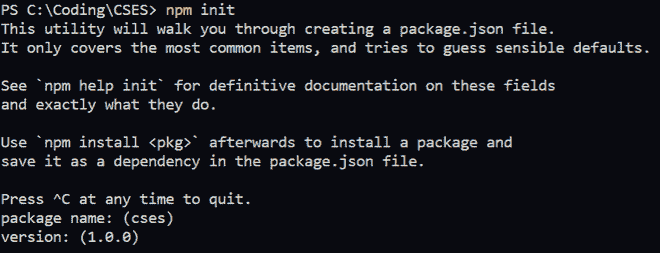
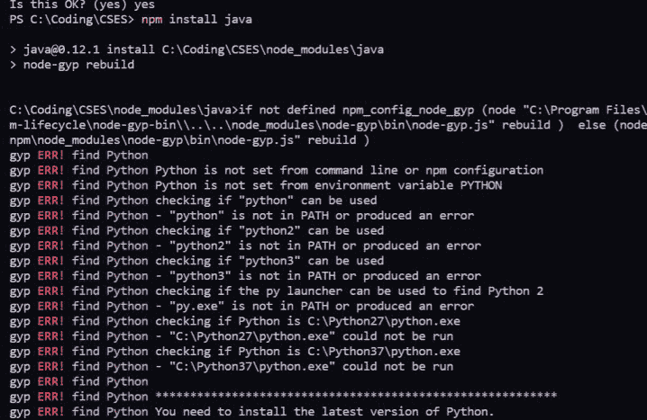
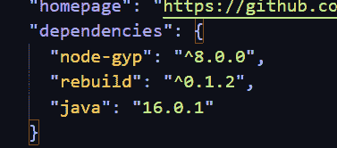

# 如何在 Node.js 中运行 Java 代码？

> 原文:[https://www . geesforgeks . org/how-run-Java-code-in-node-js/](https://www.geeksforgeeks.org/how-to-run-java-code-in-node-js/)

Node.js 是一个非阻塞的、事件驱动的 JavaScript 运行时平台，它是使用 Chrome 的 V8 JavaScript 引擎构建的。它主要用于构建可扩展的项目和应用程序，因为它既高效又轻量级。它主要用于构建应用程序时的后端目的。

**方法:**在这篇特别的文章中，我们将学习如何使用 Node.js 运行 Java 代码。我们实现这一功能的主要方法是使用 Bridge API，以便能够连接到现有的 Java APIs。

按照以下步骤在 Node.js 中运行 java 程序:

**1。在你的电脑上安装 Node.js，这里看到**[](https://www.geeksforgeeks.org/installation-of-node-js-on-windows/#:~:text=Visit%20the%20official%20Node.,be%20downloaded%20on%20your%20system.)****的步骤。****

**如果已经安装，请跳过此步骤。**

****2。打开存储 Java 代码的文件夹(或)项目，并初始化 npm。****

****语法:****

```js
npm init
```

****

****3。将 java 安装为 npm 包****

****语法:****

```js
npm install java
```

****<u>注意</u> :** Python 和 JDK 需要安装在您的系统上，这样才能无错误地运行，因为要安装的包使用 gyp，否则您会以类似的一组错误结束:**

****

**了解如何从[这里](https://www.geeksforgeeks.org/download-and-install-python-3-latest-version/)下载 Python，从[这里](https://www.geeksforgeeks.org/how-to-download-and-install-java-for-64-bit-machine/)下载 JDK，并设置环境变量为两者及其各自的路径。**

** **

**或者，您可以在依赖项列中将 java 包直接添加到项目中的 package.json 文件中。**

****

****注意:**这应该是最后的手段，即只有在任何其他方法不起作用的情况下。**

****4。现在通过在 test.js 文件中运行来测试 java 程序。****

****例 1:****

## **java 描述语言**

```js
var java = require('java');
var javaLangSystem = java.import('java.lang.System');

javaLangSystem.out.printlnSync('I love gfg!');
```

**然后在项目的终端上执行以下命令:**

```js
node test.js
```

****输出:****

```js
I love gfg!
```

****例 2:****

## **java 描述语言**

```js
var java = require('java');
var javaLangSystem = java.import('java.lang.System');
var n=10

javaLangSystem.out.printlnSync(n);
```

```js
node test.js
```

****输出**:**

```js
10
```

**参考:[https://www.npmjs.com/package/java](https://www.npmjs.com/package/java)。**