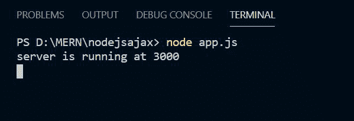

# 如何在不重新加载页面的情况下，使用 Ajax 将数据从客户端发送到 Node.js 服务器？

> 原文:[https://www . geeksforgeeks . org/如何在不重新加载页面的情况下使用 ajax 将数据从客户端发送到节点 js-server/](https://www.geeksforgeeks.org/how-to-send-data-from-client-side-to-node-js-server-using-ajax-without-page-reloading/)

在本文中，我们将学习如何使用 Ajax 将数据发送到节点服务器，而无需从客户端重新加载页面。

**方法:**我们正在客户端的 HTML 文档中创建一个按钮，当按钮被按下时，在我们的节点服务器上发出请求，并且对象在我们的服务器上被接收，而无需重新加载页面。这可以通过 Ajax 请求来完成，我们正在向我们的节点服务器发送数据，它也响应我们的 Ajax 请求返回数据。

**步骤 1:** 初始化节点模块，使用以下命令创建 package.json 文件。

```js
npm init
```

**步骤 2:** 使用以下命令将 express 模块本地安装到您的系统中。

```js
npm i express 
```

**第三步:**在 *js* 文件夹中创建 *script.js，index.html*文件，如下图所示。

**项目结构:**如下图。


文件结构

**第 4 步:**在给定的文件中写下以下代码。

## index.html

```js
<!DOCTYPE html>
<html lang="en">

<head>
    <meta charset="UTF-8">
    <meta http-equiv="X-UA-Compatible" content="IE=edge">
    <meta name="viewport" content=
        "width=device-width, initial-scale=1.0">
    <style>
        .container {
            width: 500px;
            margin: auto;
            text-align: center;
        }
    </style>
</head>

<body>
    <div class="container">
        <h1>
            Sending data to a node server using 
            Ajax Request without Reloading Page
        </h1>

        <button id="submit">submit</button>
    </div>

    <script src="https://code.jquery.com/jquery-3.6.0.min.js"
        integrity=
        "sha256-/xUj+3OJU5yExlq6GSYGSHk7tPXikynS7ogEvDej/m4=" 
        crossorigin="anonymous">
    </script>
    <script src="js/script.js"></script>
</body>

</html>
```

## script.js

```js
$(document).ready(function () {
   $("#submit").click(function () {
      $.post("/request",
         {
            name: "viSion",
            designation: "Professional gamer"
         },
         function (data, status) {
            console.log(data);
         });
   });
});
```

## app.js

```js
const express = require("express")
const path = require("path");

const app = express();
const port = process.env.PORT || 3000;

// Setting path for public directory 
const static_path = path.join(__dirname, "public");
app.use(express.static(static_path));
app.use(express.urlencoded({ extended: true }));

// Handling request 
app.post("/request", (req, res) => {
   res.json([{
      name_recieved: req.body.name,
      designation_recieved: req.body.designation
   }])
})

// Server Setup
app.listen(port, () => {
   console.log(`server is running at ${port}`);
});
```

**步骤 5:** 使用以下命令运行 *app.js* 文件:

```js
node app.js
```



启动节点服务器

**输出:**


浏览器输出