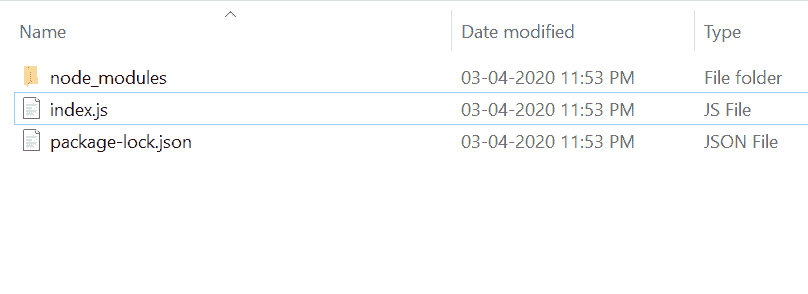
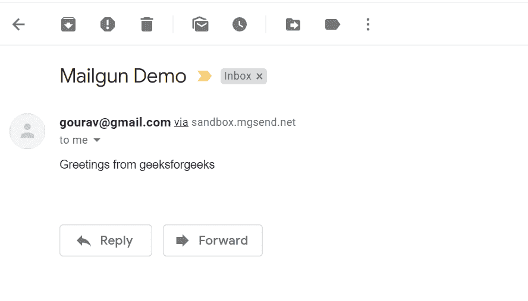

# 如何使用 Node.js 中的 Mailgun API 发送邮件？

> 原文:[https://www . geesforgeks . org/how-发送电子邮件-使用-mailgun-api-in-node-js/](https://www.geeksforgeeks.org/how-to-send-email-using-mailgun-api-in-node-js/)

发送电子邮件是任何项目必不可少的一部分，可以通过使用 Mailgun API 来实现。发送电子邮件非常受欢迎。
**麦谷特色:**。

1.  它很容易上手，也很容易使用。
2.  它是广泛使用和流行的发送电子邮件模块。
3.  邮件也可以安排。

**安装邮件枪模块:**

1.  您可以访问[安装邮件枪模块](https://www.npmjs.com/package/mailgun-js)的链接。您可以使用以下命令安装此软件包。

```
npm install mailgun-js
```

1.  安装 mailgun 后，您可以使用命令在命令提示符下检查您的 mailgun 版本。

```
npm version mailgun-js
```

1.  之后，您可以创建一个文件夹并添加一个文件。例如 *index.js* 。要运行此文件，您需要运行以下命令。

```
node index.js
```

1.  **需要模块:**您需要使用这些行在您的文件中包含 mailgun 模块。

```
const mailgun = require('mailgun-js');
```

**文件名:index.js**

## java 描述语言

```
var API_KEY = 'Your_Api_Key';
var DOMAIN = 'Your_Domain';
var mailgun = require('mailgun-js')
       ({apiKey: API_KEY, domain: DOMAIN});

sendMail = function(sender_email, receiver_email,
         email_subject, email_body){

  const data = {
    "from": sender_email,
    "to": receiver_email,
    "subject": email_subject,
    "text": email_body
  };

  mailgun.messages().send(data, (error, body) => {
    if(error) console.log(error)
    else console.log(body);
  });
}

var sender_email = 'sender@gmail.com'
var receiver_email = 'receiver@gmail.com'
var email_subject = 'Mailgun Demo'
var email_body = 'Greetings from geeksforgeeks'

// User-defined function to send email
sendMail(sender_email, receiver_email,
            email_subject, email_body)
```

**运行程序的步骤:**

1.  项目结构会是这样的:



1.  确保您已经使用以下命令安装了 mailgun】

```
npm install mailgun-js
```

1.  使用以下命令运行 *index.js* 文件:

```
node index.js
```


1.  如果没有错误发生，那就去查看收件人邮箱

