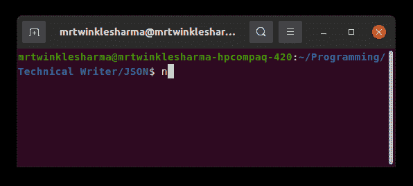
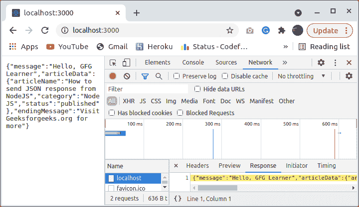

# 如何使用 Node.js 发送 JSON 响应？

> 原文:[https://www . geesforgeks . org/how-send-JSON-response-use-node-js/](https://www.geeksforgeeks.org/how-to-send-json-response-using-node-js/)

[NodeJS](https://www.geeksforgeeks.org/nodejs-tutorials/) 是运行时环境，可以在任何平台上执行 javascript 代码。由于其显著的特性，它被广泛用于创建和运行 web 应用服务器。在生产过程中，我们需要多次发送资源或某种类型的信息作为响应，javascript 对象符号(JSON)语法被广泛用于发送数据，也用于任何两个应用程序之间的通信。在本文中，我们将看到如何通过 node.js 服务器将信息作为 JSON 发送给用户。NodeJS 包含一个内置的 HTTP 模块，它用于通过 HTTP 协议传输数据，并支持许多对任何 web 应用程序都有用的功能。

让我们看看逐步实现。

**步骤 1:** 创建 NodeJS 应用程序

在您的终端中编写这个命令，它将创建一个节点应用程序。这个命令还会要求为这个应用程序提供很少的配置，这很容易提供。作为另一个选项，您可以使用 **npm init** 后的 **-y** 标志进行默认配置。

```
npm init
```

**第二步:**创建一个 Javascript 文件，我们将把它命名为 **app.js** 你可以随意命名。在这个文件中，我们将编写整个代码。

**项目结构:**现在我们的目录结构会如下图所示。


**第三步:**现在我们要创建一个后端服务器，更明确的说，创建一个服务器无非就是写几行代码，调用 nodejs 的内置函数。它只是创建一个运行时，在机器上执行 javascript 代码。

**进场:**

1.  导入 **app.js** 文件顶部带有 require 关键字的 HTTP 模块，并将返回的结果存储在一个 const 变量中。
2.  现在调用 createServer()函数，它将为您提供一个 web 服务器作为回报。稍后，此服务器对象将用于侦听指定主机和端口上的连接
3.  现在通过提供端口号、主机名和回调函数来调用函数 listen()。
4.  回调函数将在服务器成功启动或失败时执行。

## app.js

```
const http = require('http');

const server = http.createServer();

server.listen(3000,'localhost', function(error){
    if(!error)
        console.log("Server is Listening at Port 3000!");
    else 
        console.log("Error Occured");
});
```

**输出:**使用终端中的****节点 app.js** 命令运行服务器。成功启动后，类似这样的内容将显示在您的终端中。**

****

****第 4 步:**创建请求监听器。直到第 3 步，我们已经成功地创建了一个服务器，但目前，服务器既不会与我们交互，也不会响应我们的请求。原因是我们还没有创建请求侦听器。在这一步中，我们将创建一个请求侦听器，每当有人点击服务器时就会调用它。**

****进场:****

1.  **创建一个简单的函数，就像我们在 javascript 中做的那样，这个函数将接收请求和响应对象作为参数，我们可以在其中执行任何与服务器相关的功能。**
2.  **第一个 console.log()语句只是为了表明我们的服务器正在工作，并且正在对任何请求调用请求侦听器。**
3.  **接下来，我们准备一些随机数据作为响应发送。**

## **app.js**

```
const requestListener = (req, res)=>{
  console.log("Request is Incoming");

  const responseData = {
      message:"Hello, GFG Learner",
    articleData:{
        articleName: "How to send JSON response from NodeJS",
        category:"NodeJS",
        status: "published"
    },
    endingMessage:"Visit Geeksforgeeks.org for more"
  }
};
```

****第五步:**现在我们发送响应。数据将与响应对象一起发送给用户。**

****进场:****

1.  **在发送响应之前，在 requestListener 内部，我们正在从 javascript 对象创建一个 jsonContent，因为将用于发送数据的 end()函数接收缓冲区或字符串作为数据。**
2.  **JSON.stringify()是 nodejs 中的内置方法，它接受一个 javascript 对象并返回 stringified 对象。**
3.  **对 end()函数的调用向服务器指示所有进程都已完成，以便它可以向用户发送响应。
    end 函数可以接收随响应一起发送的数据、响应流成功结束时调用的回调函数以及字符编码。
    在我们的情况下，我们只对发送数据感兴趣。**
4.  **最后，我们在 createServer()中传递了请求侦听器，这样服务器的每个请求都可以在请求侦听器中调用这个功能。**

## **app.js**

```
const http = require('http');

const requestListener = (req, res)=>{
  console.log("Request is Incoming");

  const responseData = {
      message:"Hello, GFG Learner",
    articleData:{
        articleName: "How to send JSON response from NodeJS",
        category:"NodeJS",
        status: "published"
    },
    endingMessage:"Visit Geeksforgeeks.org for more"
  }

  const jsonContent = JSON.stringify(responseData);
  res.end(jsonContent);
};

const server = http.createServer(requestListener);

server.listen(3000,'localhost', function(){
    console.log("Server is Listening at Port 3000!");
});
```

****运行应用程序的步骤:**打开终端，键入以下命令。**

```
node app.js
```

****输出:**这是请求的 JSON 响应。如果我们打开 chrome 开发者工具的网络部分，我们将能够看到服务器的实际响应。**

****

**这就是从 NodeJS 服务器以 JSON 的形式发送响应。**