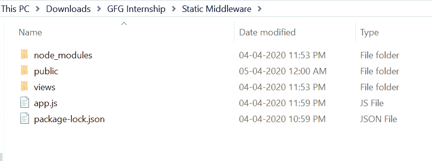

# 如何使用 Node.js 服务静态内容？

> 原文:[https://www . geesforgeks . org/how-to-service-static-content-use-node-js/](https://www.geeksforgeeks.org/how-to-serve-static-content-using-node-js/)

当您想让服务器可以访问您的静态内容以供使用时，访问静态文件非常有用。为了服务静态文件，如图像、CSS 文件和 JavaScript 文件等，我们使用了 node.js 中内置的中间件，即 express.static。

**设置静态中间件:**

1.  您需要创建一个文件夹并添加一个文件。例如，app.js，要运行这个文件，您需要运行以下命令。

    ```
    node app.js
    ```

2.  现在创建一个文件夹，其内容要作为静态内容，例如，您可以创建一个名为 public 的文件夹。
3.  现在向这个公共文件夹添加一些静态内容。在这种情况下，公共文件夹中有一个 GeeksLogo.png 图像。
4.  要将这个文件夹作为静态文件夹，您需要在您的 index.js 中编写这个中间件，如下所示:
    `app.use(express.static(path.join(__dirname, 'public')))`
    ，其中 path 是全局对象，__dirname 保存当前目录地址。视图是保存我们所有网页的文件夹。
5.  现在创建一个像 Demo.ejs 这样的 EJS 文件，并将这个文件放在 views 文件夹中。

**文件名称:演示。ejs**

```
<!DOCTYPE html>
<html>
<head>
    <title>Static Middleware Demo</title>
</head>
<body>
  
</body>
</html>
```

**文件名:app.js**

```
const express = require('express')
const path = require('path')
const app = express()

// Static Middleware
app.use(express.static(path.join(__dirname, 'public')))

// View Engine Setup
app.set('views', path.join(__dirname, 'views'))
app.set('view engine', 'ejs')

app.get('/', function(req, res){
    res.render('Demo')
})

app.listen(8080, function(error){
    if(error) throw error
    console.log("Server created Successfully")
})
```

**运行程序的步骤:**

1.  项目结构会是这样的:
    
2.  确保你有“查看引擎”，就像我使用“ejs”一样，并使用以下命令安装 express:

    ```
    npm install ejs
    ```

    ```
    npm install express
    ```

3.  Run app.js file using below command:

    ```
    node app.js
    ```

    

4.  打开浏览器，输入该网址:

    ```
    http://localhost:8080/
    ```

5.  然后你会看到如下所示的 Demo.ejs 页面:
    

这就是如何将静态内容提供给我们的服务器，这对于在您的项目中提供图像、CSS、js 文件等非常有帮助。