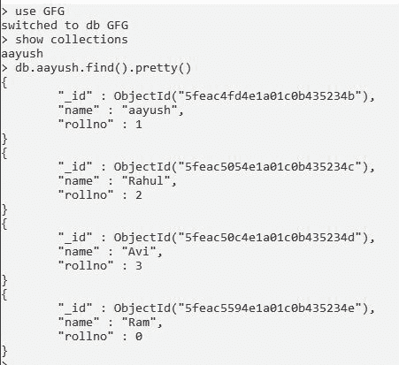

# 如何使用 Node.js 对 MongoDB 数据库的集合进行升序排序？

> 原文:[https://www . geesforgeks . org/how-to-sort-collection-of-MongoDB-database-in-升序-use-node-js/](https://www.geeksforgeeks.org/how-to-sort-collection-of-mongodb-database-in-ascending-order-using-node-js/)

**MongoDB** ，最受欢迎的 NoSQL 数据库，是一个开源的面向文档的数据库。术语“NoSQL”的意思是“非关系的”。这意味着 MongoDB 不是基于类似表的关系数据库结构，而是提供了一种完全不同的数据存储和检索机制。这种存储格式称为 BSON(类似于 JSON 格式)。

**MongoDB 模块**:node . js 的这个模块用于连接 MongoDB 数据库，也用于操作 MongoDB 中的集合和数据库。mongodb.connect()方法用于连接在您的计算机上的特定服务器上运行的 mongodb 数据库。(参考 [本](https://www.geeksforgeeks.org/how-to-connect-mongodb-server-with-node-js/) 篇)。

**排序()方法**的用于对文档进行排序。 此方法用于定义文件的顺序。

*   集合的特定键按升序排列

```js
{Collection's key:1}
```

**安装模块:**

```js
npm install mongodb
```

**项目结构:**


**在本地 IP 上运行服务器:数据是 MongoDB 服务器所在的目录。**

```js
mongod --dbpath=data --bind_ip 127.0.0.1
```


**MongoDB 数据库:**

```js
Database name:GFG
Collection name:aayush
```



**Index.js**

## java 描述语言

```js
const mongoclient = require("mongodb");
const url = "mongodb://localhost:27017/"

// Database name
const databasename = "GFG"

// Connecting to MongoDB
mongoclient.connect(url).then((db) => {
    const connect = db.db(databasename);

    // Connecting to collection
    const collection = connect.collection("aayush");
    console.log("Connection Created")

    // Sort the document key
    const sort = { rollno: 1 }

    collection.find().sort(sort).toArray((err, ans,) => {
        if (!err) {

            // Printing the documents
            console.log(ans);
        }
    })

}).catch((err) => {
    console.log(err.Message);
})
```

**执行命令:**

```js
node index.js
```

**控制台输出:**

