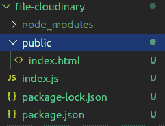
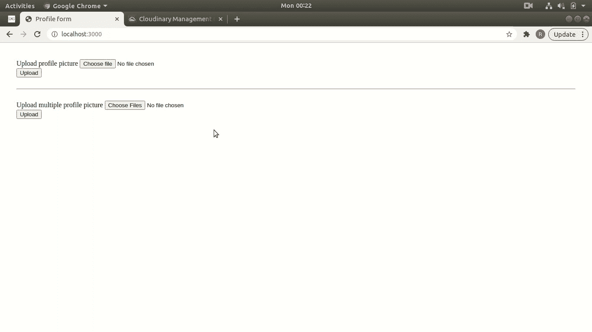

# 如何使用 node.js 将单/多张图片上传到 cloudinary？

> 原文:[https://www . geesforgeks . org/how-upload-single-multi-image-to-cloudinary-use-node-js/](https://www.geeksforgeeks.org/how-to-upload-single-multiple-image-to-cloudinary-using-node-js/)

**Cloudinary** 是一款面向网站和移动应用的端到端图像和视频管理解决方案，涵盖从图像和视频上传、存储、操作、优化到交付的所有内容。

**安装:**

*   **第一步:**转到项目目录，在终端使用下面的命令初始化项目。

    ```
    npm init -y
    ```

*   **步骤 2:** 使用以下命令安装所需的 npm 包。

    ```
    npm install express multer cloudinary
    ```

*   **第三步:**在当前项目目录下创建 2 个文件，分别命名为 **index.js** 和 **public/index.html** ，如下图项目目录所示。

**项目结构:**


**index.html:** 基本包含单个和多个文件上传两种形式。

## index.html

```
<!DOCTYPE html>
<body style="padding: 30px;">
    <form method="POST" action="/profile-upload-single" 
          enctype="multipart/form-data">
        <div>
            <label>Upload profile picture</label>
            <input type="file" name="profile-file" required/>
        </div>
        <div>
            <input type="submit" value="Upload" />
        </div>
    </form>

    <br><hr><br>

    <form method="POST" action="/profile-upload-multiple" 
          enctype="multipart/form-data">
        <div>
            <label>Upload multiple profile picture</label>
            <input type="file" name="profile-files" required multiple  />
        </div>
        <div>
            <input type="submit" value="Upload" />
        </div>
    </form>
</body>
</html>
```

**index.js:** 将 *cloud_name* 、 *api_key* 、 *api_secret* 替换为您在 [cloudinary 仪表盘](https://cloudinary.com/users/login)上可以找到的 **cloudinary 凭证**。

## index.js

```
// Requiring module
const express = require("express");
const multer = require("multer");
const port = 3000;
const app = express();
const cloudinary = require("cloudinary").v2;
const bodyParser = require("body-parser");
const fs = require("fs");

// Creating uploads folder if not already present
// In "uploads" folder we will temporarily upload
// image before uploading to cloudinary
if (!fs.existsSync("./uploads")) {
    fs.mkdirSync("./uploads");
}

// Multer setup
var storage = multer.diskStorage({
    destination: function (req, file, cb) {
        cb(null, "./uploads");
    },
    filename: function (req, file, cb) {
        cb(null, file.originalname);
    },
});

var upload = multer({ storage: storage });

// Body parser configuration
app.use(bodyParser.json());
app.use(bodyParser.urlencoded({ extended: true }));

app.use(express.static(__dirname + "/public"));
app.use("/uploads", express.static("uploads"));

// Cloudinary configuration
cloudinary.config({
    cloud_name: "YOUR_CLOUD_NAME",
    api_key: "YOUR_API_NAME",
    api_secret: "YOUR_API_SECRET",
});

async function uploadToCloudinary(locaFilePath) {

    // locaFilePath: path of image which was just
    // uploaded to "uploads" folder

    var mainFolderName = "main";
    // filePathOnCloudinary: path of image we want
    // to set when it is uploaded to cloudinary
    var filePathOnCloudinary = 
        mainFolderName + "/" + locaFilePath;

    return cloudinary.uploader
        .upload(locaFilePath, { public_id: filePathOnCloudinary })
        .then((result) => {

            // Image has been successfully uploaded on
            // cloudinary So we dont need local image 
            // file anymore
            // Remove file from local uploads folder
            fs.unlinkSync(locaFilePath);

            return {
                message: "Success",
                url: result.url,
            };
        })
        .catch((error) => {

            // Remove file from local uploads folder
            fs.unlinkSync(locaFilePath);
            return { message: "Fail" };
        });
}

function buildSuccessMsg(urlList) {

    // Building success msg to displpay on screen
    var response = `<h1>
                   <a href="/">Click to go to Home page</a><br>
                  </h1><hr>`;

    // Iterating over urls of images and creating basic
    // html to render images on screen
    for (var i = 0; i < urlList.length; i++) {
        response += "File uploaded successfully.<br><br>";
        response += `FILE URL: <a href="${urlList[i]}">
                    ${urlList[i]}</a>.<br><br>`;
        response += `<br><hr>`;
    }

    response += `<br>
<p>Now you can store this url in database or 
  // do anything with it  based on use case.</p>
`;
    return response;
}

app.post(
    "/profile-upload-single",
    upload.single("profile-file"),
    async (req, res, next) => {

        // req.file is the `profile-file` file
        // req.body will hold the text fields,
        // if there were any

        // req.file.path will have path of image
        // stored in uploads folder
        var locaFilePath = req.file.path;

        // Upload the local image to Cloudinary 
        // and get image url as response
        var result = await uploadToCloudinary(locaFilePath);

        // Generate html to display images on web page.
        var response = buildSuccessMsg([result.url]);

        return res.send(response);
    }
);

app.post(
    "/profile-upload-multiple",
    upload.array("profile-files", 12),
    async (req, res, next) => {

        // req.files is array of `profile-files` files
        // req.body will contain the text fields,
        // if there were any
        var imageUrlList = [];

        for (var i = 0; i < req.files.length; i++) {
            var locaFilePath = req.files[i].path;

            // Upload the local image to Cloudinary
            // and get image url as response
            var result = await uploadToCloudinary(locaFilePath);
            imageUrlList.push(result.url);
        }

        var response = buildSuccessMsg(imageUrlList);

        return res.send(response);
    }
);

app.listen(port, () => {
    console.log(`Server running on port ${port}!
            \nClick http://localhost:3000/`);
});
```

**运行程序的步骤:**

```
node index.js
```

**输出:**打开浏览器，访问***http://localhost:3000***。您现在可以看到以下两种形式，即单个和多个图像上传，如下所示。



参考文献:[https://cloudinary.com/documentation/node_integration](https://cloudinary.com/documentation/node_integration)。