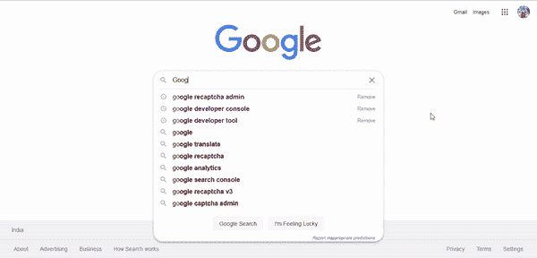
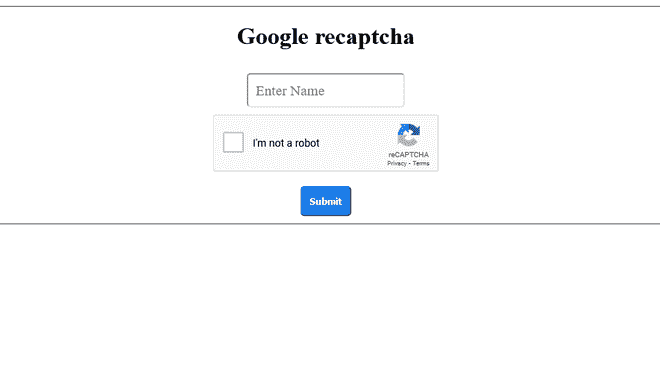
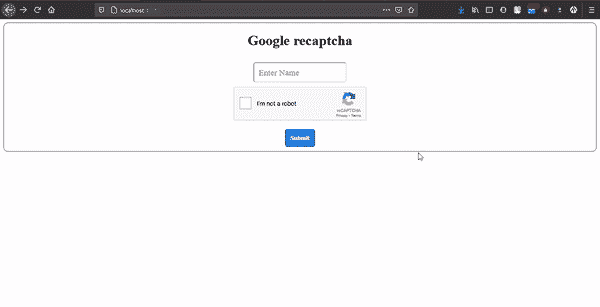
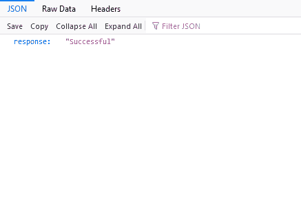
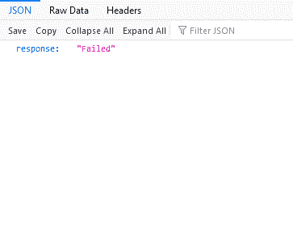

# 如何在 Node.js 服务器调用中验证 recaptcha？

> 原文:[https://www . geesforgeks . org/how-verify-recaptcha-in-node-js-server-call/](https://www.geeksforgeeks.org/how-to-verify-recaptcha-in-node-js-server-call/)

**Google reCAPTCHA:**reCAPTCHA 是一个验证码系统，可以让网络主机区分对网站的人工访问和自动访问。这项服务由谷歌提供。

谷歌提供了两个版本的 reCAPTCHA:

1.  recptcha v3
2.  recptcha v2

在本文中，我们将看到关于 reCAPTCHA v2 的内容。

**进场:**

*   在谷歌注册你的网站
*   提交 [HTML](https://www.geeksforgeeks.org/html-tutorials/) 表单。
*   在 [Node.js](https://www.geeksforgeeks.org/nodejs-tutorials/) 服务器中获取响应密钥
*   重新验证密钥并向用户终端给出响应。

**第一步:在谷歌注册你的网站**

在谷歌注册平台注册你的网站，获取密钥，即网站密钥和编码 HTML 表单所需的秘密密钥。

点击这里进入谷歌 reCAPTCHA 网站。



谷歌注册网站演示

**第二步:在 HTML 中创建 Google reCAPTCHA 表单**

在这里，我们将创建一个简单的 HTML 表单，其中包含操作 as /submit、一个输入字段和一个按钮。同时，我们需要在我们的 HTML 文档中添加 google reCAPTCHA CDN，并在表单中添加 div 标签，以在 HTML 文档中获取 reCAPTCHA。

```js
CDN: <script src="https://www.google.com/recaptcha/api.js" async defer></script>
DIV TAG: <div class="g-recaptcha" data-sitekey="your_site_key"></div> 
```

**注意:**您需要用您的站点密钥替换“您的站点密钥”。

**示例:**

**文件名:index.html**

## 超文本标记语言

```js
<!DOCTYPE html>
<html lang="en">

<head>
    <meta charset="UTF-8">
    <meta http-equiv="X-UA-Compatible" content="IE=edge">
    <meta name="viewport"
          content="width=device-width, initial-scale=1.0">

    <!-- CSS file -->
    <link rel="stylesheet" href="style.css">

    <!-- Google reCAPTCHA CDN -->
    <script src=
"https://www.google.com/recaptcha/api.js" async defer>
    </script>
</head>

<body>
    <div class="container">
        <h1>Google recaptcha</h1>

        <!-- HTML Form -->
        <form action="/submit" method="post">
            <input type="text" name="name" id="name"
                   placeholder="Enter Name" required>
            <br>

            <!-- div to show reCAPTCHA -->
            <div class="g-recaptcha"
                 data-sitekey="your_site_key">
            </div>
            <br>

            <button type="submit">Submit</button>
        </form>

    </div>
</body>

</html>
```

**文件名:style.css**

## 半铸钢ˌ钢性铸铁(Cast Semi-Steel)

```js
.container {
  border: 1px solid rgb(73, 72, 72);
  border-radius: 10px;
  margin: auto;
  padding: 10px;
  text-align: center;
}

h1 {
  margin-top: 10px;
}

input[type="text"] {
  padding: 10px;
  border-radius: 5px;
  margin: 10px;
  font-family: "Times New Roman", Times, serif;
  font-size: larger;
}

button {
  border-radius: 5px;
  padding: 10px;
  color: #fff;
  background-color: #167deb;
  border-color: #0062cc;
  font-weight: bolder;
  cursor: pointer;
}

button:hover {
  text-decoration: none;
  background-color: #0069d9;
  border-color: #0062cc;
}

.g-recaptcha {
  margin-left: 513px;
}
```

**输出:**



超文本标记语言表单

**第三步:Node.js 服务器:**

我们已经准备好了表单，让我们对服务器文件进行编码。在服务器端，我们将使用两个包，一个是针对作为 web 框架的服务器的 express，另一个是针对 http/https 调用的同构提取。

创建新目录并在其中生成 package.json 文件。使用 **<u>npm init</u>** 命令生成 package.json 文件，这是最佳实践。这是我的 package.json 文件，供参考。

**文件名:package.json**

## java 描述语言

```js
{
  "name": "google_recaptcha",
  "version": "1.0.0",
  "description": "Google recaptacha v2 demonstration.",
  "main": "app.js",
  "scripts": {
    "test": "echo \"Error: no test specified\" && exit 1"
  "author": "Asmit Sirohi",
  "license": "ISC",
  "dependencies": {
    "express": "^4.17.1",
    "isomorphic-fetch": "^3.0.0"
  }
}
```

现在，让我们为服务器文件编写代码，HTML 表单将在该文件中提交数据。

**第四步:验证验证码:**

为了验证验证码，我们需要向以下网址发出帖子请求。

*   **URL:**https://www.google.com/recaptcha/api/siteverify?secret=<秘钥>T4【响应= <响应 _ 密钥>
*   **secret_key** :这个密钥你会从谷歌控制台得到，也就是 Secret Key。
*   **response_key:** 该键来自用户提交表单时的客户端。

**注:**

*   g-recaptcha-response 是浏览器将在表单提交时生成的响应密钥的名称。如果它的空白或 null 表示用户没有选择验证码，那么返回错误。
*   您需要将“您的密钥”替换为您的密钥。

**文件名:app.js**

## java 描述语言

```js
// Importing express package
const express = require("express");
// Importing isomorphic-fetch package
const fetch = require("isomorphic-fetch");

// instantiating express package
const app = express();

// Making public folder static where index.html file is present
// By making it static, we can easily serve index.html page
app.use(express.static("public"));

// To accept HTML form data
app.use(express.urlencoded({ extended: false }));

// Here, HTML form is submit
app.post("/submit", (req, res) => {
  const name = req.body.name;
  // getting site key from client side
  const response_key = req.body["g-recaptcha-response"];
  // Put secret key here, which we get from google console
  const secret_key = "<your_secret_key>";

  // Hitting POST request to the URL, Google will
  // respond with success or error scenario.
  const url =
`https://www.google.com/recaptcha/api/siteverify?secret=${secret_key}&response=${response_key}`;

  // Making POST request to verify captcha
  fetch(url, {
    method: "post",
  })
    .then((response) => response.json())
    .then((google_response) => {

      // google_response is the object return by
      // google as a response
      if (google_response.success == true) {
        //   if captcha is verified
        return res.send({ response: "Successful" });
      } else {
        // if captcha is not verified
        return res.send({ response: "Failed" });
      }
    })
    .catch((error) => {
        // Some error while verify captcha
      return res.json({ error });
    });
});

// lifting the app on port 4000.
const PORT = 4000;
app.listen(PORT, () => console.log(`Server is running on PORT ${PORT}`));
```

**运行应用:**

要运行应用程序，请切换到项目文件夹，并使用命令运行节点应用程序。

```js
node app.js
```

转到 localhost:4000 查看应用。

**输出:**



*   **验证码验证时**



*   **验证码未验证时**

