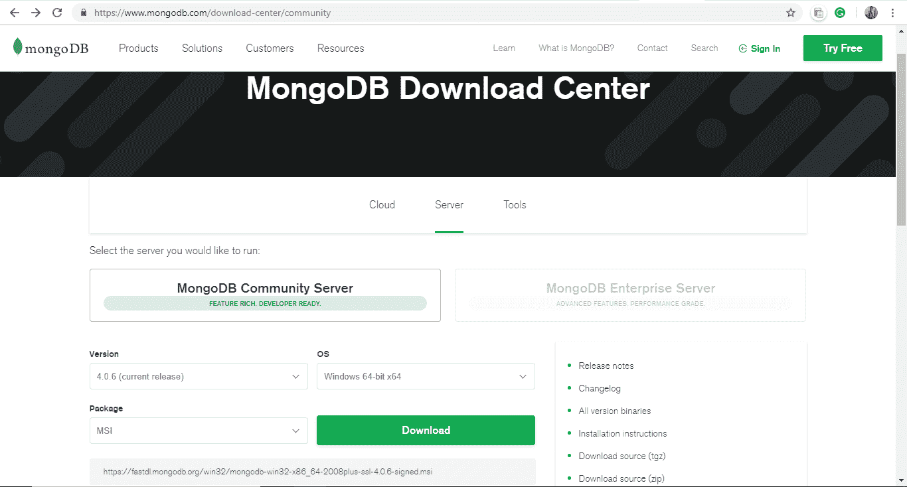
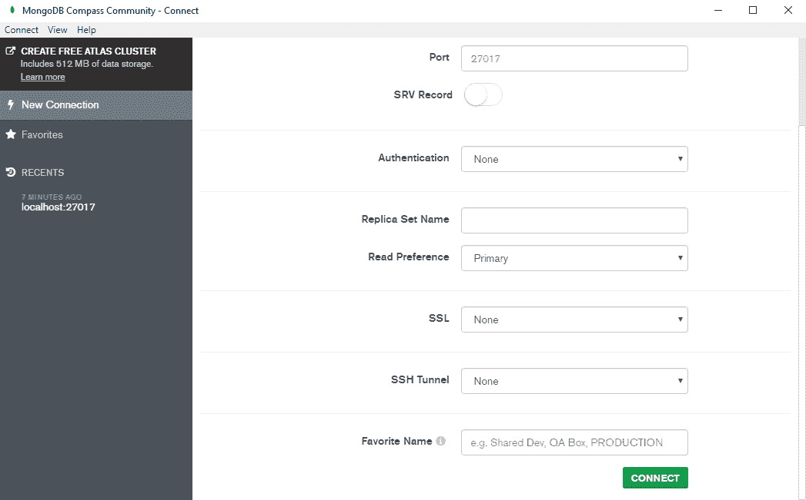
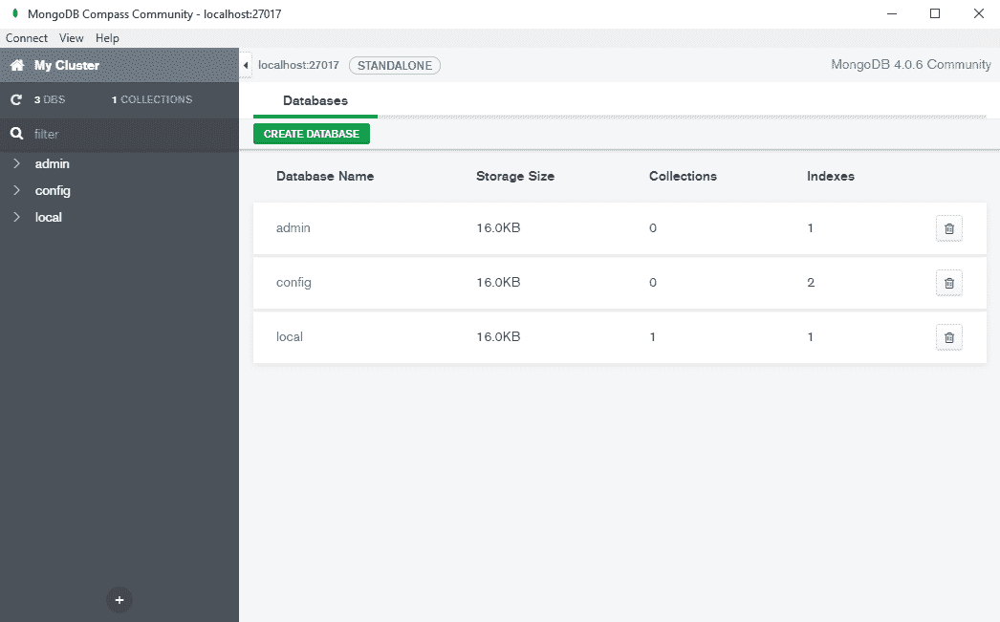
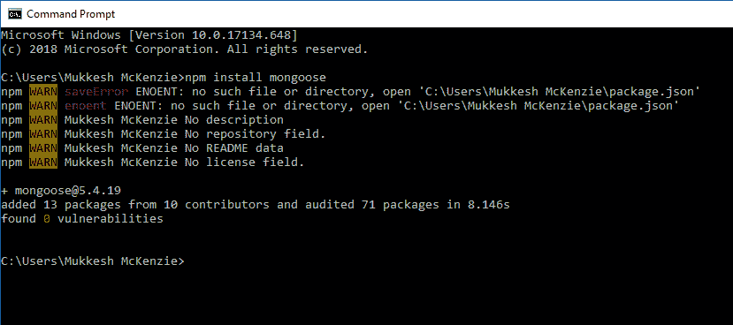
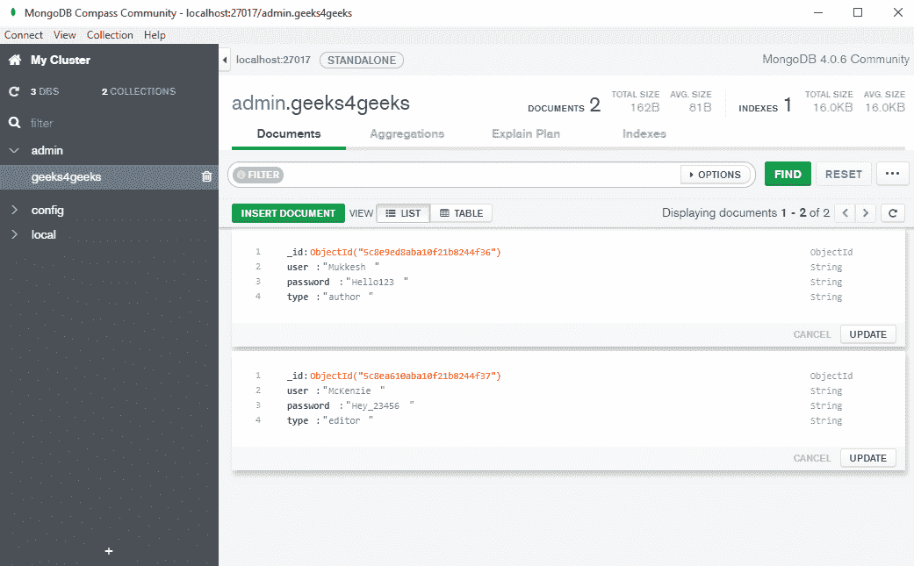

# 关于 Node.js 和 MongoDB 的介绍

> 原文:[https://www . geesforgeks . org/introduction-about-node-js-and-MongoDB/](https://www.geeksforgeeks.org/introduction-about-node-js-and-mongodb/)

NoSQL 数据库是以非表格形式存储和检索数据的数据库。根据存储数据的格式，NoSQL 数据库分为 4 种主要类型:

*   键值
*   图形数据库
*   面向文档
*   柱族

这些数据库旨在解决传统关系数据库管理系统的缺点，提供高性能、高可用性和更高的可伸缩性(横向)，同时还处理随时间不断改变其模式的数据。当今最流行的 NoSQL 数据库之一是蒙古数据库。
**MongoDB** 是一个可扩展、高性能、开源、面向文档的 NoSQL 数据库，由 10gen 在 2007 年开发。它是用 C++编写的，支持多种编程语言的各种 API。

### MongoDB 的主要功能:

*   对高性能的全面索引支持
*   水平可扩展和容错(分布式数据存储/分片)
*   基于文档的丰富查询，易于阅读
*   高可用性的复制和故障转移
*   聚合的映射/减少
*   支持主从复制
*   没有连接也没有事务
*   没有僵化的模式，这使得它是动态的
*   JSON / BSON 中的数据

### 什么时候用 MongoDB？

MongoDB 可以用在需要简单查询、简单快速的数据集成以及数据结构随时间不断变化的地方。

**例:**

*   电子商务网站
*   移动应用
*   博客和内容管理门户
*   存储地理空间数据

同时，由于它不支持事务，所以不能在高事务性系统中使用。

### SQL vs MongoDB

MySQL 和 MongoDB 中使用的组件有不同的术语，但功能相似。

| 结构化查询语言 | MongoDB |
| 数据库ˌ资料库 | 数据库ˌ资料库 |
| 桌子 | 收藏品 |
| 排 | 文件 |
| 圆柱 | 田 |
| 索引 | 索引 |

### 安装 MongoDB(在 windows 上):

转到以下链接([https://www.mongodb.com/download-center/community](https://www.mongodb.com/download-center/community))并下载 MongoDB 社区服务器。


从这里，下载 MSI 文件，并在你的电脑中安装 MongoDB。

安装完成后，打开 MongoDB Compass Community 应用，选择**连接**选项。


MongoDB 的本地实例现在将在本地主机上运行，端口号为 27017。


### node.js 和 mongodb

Node.js 是一个开源的 JavaScript 服务器环境，能够连接到 SQL 和 NoSQL 数据库，比如 MySQL 和 MongoDB(分别)。为了使用这些数据库，需要使用节点包管理器(npm)下载并安装所需的模块。

要使用 MongoDB，需要安装**mongose**模块。

*   ### 安装猫鼬:

    打开命令提示符或终端，输入以下命令，安装**猫鼬**模块

    ```
    npm install mongoose
    ```

    

*   ### 使用 Node.js 连接到 MongoDB

    下面的 Node.js 脚本用于连接到 MongoDB 的本地实例。

    ```
    var client = require('mongodb').MongoClient;
    var url = 'mongodb://localhost:27017/admin';
    client.connect(url,{ useNewUrlParser: true }, function(err,db)
    {
         console.log("Connected");
         db.close();
    });
    ```

    **说明:**

    1.  要连接到数据库/创建数据库，需要创建一个 MongoClient 对象。
    2.  应该指定 MongoDB 的 URL，后跟数据库名称
    3.  使用 MongoClient 对象的连接功能，在服务器和 MongoDB 之间建立连接。

    **注意:**这里使用的是管理数据库。

    **运行 Node.js 文件:**
    打开命令提示符，导航到包含 js 文件的文件夹，输入以下命令。

    ```
    node *filename*.js
    ```

    

    **注意:**如果添加新文档时，网址中提到的数据库不在 MongoDB 中，则创建数据库。

*   ### 从 MongoDB 查询数据:

    下面的代码片段用于查询 MongoDB 数据库中的数据。

    ```
    var client = require('mongodb').MongoClient;
    var url = 'mongodb://localhost:27017/';
    client.connect(url,{ useNewUrlParser: true }, function(err,db)
    {    
            var dbo=db.db("admin")
        var cursor = dbo.collection('geeks4geeks').find();    
        cursor.each(function (err,doc)
        {
            if(doc!=null)
            console.log(doc);
        });
        db.close();
    });
    ```

    **说明:**

    *   使用该网址，可以建立与 MongoDB 服务器的连接。
    *   使用数据库功能，创建到**管理**数据库的连接。
    *   出现在 **geeks4geeks** 集合中的所有文档都被检索并显示在控制台中。

    **注意:**这里使用的是管理数据库，里面包含了**极客 4geeks** 的集合，里面有一些文档。

    **运行 Node.js 文件:**
    打开命令提示符，导航到包含 js 文件的文件夹，输入以下命令。

    ```
    node *filename*.js
    ```

    

    这些是管理数据库极客 4geeks 集合中的文档。
    