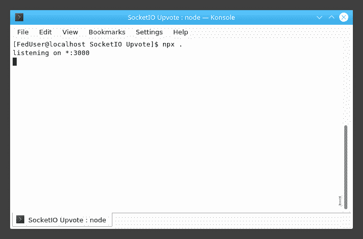
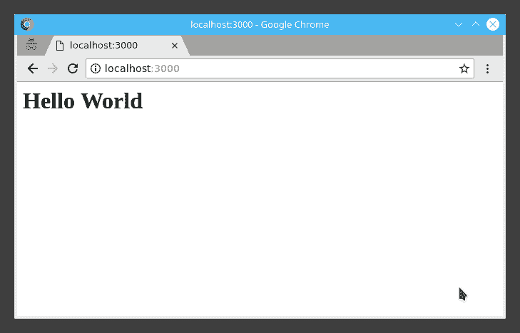
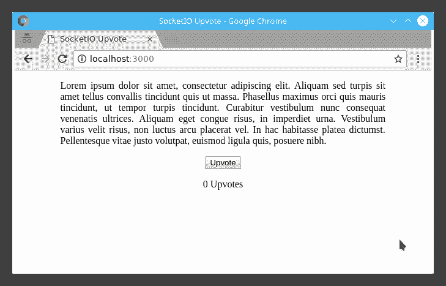
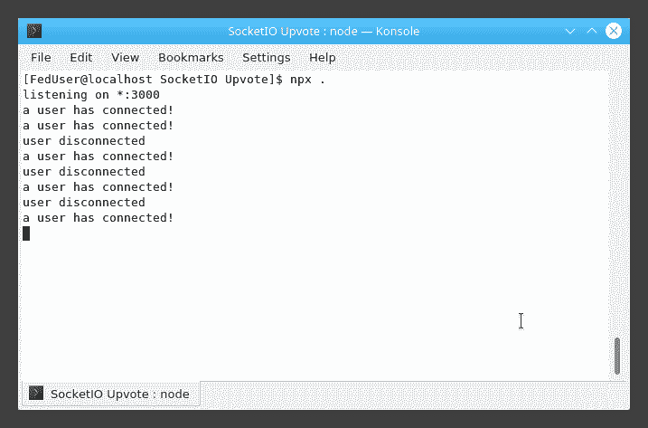
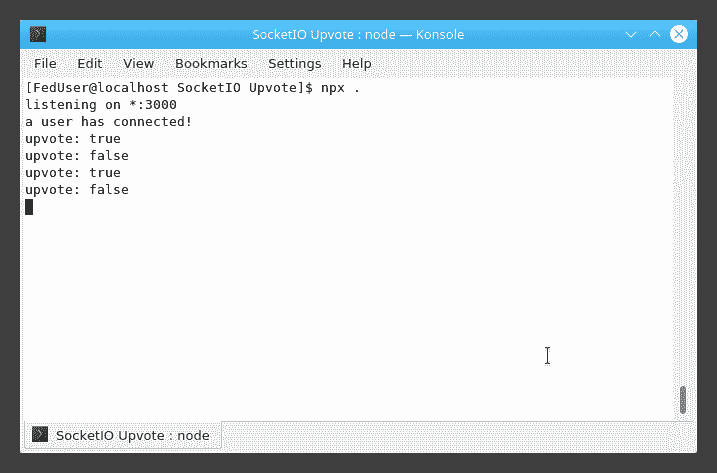
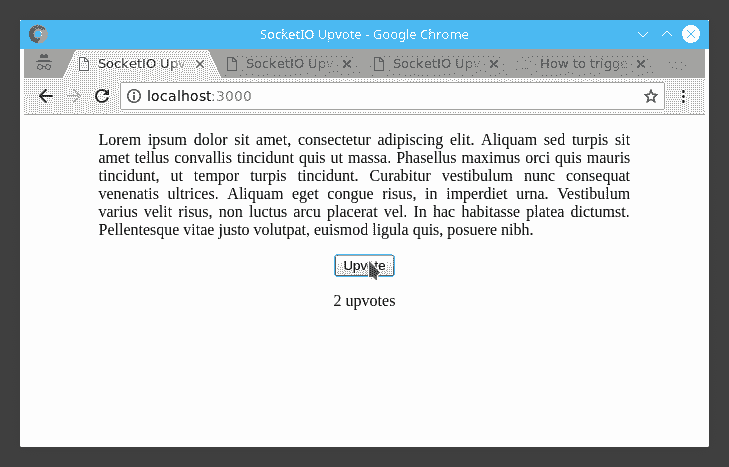
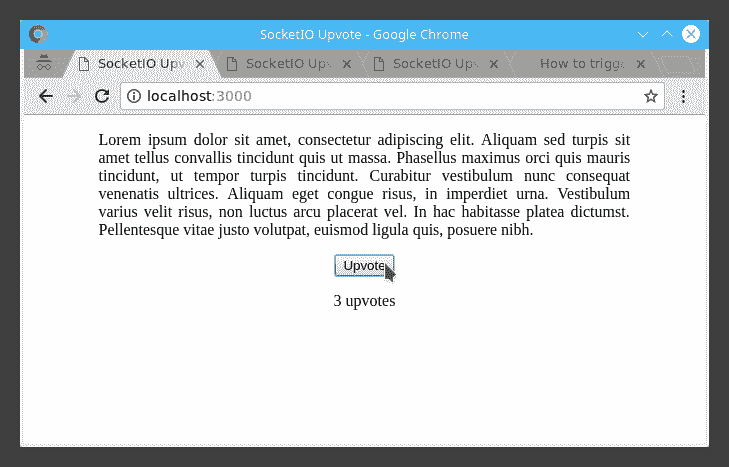

# 插座介绍。Node.js 中的 IO

> 原文:[https://www . geesforgeks . org/introduction-to-sockets-io-in-node-js/](https://www.geeksforgeeks.org/introduction-to-sockets-io-in-node-js/)

**插座。IO :**

以前，网站用于在每次请求资源时重新加载。这引入了不必要的延迟，增加了平均等待时间。用户通常需要等待几分钟才能获取特定的页面或文件。另一方面，实时应用程序(即时消息、在线游戏、推送通知等)是那些在给定时间段内运行的应用程序，以便向用户呈现资源的即时和最新副本。这些应用程序中的延迟尽可能低，以提供流畅一致的用户体验。插座。IO 就是这样一个 JavaScript 库，程序员在开发实时“Web 应用程序”时会用到它。

**为什么是插座。IO :**
如今互联网上的大部分应用都是基于客户端-服务器架构。客户端是向服务器请求某些东西的人。服务器根据请求，以适当的结果进行响应。这两个实体完全不同，因为它们执行的任务的性质。浏览器是客户端应用程序的完美例子。浏览器上的客户端通常通过 HTTP 请求和响应与服务器通信。这种通信的问题在于，一次可以发送一个请求或一个响应。为了便于理解，可以将其视为半双工链路。此外，HTTP 头包含大量的冗余信息，一旦客户端和服务器之间建立了连接，这些信息就没有用了。另一方面，套接字在网络堆栈的传输层工作。没有很多冗余字段，从而提高了网络信息传输的效率。

插座。IO 工作在同一个概念上，支持 web 客户端和服务器之间的双向通信。为了分别有效地处理它们，它由两部分组成；

*   一个运行在浏览器上的 JavaScript 客户端库。
*   一个 Node.js 服务器

插座。输入输出依赖于引擎。IO，它是基于传输的跨浏览器/跨设备双向通信层的实现。它为 Socket 带来了以下特性。IO；

*   **可靠性:**即使有代理、负载平衡器、个人防火墙和防病毒软件，它也能建立连接。
*   **自动重新连接支持:**除非代码中明确提到，否则客户端库将尝试永远重新连接，直到服务器再次可用。
*   **断线检测:**它让服务器和客户端都知道对方何时不再响应。
*   **复用支持:**允许同一底层连接上有多个通信通道。
*   **二进制流支持:**它还允许发出任何可序列化的二进制数据，如 ArrayBuffer、Blobs 等。

**安装:**

**Required for Installation of Sockets.IO**

*   **节点**已安装*   **npm (node package manager)** installed

    如前所述，一个项目中包含两个不同的库。

    *   **服务器:**
        要将其安装在 Node.js 项目中，运行以下命令，

        ```
        $ npm install --save socket.io
        ```

    *   **JavaScript Client:**
        A standalone build of the client is exposed by default by the server at **/socket.io/socket.io.js**. Otherwise, it can also be served from any of the CDN providers.

        要从 Node.js 中使用它，请通过以下命令安装它:

        ```
        $ npm install --save socket.io-client
        ```

    ### 示例:

    这个例子是关于在 Socket.IO 中实现一个基本的 Upvote 按钮，它将显示服务器和客户端的实时通信。首先，转到所需的项目目录，并使用 **npm init** 命令或手动创建一个 **package.json** 文件对其进行初始化。

    > {
    > “name”:“up vote-example”，
    > “version”:“0.1”，
    > “description”:“第一个 socket.io app”，
    > “main”:“index . js”，
    > “dependencies”:{ }
    > }

    现在使用以下命令安装 express js，

    ```
    $ npm install --save express@4.15.2
    ```

    安装后，创建 **index.js** 文件来设置应用程序。

    > var app = require(' express ')()；
    > var http = require( 'http ')。createServer(应用程序)；
    > 
    > const PORT = 3000
    > 
    > app.get( '/'，function( req，res ) {
    > res.send('
    > 
    > # 你好世界
    > 
    > ' );
    > })；
    > 
    > http.listen( PORT，function(){
    > console . log(' listening on *:'+PORT)；
    > })；

    这段代码的作用是，为 Express 创建一个函数处理程序，然后提供给 HTTP 服务器。当请求 **/** 页面时，该处理程序向客户端响应“Hello World”。最后，HTTP 服务器开始监听端口 3000。

    运行它会像这样，

    

    

    **服务 HTML:**
    以前，只发送一行 HTML 作为对 GET 请求的响应。这次，使用**发送文件**方法附加一个 HTML 文件。

    > app.get( '/'，function( req，RES){
    > RES . sendfile(_ dirname+'/public/index . html ')；
    > })；

    现在创建**index.html**文件并粘贴以下代码。

    ```
    <!DOCTYPE html>
    <html>

    <head>
        <title>SocketIO Upvote</title>
        <style>
            .container {
                width: 80%;
                margin: 1rem auto;
            }

            .text-justify {
                text-align: justify;
            }
        </style>
    </head>

    <body>
        <div class="container">

            <p class="text-justify">Lorem ipsum dolor sit amet, consectetur adipiscing elit.
     Aliquam sed turpis sit amet tellus convallis tincidunt quis ut massa. Phasellus maximus
     orci quis mauris tincidunt, ut tempor turpis tincidunt. Curabitur vestibulum nunc consequat
     venenatis ultrices. Aliquam eget congue risus, in imperdiet urna. Vestibulum varius velit 
     risus, non luctus arcu placerat vel. In hac habitasse platea dictumst. Pellentesque vitae
     justo volutpat, euismod ligula quis, posuere nibh.</p>
        </div>

        <div class="container">
            <center>
                <button id="upvote-btn"> Upvote </button>
                <p id="upvote-count">0 Upvotes</p>
            </center>
        </div>
    </body>

    </html>
    ```

    重新启动项目并刷新页面，应该是这样的，

    

    **集成插座。IO:**
    要安装服务器端模块，运行以下命令，

    ```
    $ npm install --save socket.io
    ```

    现在对 **index.js** 进行如下更改:

    > var app = require(' express ')()；
    > var http = require( 'http ')。createServer(应用程序)；
    > var io = require(' socket . io ')(http)；
    > 
    > const PORT = 3000
    > 
    > app.get( '/'，function( req，RES){
    > RES . sendfile(_ dirname+'/public/index . html ')；
    > })；
    > 
    > http.listen( PORT，function(){
    > console . log(' listening on *:'+PORT)；
    > })；
    > 
    > io.on( 'connection '，function(socket){
    > console . log("某用户已连接！");
    > })；

    额外的改变初始化了套接字。输入输出处理器。当此处理程序发出“连接”信号时，会附加一个日志记录操作。

    在客户端，只需要在结束标记之前的以下代码片段。这暴露了一个由特定客户端使用的 **io** 全局。

    > <脚本>
    > var socket = io()；
    > </脚本>

    从控制台重新启动项目，并尝试在多个选项卡和浏览器上打开 localhost。它们中的每一个都将充当唯一的客户端连接。每次在客户端和服务器之间建立连接时，都会打印日志消息。

    

    当客户端关闭或刷新选项卡时，每个插座还会触发一个特殊的**断开**事件:

    > io.on( 'connection '，function(socket){
    > console . log('用户已连接！');
    > socket.on( 'disconnect '，function(){
    > console . log(' user disconnected ')；
    > })；
    > })；

    

    **发射事件:**
    Socket 背后的主要思想。IO 是一个人可以发送和接收任何选择的事件，有或没有任何数据。任何可以编码为 JSON 的对象都可以，也支持二进制数据。

    让我们假设当用户点击向上投票按钮时，发出名为**向上投票事件**的事件。所以在**index.html**文件中，插入以下脚本。

    > <脚本>
    > var socket = io()；
    > var BTN = document . getelement byid(' up vote-BTN ')；
    > var up vote _ val = false；
    > 
    > btn.addEventListener( 'click ')，函数(e){
    > e . preventdefault()；//防止页面重新加载
    > 
    > upvote_val = upvote_val 吗？false: true：
    > 
    > socket.emit( 'upvote-event '，up vote _ val)；
    > })；
    > </剧本>

    在 **index.js** 中，下面的代码片段记录事件数据。

    > io.on( 'connection '，function(socket){
    > console . log('用户已连接！');
    > 
    > socket.on( 'disconnect '，function(){
    > console . log(' user disconnected ')；
    > })；
    > 
    > socket.on( 'upvote-event '，function(up vote _ flag){
    > console . log(' up vote:'+up vote _ flag)；
    > })；
    > })；

    结果应该是这样的，
    

    **广播:**
    下一个目标是从服务器向其余用户发出一个事件。这一次，基于点击的向上投票计数将被广播给连接到服务器的每一个客户端。我们把这个事件叫做**更新投票**。为了计算向上票数，让我们创建一个变量**向上票数-计数**。像这样更新 **index.js** ，

    > var up vout _ count = 0；
    > io.on( 'connection '，function(socket){
    > console . log('用户已连接！');
    > 
    > socket.on( 'disconnect '，function(){
    > console . log(' user disconnected ')；
    > })；
    > 
    > socket.on( ‘upvote 事件’，函数[upvote _ flag]{
    > upvote _ count+= upvote _ flag 吗？一:一：
    > 在哪里 f_str =上数+(上数== 1)？「上下限」─「上下限」─：
    > 
    > io . emit(' update-uploats '，f _ str)；
    > })；
    > })；

    这里， **upvote_count** 初始化为零(0)，并根据 **upvote_flag** 的值进行更新。然后，更新后的值被发送到所有客户端，包括发生“更新事件”的客户端。

    在客户端，这样更新**index.html**，

    > btn.addEventListener( 'click ')，函数(e){
    > e . preventdefault()；//防止页面重新加载
    > 
    > upvote_val = upvote_val 吗？false: true：
    > 
    > socket.emit( 'upvote-event '，up vote _ val)；
    > })；
    > 
    > socket . on(' update-up vots '，function(f _ str){
    > document . getelementbyid(' up vote-count ')。innerHTML = f _ str
    > })；
    > </剧本>

    它将用当前的向上投票计数值更新 DOM 元素。结果会是这样的，

    
    

    要使这个例子在实际开发中健壮和可用，需要考虑很多事情。人们应该考虑到这样一个事实，即当多个用户同时点击 upvote 按钮时，这个例子将遇到一个竞争条件的问题。应该使用适当的锁定机制来使它在现实世界的应用程序中工作。

    **获取此示例:**
    在 Github [上找到此示例的完整代码，点击此处](https://github.com/CherryGot/SocketIO-Upvote)。

    **去背包**

    ```
    https://github.com/CherryGot/SocketIO-Upvote.git
    ```