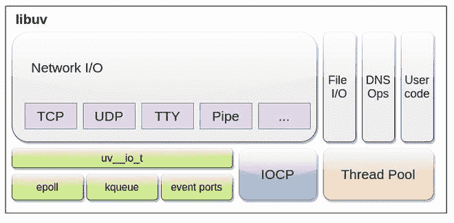

# node . js 中的 Libuv

> 原文:[https://www.geeksforgeeks.org/libuv-in-node-js/](https://www.geeksforgeeks.org/libuv-in-node-js/)

Node.js 依赖于不同的依赖关系来提供不同的特性。

*   V8
*   libuv
*   llhttp
*   c-ares(消歧义)
*   OpenSSL

Libuv 就是其中之一，我们来详细讨论一下 **libuv** 。

**libuv:** libuv 是一个 C 库，最初是为 Node.js 编写的，用于抽象**非阻塞 I/O 操作**。

*   集成了事件驱动的异步输入输出模型。
*   它允许在执行输入/输出操作的同时同时使用中央处理器和其他资源，从而有效利用资源和网络。
*   它促进了一种事件驱动的方法，其中使用基于回调的通知来执行输入/输出和其他活动。

**示例:**如果一个程序正在查询数据库，那么 CPU 将一直处于空闲状态，直到查询被处理，并且程序处于暂停状态，从而导致系统资源的浪费。为了防止这种情况，在 Node.js 中使用了 **libuv** ，这有助于实现无阻塞的输入/输出

它还具有处理服务的机制，如 [**【文件系统】**](https://www.geeksforgeeks.org/node-js-file-system/)**[**【DNS】**](https://www.geeksforgeeks.org/nodejs-dns/)**、网络、** [**子进程**](https://www.geeksforgeeks.org/node-js-child-process/) **、管道、信号处理、轮询****和** [**流送**](https://www.geeksforgeeks.org/node-js-streams/) **。**
为了执行操作系统级无法异步完成的阻塞操作，libuv 还包括一个**线程池**来分配 CPU 负载。**

*   ****什么是线程池？**** 

**Libuv 将任务分配给工作线程池。但是，任务完成时发生的所有回调都在主线程上执行。
**注意:【Node 10.5 之后工作线程也可以用来并行执行 JavaScript。默认情况下，Libuv 使用 4 个线程，但是可以使用 **UV_THREADPOOL_SIZE** 进行更改****

```
process.env.UV_THREADPOOL_SIZE = 5
```

****libuv 的特点:****

*   **由 epoll (Linux)、kqueue (OSX)、IOCP (Windows)、事件端口(SunOS)支持的全功能事件循环。**
*   **异步 TCP(网络模块)和 UDP(分布式内存模块)**
*   **异步域名解析(部分用于域名系统模块)**
*   **异步文件、文件系统操作和事件(文件系统模块)**
*   **ANSI 转义码控制的 TTY**
*   **线程池和信号处理**
*   **子进程**
*   **高分辨率时钟**
*   **线程和同步原语。**
*   **使用套接字和 Unix 域套接字的进程间通信(窗口)** 

****

****事件或输入/输出循环:**事件或输入/输出循环使用**单线程异步输入/输出方法**，因此它绑定到单线程。为了运行多个事件循环，**每个事件循环**必须在不同的线程**上运行。默认情况下**不是线程安全的**，但有一些例外。****

**Libuv 维护一个**事件队列**和**事件解复用器**。该循环监听传入的输入/输出，并为每个请求发出**事件**。然后将请求分配给特定的处理程序(取决于操作系统)。成功执行后，**注册的回调在事件队列中排队**，一个接一个连续执行。
**注意:**在循环的每次迭代开始时，整个过程所需的当前时间由 libuv 缓存，以尽量减少频繁的系统调用。**

****示例:**如果发出网络请求，则为该请求注册一个回调，并将任务分配给处理程序。在它被执行之前，其他操作继续进行。在成功执行/终止时，注册的回调在事件队列中排队，然后由主线程在队列中已经存在的先前回调执行之后执行。**

**它使用前面提到的特定于平台的机制来实现最佳的兼容性和性能 **epoll (Linux)、kqueue (OSX)、IOCP (Windows)、事件端口(SunOS)。****

****文件输入/输出:**文件输入/输出使用**全局线程池**在 libuv 中实现，所有循环都可以在该线程池上排队工作。它允许以抽象的异步方式使用磁盘。它将复杂的操作分解成更简单的操作，以促进类似**异步的**行为。**

****示例:**如果程序指示向特定文件写入缓冲区，在正常情况下，I/O 将被阻塞，直到操作成功/终止。然而，libuv 通过放置**事件通知**将此抽象为异步方式，该事件通知将在操作完成后通知操作成功/失败，在此之前，其他输入/输出操作可以轻松执行。
**注:**libuv 不能保证螺纹安全(少数例外)**

**与事件循环不同，文件输入/输出使用独立于平台的机制。由文件输入输出处理的**异步磁盘接口**有三种:**

1.  **linux AIO(内核支持)**
2.  **posix AIO(由 linux、BSD、Mac OS X、solaris、AIX 等支持)**
3.  **窗口重叠输入输出**

****优势:****

*   **磁盘操作是异步执行的。**
*   **高级操作可以分解为更简单的磁盘操作，这有助于纠正信息。**
*   **磁盘线程可以使用像 readv & writev 这样的向量操作，允许传递更多的缓冲区。**

****参考:**T2】http://docs.libuv.org/en/v1.x/design.html**