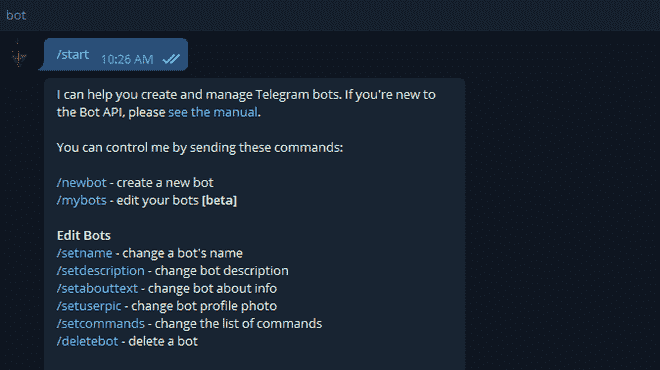
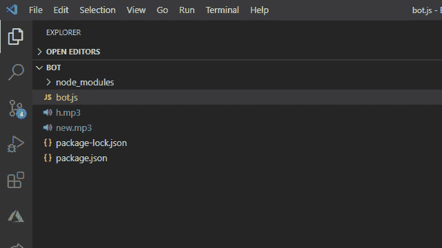
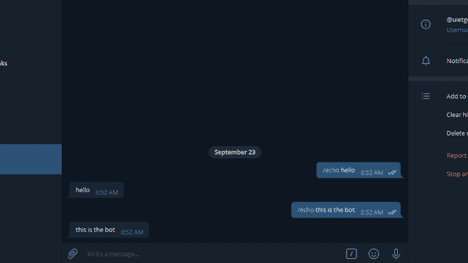

# 电报机器人

的 Node.js Bot.onText() API

> 原文:[https://www . geesforgeks . org/node-js-bot-ontext-API-for-telegram-bot/](https://www.geeksforgeeks.org/node-js-bot-ontext-api-for-telegram-bot/)

Node.js 电报 Bot API 中使用了 **Bot.onText()** 方法。这个 Node.js 模块与官方的电报机器人应用编程接口进行交互。该方法用于用户与电报机器人交互时的回复。

**语法:**

```js
TelegramBot.onText(regexp, callback)
```

**参数:**该方法接受两个参数，如上所述，如下所述:

*   **regexp:** 是正则表达式，消息必须包含 */echo* 。
*   **回调:**是函数调用执行时作为参数传递并调用的回调函数。

**返回类型:**函数的返回类型为空。

**安装模块:**使用以下命令安装模块:

```js
npm i telegram-bot-api
```

**获取钥匙的步骤:**

1.  首先通过电报从机器人父亲那里获得 **GET BOT_TOKEN** 。只需在 Telegram 中搜索**botdeator**，选择验证后的如下所示:
    
2.  键入*/启动*然后点击*/新机*如下图:
    
3.  现在输入机器人的名称，并且必须是唯一的。
    
4.  现在只需从机器人父亲那里复制令牌。要删除令牌，只需在 BotFather 中搜索/删除令牌。

**项目结构:** 

**文件名:bot.js**

```js
var token = 'Enter the token';

const TelegramBot = require('node-telegram-bot-api');

const bot = new TelegramBot(token, {polling: true});

// Matches "/echo [whatever]"
bot.onText(/\/echo(.+)/, (msg, match) => {

 // The 'msg' is the received Message from Telegram
 // and 'match' is the result of executing the regexp 
 // above on the text content of the message

 const chatId = msg.chat.id;

 // The captured "whatever"
 const resp = match[1]; 

 // send back the matched "whatever" to the chat
 bot.sendMessage(chatId,resp);

});
```

使用以下命令运行 bot.js 文件:

```js
node bot.js
```

**输出:**
