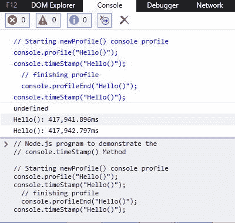
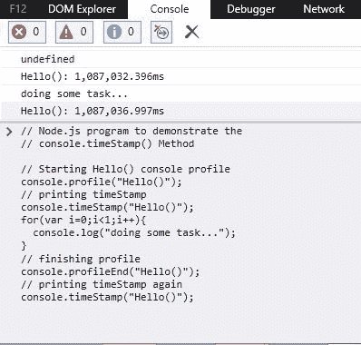

# Node.js console.timeStamp()方法

> 原文:[https://www . geesforgeks . org/node-js-console-timestamp-method/](https://www.geeksforgeeks.org/node-js-console-timestamp-method/)

*控制台*模块提供了一个简单的调试控制台，该控制台由 web 浏览器提供，该浏览器导出两个特定组件:

*   一个控制台类，可用于写入任何 Node.js 流。示例: *console.log()、console.error()、*等。
*   无需导入控制台即可使用的全局控制台。例如: *process.stdout，process.stderr* 等。

***console . timestamp()***(在 v8.0.0 中添加)方法是“ *console* ”模块的内置应用编程接口，除非在检查器中使用，否则不会显示任何内容。此方法将带有标签“*标签*的事件添加到检查器的时间线面板。

**注意:**全局控制台方法既不是一致同步的，也不是一致异步的。

**语法:**

```js
console.timeStamp([label])
```

**参数:**该函数接受如上所述的单个参数，如下所述:

*   **标签** < *字符串* > **:** 它接受进一步在检查器中使用的标签名称。

**返回值:**它不在控制台打印任何东西，而是在检查器中打印调用时的时间戳。

下面的例子说明了在 Node.js 中使用 *console.timeStamp()* 方法

**示例 1:** **文件名:index.js**

```js
// Node.js program to demonstrate the 
// console.timeStamp() Method

// Starting newProfile() console profile
console.profile("Hello()");

// Printing timestamp
console.timeStamp("Hello()");

// Finishing profile
console.profileEnd("Hello()");
```

使用以下命令运行 **index.js** 文件:

```js
node index.js
```

**控制台输出:**

> ***不在控制台打印任何内容……**

**检测器(边缘)中的输出:**



**示例 2:** **文件名:index.js**

```js
// Node.js program to demonstrate the 
// console.timeStamp() Method

// Starting Hello() console profile
console.profile("Hello()");

// Printing timeStamp
console.timeStamp("Hello()");

// Performing some action
for(var i=0; i<1; i++) {
  console.log("doing some task...");
}

// Finishing profile
console.profileEnd("Hello()");

// Printing timeStamp again
console.timeStamp("Hello()");
```

使用以下命令运行 **index.js** 文件:

```js
node index.js
```

**控制台输出:**

> 做一些任务…

**检测器(边缘)中的输出:**



**参考:**[https://nodejs . org/API/console . html # console _ console _ timestamp _ label](https://nodejs.org/api/console.html#console_console_timestamp_label)