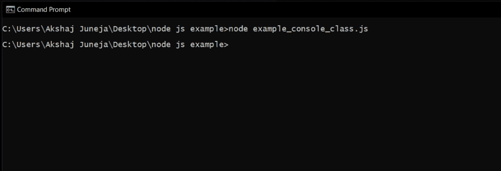
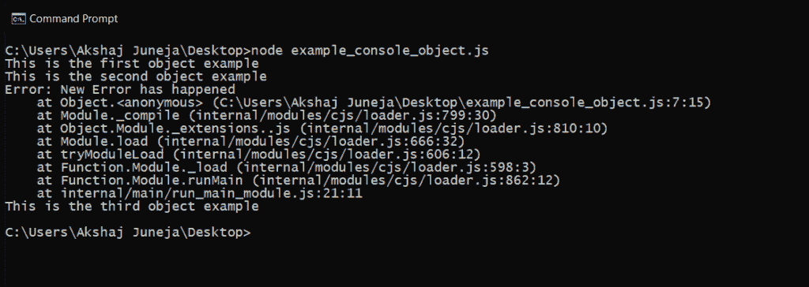

# Node.js 控制台

> 原文:[https://www.geeksforgeeks.org/node-js-console/](https://www.geeksforgeeks.org/node-js-console/)

Node.js 控制台模块是一个全局对象，它提供了一个类似于 JavaScript 的简单调试控制台来显示不同级别的消息。它由网络浏览器提供。控制台模块包含两个组件:

*   **Console 类:**Console 类方法有 console.log()、console.error()和 console.warn()来显示 Node.js 流。
*   **全局控制台:**不调用 require('控制台')使用。

**Console 类示例:**制作一个文件，保存为*示例 _console_class.js* ，文件中有以下代码。

```
// It requires the fs module 
const fs = require('fs');

const out = fs.createWriteStream('./stdout.log');
const err = fs.createWriteStream('./stderr.log');

const myobject = new console.Console(out, err);

// It will display 'This is the first example' to out
myobject.log('This is the first example');

// It will display 'This is the second example' to out
myobject.log('This is the %s example', 'second');

// It will display 'Error: In this we creating some error' to err
myobject.error(new Error('In this we creating some error'));

const num = 'third';

// It will display 'This is the third error' to err
myobject.warn(`This is the ${num} example`);
```

如果您观察上面的例子，我们已经使用控制台类创建了一个具有可配置输出流的简单对象，并且使用**控制台创建了一个**控制台类**对象。控制台**

现在，我们将通过导航到如下所示的文件夹来执行命令提示符下的 *example_console_class.js* 脚本文件。



上面的 node.js 示例将在*示例 _console_class.js* 文件所在的文件夹中创建一个日志文件(stdout & stderr)，其中包含如下所示的所需消息。


**全局控制台对象示例:**创建一个文件，保存为 example_console_object.js，文件中有以下代码。

```
// It will display 'This is the first object example' to stdout
console.log('This is the first object example');

// It will display 'This is the second object example' to stdout
console.log('This is the %s example', 'second object');

// It will display 'Error: New Error has happened' to stderr
console.error(new Error('New Error has happened'));

const obj = 'third object';

// It will display 'This is the third object example' to stderr
console.warn(`This is the ${obj} example`);
```

如果您观察到上面的代码，我们正试图使用全局控制台对象方法(如 **console.log()、console.error()和 console.warn()将消息写入 node.js 流。**这里，我们正在访问全局控制台对象，而没有使用 require 指令导入它。

现在，我们将执行*example _ console _ object . js*文件，为此，打开命令提示符(cmd)并导航到包含*example _ console _ object . js*文件的文件夹，然后编写命令 ***节点 example _ console _ object . js***并点击如下所示的回车按钮。



如果您观察结果，我们可以使用**全局控制台对象向 node.js 流中写入所需的消息。**

**Console 方法:**除了上述三种方法 **(console.log()、console.error()、console.warn())、**在 node.js console 对象中很少有其他方法可以在 node.js 流中写入或打印消息。

*   **console.count():** 用于统计特定标签被调用的次数。
*   **console.clear():** 用于清除控制台历史记录。
*   **console.info():** 用于在 console 上写一条消息，是 console.log()方法的别名。
*   **console.time():** 用于获取一个动作的开始时间。
*   **console.timeEnd():** 用于获取具体动作的结束时间。
*   **console.dir():** 它对对象使用 util.inspect()，并将结果字符串打印到 stdout。