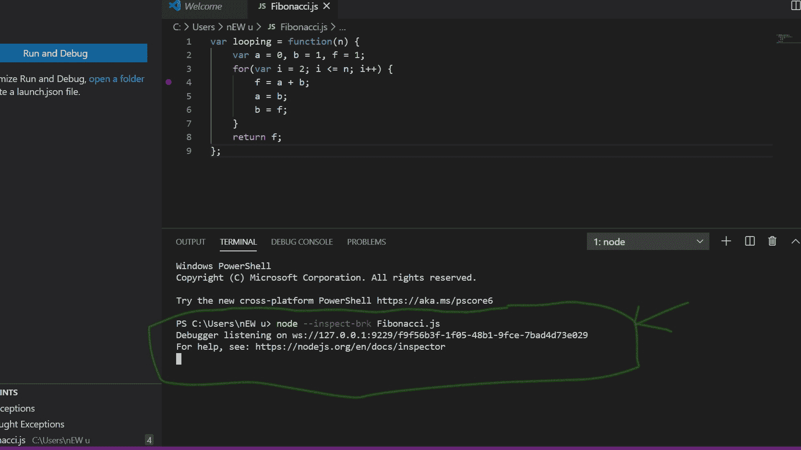
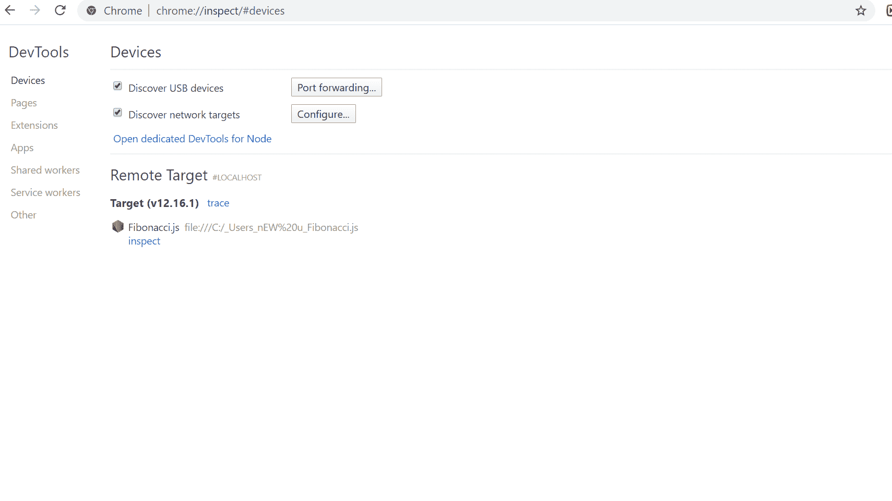
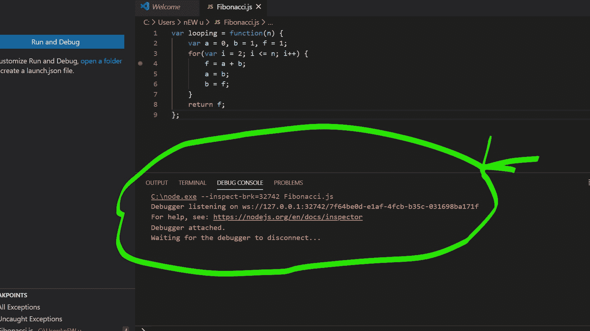

# Node.js 调试

> 原文:[https://www.geeksforgeeks.org/node-js-debugging/](https://www.geeksforgeeks.org/node-js-debugging/)

**Node.js 调试:**调试是一个从软件应用程序中识别和移除错误的概念。在本文中，我们将学习调试 Node.js 应用程序的技术。

**为什么不用 console.log()？**
使用 **console.log** 调试代码一般会陷入“停止应用并添加 console.log，然后重新启动应用”的无限循环操作。除了减慢应用程序的开发速度，它还会使书写变脏并产生不必要的代码。最后，试图注销变量以及其他潜在的日志记录操作的噪音，可能会使调试过程在试图找到您正在调试的值时变得困难。

**如何调试？**
大部分情况下我们使用 **console.log()** 但是如上所述，这并不总是一个好的做法。我们可以用一个 V8 检查员。

**调试步骤:**

1.  如下所示，在终端窗口中编写以下代码:

```js
node --inspect-brk-filename.js
```



*   打开你的 Chrome 浏览器，写检查如下图:
    *   现在点击**打开节点专用开发工具**。
    T3】*   Now, click on the Node.js icon. The terminal will show the following message:
    

    **帮助启动开发工具窗口的其他工具:**

    ```js
    june07.com/nim
    github.com/jaridmargolin/inspect-process
    github.com/darcyclarke/rawkit

    ```

    **附加调试 API:**

    1.  **调试现有节点进程:**

        ```js
        process._debugProcess(pid);</pre

        ```

    2.  **类似 GDB 的命令行界面调试器:**

        ```js
        node inspect filename.js

        ```

    3.  **通过 WS 端口使用开发工具协议驱动:**

        ```js
        const dp = require('chrome-remote-interface');

        async function test() {
        const client = await dp();
        const {Profiler, Runtime} = client;

        await Profiler.enable();
        await Profiler.setSamplingInterval({interval: 500});

        await Profiler.start();
        await Runtime.evaluate({expression: 'startTest();'});
        await sleep(800);

        const data = await Profiler.stop();
        require('fs').writeFileSync('data.cpuprofile',
                        JSON.stringify(data.profile));
        };

        test().then((result)=>{
            console.log(result);
        })
        .catch((error)=>{
            console.log(error);
        });
        ```

    4.  **开发工具协议通过要求('检查员'):**

        ```js
        const inspector = require('inspector');
        const fs = require('fs');
        const session = new inspector.Session();

        session.connect();
        session.post('Profiler.enable');
        session.post('Profiler.start');

        setTimeout( function() {
            session.post('Profiler.stop', 
                     function(err, data) {
                fs.writeFileSync('data.cpuprofile',
                     JSON.stringify(data.profile));
            });
        }, 8000);
        ```

使用 Chrome 作为调试工具的另一个令人敬畏的地方是，您可以用相同的接口调试前端和后端的 JavaScript 代码。