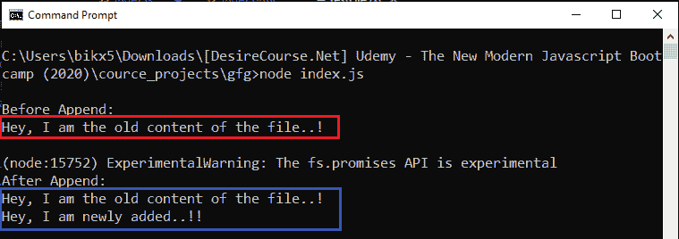

# node . js file handle . appendfile()方法

> 原文:[https://www . geesforgeks . org/node-js-file handle-append file-method/](https://www.geeksforgeeks.org/node-js-filehandle-appendfile-method/)

**filehandle.appendFile()** 方法是在 Node.js 的 File System 模块中定义的，File System 模块基本上就是和用户电脑的硬盘进行交互。appendFile()方法用于在现有文件中异步追加新数据，或者如果该文件不存在，则首先创建该文件，然后给定数据被追加到该文件中。

**语法:**

```js
filehandle.appendFile(data, options);
```

**参数:**该方法接受两个参数，如上所述，如下所述:

*   **数据:**它是一个字符串或缓冲区，将附加到目标文件。
*   **选项:**它是一个可选参数，以某种方式影响输出，因此我们是否将其提供给函数调用。
    *   **编码:**指定编码技术，默认为‘UTF8’。

**方法:**fs . promises . open(路径，模式)方法返回一个用 filehandle 对象解析的 promise。首先，我们创建一个 filehandle 对象，然后在这个对象的帮助下继续使用 appendFile()方法。

在 filehandles 上操作时，模式不能从使用 fs.promises.open()设置的模式更改，因此，我们在调用 fs.promises.open()方法时要确保在模式中添加“a”或“a+”，否则 appendFile()方法只是充当 writeFile()方法。

**示例 1:** 此示例说明了新数据如何追加到先前存在的文件中。

```js
// Importing File System and Utilities module
const fs = require('fs')

// fs.readFileSync(() method reads the file
// and returns buffer form of the data 
const oldBuffer = fs.readFileSync('./testFile.txt')

// File content before append 
const oldContent = oldBuffer.toString()
console.log(`\nBefore Append: ${oldContent}\n`)

const appendDataToFile = async (path, data) => {
    let filehandle = null

    try {
        // Mode 'a' allows to append new data in file
        filehandle = await fs.promises.open(path, mode = 'a')

        // Append operation
        await filehandle.appendFile(data)
    } finally {
        if (filehandle) {

            // Close the file if it is opened.
            await filehandle.close();
        }
    }

    const newBuffer = fs.readFileSync('./testFile.txt')

    // File content after append 
    const newContent = newBuffer.toString()
    console.log(`After Append: ${newContent}`)
}

appendDataToFile('./testFile.txt', 
        '\nHey, I am newly added..!!')
    .catch(err => {
        console.log(`Error Occurs, Error code -> 
            ${err.code}, Error NO -> ${err.errno}`)
    })
```

**输出:**


**示例 2:** 此示例说明了数据如何在运行时追加到新创建的文件中。

```js
// Importing File System and Utilities module
const fs = require('fs')

const appendDataToFile = async (path, data) => {
    let filehandle = null

    try {

        // Mode 'a' allows to append new data in file
        filehandle = await fs.promises.open(path, mode = 'a')

        // Append operation
        await filehandle.appendFile(data)
    } finally {
        if (filehandle) {

            // Close the file if it is opened.
            await filehandle.close();
        }
    }

    // fs.readFileSync(() method reads the file
    // and returns buffer form of the data 
    const buff = fs.readFileSync('./testFile.txt')

    // File content after append 
    const content = buff.toString()
    console.log(`\nContent : ${content}`)
}

appendDataToFile('./testFile.txt', 
    '\nPlease add me to the test file..!!')
    .catch(err => {
        console.log(`Error Occurs, Error code -> 
            ${err.code}, Error NO -> ${err.errno}`)
    })
```

**运行程序前的目录结构:**


**运行程序后的目录结构:**


**输出:**
