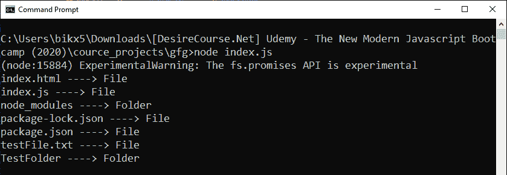
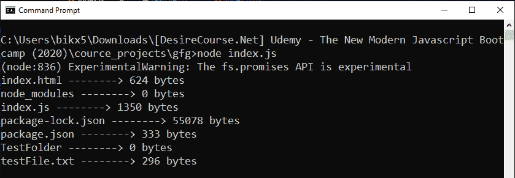

# Node.js filehandle.stat()类中的方法:FileHandle

> 原文:[https://www . geesforgeks . org/node-js-file handle-stat-method-from-class-file handle/](https://www.geeksforgeeks.org/node-js-filehandle-stat-method-from-class-filehandle/)

**filehandle.stat()** 方法是在 Node.js 的 File System 模块中定义的，File System 模块基本上就是和用户电脑的硬盘进行交互。filehandle.stat()方法使用在 stats 对象(stat 方法返回的对象)上定义的方法给出了一些特定于文件和文件夹的信息。该方法返回已解决或已拒绝的承诺。

**语法:**

```js
filehandle.stat(options);
```

**参数:**该方法接受如上所述的单个参数，描述如下:

*   **选项:**为可选参数。一个选项参数是“bigint”，它是一个布尔值，这里我们指定 filehandle.stat()返回的 stats 对象中的数值是否为 biting(默认值-false)。

**返回值:**返回已解析或已拒绝的承诺。如果成功读取目录，则使用 stats 对象解析承诺；否则，如果出现任何错误，则使用 error 对象拒绝承诺(例如，指定的目录不存在或无权读取文件等)。

从解析的承诺返回的 stats 对象中定义了一些属性和方法，这有助于获得一些关于目标文件或文件夹的具体细节。

*   **stats.isDirectory():** 如果 stats 对象描述文件系统目录，则返回 true。
*   **stats.isFile():** 如果 stats 对象描述了一个常规文件，则返回 true。
*   **stats.isSocket():** 如果 stats 对象描述了一个套接字，则返回 true。
*   **stats . issymbolilink():**如果 stats 对象描述了一个符号链接，则返回 true。
*   **stats.isFile():** 如果 stats 对象描述了一个常规文件，则返回 true。
*   **stats.isFIFO():** 如果 stats 对象描述先进先出管道，则返回 true。
*   **stats.size:** 以字节为单位指定文件的大小。
*   **stats.blocks:** 它指定为文件分配的块数。

**示例 1:** 该示例使用每个子目录的统计信息来区分目录的文件和文件夹。

```js
// Node.js program to demonstrate the
// filehandle.stat() Method

// Importing File System and Utilities module
const fs = require('fs')

const fileOrFolder = async (dir) => {
    let filehandle, stats = null

    try {
        filehandle = await fs
            .promises.open(dir, mode = 'r+')

        // Stats of directory
        stats = await filehandle.stat()
    } finally {
        if (filehandle) {
            // Close the file if it is opened.
            await filehandle.close();
        }
    }
    // File or Folder
    if (stats.isFile()) {
        console.log(`${dir} ----> File`)
    } else {
        console.log(`${dir} ----> Folder`)
    }
}

const allDir = fs.readdirSync(process.cwd())
allDir.forEach(dir => {
    fileOrFolder(dir)
        .catch(err => {
            console.log(`Error Occurs, Error code ->
                ${err.code}, Error NO -> ${err.errno}`)
        })
})
```

**输出:**


**示例 2:** 本示例使用每个子目录的统计信息来统计其大小。

```js
// Node.js program to demonstrate the
// filehandle.stat() Method

// Importing File System and Utilities module
const fs = require('fs')

const sizeOfSubDirectory = async (dir) => {
    let filehandle, stats = null

    try {
        filehandle = await fs
            .promises.open(dir, mode = 'r+')
        //Stats of directory
        stats = await filehandle.stat()
    } finally {
        if (filehandle) {
            // Close the file if it is opened.
            await filehandle.close();
        }
    }
    //size of sub-directory
    console.log(`${dir} --------> ${stats.size} bytes`)
}

const allDir = fs.readdirSync(process.cwd())
allDir.forEach(dir => {
    sizeOfSubDirectory(dir)
        .catch(err => {
            console.log(`Error Occurs, Error code ->
                ${err.code}, Error NO -> ${err.errno}`)
        })  
})
```

**输出:**


**参考:**T2】https://nodejs.org/api/fs.html#fs_filehandle_stat_options