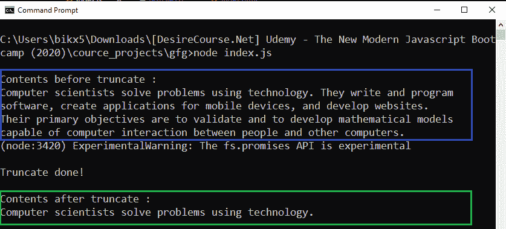

# Node.js filehandle.truncate()方法

> 原文:[https://www . geesforgeks . org/node-js-file handle-truncate-method/](https://www.geeksforgeeks.org/node-js-filehandle-truncate-method/)

**filehandle.truncate()** 方法是在 Node.js 的 File System 模块中定义的，File System 模块基本上就是和用户电脑的硬盘进行交互。truncate()方法用于通过“len”字节修改文件的内部内容。如果 len 小于文件的当前长度，文件将被截断为 len 的长度，如果 len 大于文件长度，则通过附加空字节(x00)来填充文件，直到达到 len。

**语法:**

```js
filehandle.truncate( len );
```

**参数:**该方法接受如上所述的单个参数，描述如下:

*   **len:** 是一个数字值，指定文件的长度，在该长度之后文件将被截断。这是一个可选参数，默认值为 0，即如果不提供 len 参数，将截断整个文件。

**返回值:**它返回一个承诺，该承诺将在成功时被无参数地解析，或者在出错时被错误对象拒绝(前给定路径是指向目录的路径，或者给定路径不存在)。

**示例 1:** 这个示例说明了当文件将被截断后的长度没有给出时，如何截断作品。

```js
// Importing File System and 
// Utilities module
const fs = require('fs')

const truncateFile = async (path) => {
    let filehandle = null

    try {
        filehandle = await fs.promises
                .open(path, mode = 'r+')
        // Append operation
        await filehandle.truncate()
        console.log('\nTruncate done, File"
                + " contents are deleted!\n')
    } finally {
        if (filehandle) {

            // Close the file if it is opened.
            await filehandle.close();
        }
    }
}

truncateFile('./testFile.txt')
    .catch(err => {
        console.log(`Error Occurs, Error code -> 
        ${err.code}, Error NO -> ${err.errno}`)
    })
```

**运行程序前的文件内容:**


**运行程序后文件内容:**


**输出:**

```js
Truncate done, File contents are deleted!
```

**例 2:** 这个例子说明了如何截断作品，当长度后的文件将被截断时，给出了。

```js
// Importing File System and Utilities module
const fs = require('fs')

// fs.readFileSync(() method reads the file
// and returns buffer form of the data 
const oldBuff = fs.readFileSync('./testFile.txt')

// File content after append 
const oldContent = oldBuff.toString()
console.log(`\nContents before truncate :
                         \n${oldContent}`)

const truncateFile = async (path, len) => {
    let filehandle = null

    try {
        filehandle = await fs.promises
                .open(path, mode = 'r+')
        // Append operation
        await filehandle.truncate(len)
        console.log('\nTruncate done!\n')
    } finally {
        if (filehandle) {

            // Close the file if it is opened.
            await filehandle.close();
        }
    }

    const newBuff = fs.readFileSync(path)
    //File content after truncate
    const newContent = newBuff.toString()
    console.log(`Contents after truncate :
                        \n${newContent}`)
}

truncateFile('./testFile.txt', 52)
    .catch(err => {
        console.log(`Error Occurs, Error code -> 
            ${err.code}, Error NO -> ${err.errno}`)
    })
```

**输出:**
