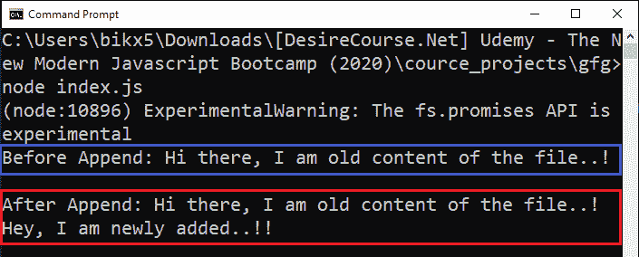

# node . js fs . promises . appendfile()方法

> 原文:[https://www . geesforgeks . org/node-js-fs-promiss-append file-method/](https://www.geeksforgeeks.org/node-js-fs-promises-appendfile-method/)

Node.js 中文件系统模块的 **fs.promises.appendFile()** 方法用于与用户电脑的硬盘进行交互。appendFile()方法用于将新数据追加到现有文件中，或者如果文件不存在，则首先创建文件，然后将给定数据追加到该文件中。fs.promises.appendFile()方法返回一个已解决或被拒绝的承诺，因此避免了在 **fs.appendFile()** 方法中可能出现的回调嵌套或回调地狱问题。

**语法:**

```
fs.promises.appendFile( path, data, options )
```

**参数:**该方法接受三个参数路径、数据和选项。选项是可选参数。

*   **路径:**它是一个字符串、缓冲区或网址，指定给定数据要附加到的目标文件的路径。
*   **数据:**它是一个字符串或缓冲区，将附加到目标文件。
*   **选项:**它是一个可选参数，以某种方式影响输出，因此我们是否将其提供给函数调用。
    *   **编码:**指定编码技术，默认值为‘UTF8’。
    *   **模式:**指定文件模式。文件模式允许我们创建、读取、写入或修改文件。默认值为“0o666”。
    *   **标志:**指定追加到文件时使用的标志。默认值为“a”。

**返回值:**返回已解决或已拒绝的承诺。如果成功地将数据追加到目标文件中，则承诺得到解决；否则，如果出现任何错误(例如，指定的文件没有写权限，等等)，则承诺将被拒绝。)

**例 1:**

```
// Importing File System module
const fs = require('fs')

// The readFile() method reads the file
// and returns buffer form of the data 
fs.promises.readFile('./test.txt')
    .then(buff => {

        // File content before append 
        const oldContent = buff.toString()
        console.log(`Before Append: ${oldContent}\n`)

        // Append operation
        return fs.promises.appendFile('./test.txt', 
                    '\nHey, I am newly added..!!')
    })

    .then(() => {

        // Getting new file content
        return fs.promises.readFile('./test.txt')
    })

    .then(buff => {

        // File content after append 
        const newContent = buff.toString()
        console.log(`After Append: ${newContent}\n`)
    })

    .catch(err => {
        console.log(err)
    })
```

我们可以使用 async-wait 关键字实现相同的功能。

```
// Importing File System module
const fs = require('fs')
const appendDataToFile = async (path, data) => {

    // The readFile() method reads the file
    // and returns buffer form of the data 
    const oldBuffer = await fs.promises.readFile(path)

    // File content before append 
    const oldContent = oldBuffer.toString()

    // Append operation
    await fs.promises.appendFile(path, data)

    const newBuffer = await fs.promises.readFile(path)

    // File content after append 
    const newContent = newBuffer.toString()

    console.log(`Before Append: ${oldContent}\n`)
    console.log(`After Append: ${newContent}`)
}

appendDataToFile('./test.txt', 
        '\nHey, I am newly added..!!')
    .catch(err => {
        console.log(err)
    })
```

**输出:**


**示例 2:** 当给定的文件名路径不存在时。

```
// Importing File System module
const fs = require('fs')

// Append operation
// If given file does not exist
// it will be created first then
// data is appended
fs.promises.appendFile('./test.txt', 
    'Please add me to the test file..!!')
    .then(() => {

        // readFile() method reads the file
        // and returns buffer form of the data 
        return fs.promises.readFile('./test.txt')
    })

    .then(buff => {

        // Appended data
        const content = buff.toString()
        console.log(`Content : ${content}`)
    })

    .catch(err => {
        console.log(err)
    })
```

用异步等待关键字实现相同的功能。

```
// Importing File System module
const fs = require('fs')

const appendDataToFile = async (path, data) => {

    // Append operation
    // If given file does not exist
    // It will created first then
    // data is appended
    await fs.promises.appendFile(path, data)

    // readFile() method reads the file
    // and returns buffer form of the data 
    const buff = await fs.promises.readFile(path)

    // File content after append 
    const content = buff.toString()
    console.log(`Content : ${content}`)
}

appendDataToFile('./test.txt', 
    'Please add me to the test file..!!')
    .catch(err => {
        console.log(err)
    })
```

**运行程序前的目录结构:**


**运行程序后的目录结构:**


**输出:**
